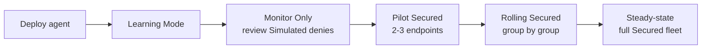

The Beginner course covered what Learning Mode is. This lesson is the actual rollout sequence: how do you take a customer from "no agents installed" to "all 120 endpoints in Secured Mode" without breaking everyone's Friday.

## The maintenance-mode timeline

The sequence isn't optional, it's the cushion that absorbs surprises. Each step exists because skipping it caused incidents at someone else's customer. Vendor docs name the phases (each maps to a Maintenance Mode the portal exposes); the durations below are MSP-recommended cadence, not a vendor specification, so adjust them to the customer's change-freeze and busy-period windows.

| Phase | What you're doing | Mode | MSP-recommended duration |
|---|---|---|---|
| Deploy | Install the agent across the fleet | n/a | 1-2 days |
| Learning | Agent observes execution, builds the application list | Learning Mode (Automatic Computer, Group, or System) | 2-4 weeks, aligned to one business cycle |
| Monitor Only | Policies "would deny" but don't, you review what would have blocked | Monitor Only | ~1 week |
| Pilot Secured | A few cooperating users get fully enforced first | Secured (per endpoint) | ~1 week |
| Rolling Secured | Group-by-group cutover, watching for problems | Secured (per group) | 2-3 weeks |
| Steady state | Whole fleet enforced, the helpdesk handles approvals | Secured | ongoing |

Automatic Learning has three flavours the Beginner course covered (Computer, Group, System); pick the one that matches the customer's group structure and stick with it for the full Learning window. Switching mid-Learning makes the artefact harder to clean up.

## The pilot picks itself

For the pilot, choose endpoints that satisfy three conditions:

1. **The user is patient and reachable.** They'll be the canary. They need to tell you immediately when something gets blocked, not silently work around it.
2. **The user runs a representative slice of the customer's software.** The IT manager is too thin a slice (they live in remote tools); the receptionist is also too thin. A mid-tier user who uses Office, the line-of-business app, and a couple of niche tools is the right pick.
3. **The user is not on a critical path during the pilot week.** Don't put the pilot in payroll week, or during the customer's busiest period.

Two or three endpoints is enough. More dilutes your attention.

## The rolling Secured cutover

After a successful pilot week, group cutovers go in this order:

1. **Lowest-risk group first.** Often Sales or general office users. They run mostly browsers and Office; if the ringfence has gaps, the impact is "Outlook is weird" not "the line-of-business system is down."
2. **Knowledge workers next.** Finance, HR, anyone with role-specific software.
3. **Specialists last.** Engineering, designers, anyone with deep-customised toolchains. Their software is the hardest to allowlist completely; doing them last lets you learn from the other groups first.
4. **Servers separately.** Server cutovers follow a different playbook: change windows, stricter pre-checks, longer monitor passes. Don't bundle them with workstations.

Between groups, you wait at least 2 days. Real problems often surface on day 2 of enforcement, not day 1; rushing the next group means you're rolling forward with an unfixed gap.

## The rollback path

Every cutover plan needs a documented rollback. The two reversal moves:

- **End maintenance / flip a single endpoint back to Monitor Only.** When one user is blocked and the rest of the fleet is fine, revert just that user, fix the policy gap, re-enforce.
- **Bulk Maintenance Mode (Application Control Monitor Only) on a computer group.** When a group cutover went badly, you can put the whole group back into Monitor Only without touching individual endpoints. The agents stop blocking on next check-in. Use the `ComputerDisableProtection` flow with a clear end date so the group doesn't sit unprotected.

Document the rollback in the customer's PSA before the cutover, not after. The conversation "we need to flip your fleet back to permissive" is much shorter when there's already a plan attached.

## Communicating the rollout to the customer

A simple message a day before each phase:

> Today (or tomorrow morning), we're enforcing ThreatLocker policies on [group] endpoints.
>
> If anyone in [group] tries to run software that hasn't been seen during the previous weeks, they'll get a "request approval" prompt. Their request comes to us; we review and approve usually within [SLA from the customer's PSA].
>
> If something they need urgently is blocked and they can't wait, the Cyber Hero team is also handling these 24/7 once we hand over [or: the on-call number is X].
>
> Expected impact: very low for routine work. Higher for anyone who installs new software regularly.

Customers who get this message handle the transition. Customers who don't are blindsided when the marketing manager can't install Canva.

## A worked rollout: Able Moose Accounting

120 staff, three offices, four computer groups (Office, Finance, Sales, IT-tools). Plan:

| Week | Phase | Endpoints |
|---|---|---|
| 1-2 | Agent deploy + Learning | All 120 |
| 3-4 | Continued Learning | All 120 |
| 5 | Monitor Only | All 120 |
| 6 | Pilot Secured | 3 mid-tier users from Sales |
| 7 | Rolling Secured | Sales group (~30) |
| 8 | Rolling Secured | Office group (~50) |
| 9 | Rolling Secured | Finance group (~30) |
| 10 | Rolling Secured | IT-tools group (~10) |
| 11+ | Steady state | All 120 |

Customer comms before each cutover, daily Response Center monitoring during the rollout, weekly retrospective with the customer's office manager during weeks 6-10.

<Checkpoint slug="threatlocker-l2-checkpoint-cutover" client:load />

## What this is NOT

- **Not the right shape for every customer.** Very small customers (under 25 staff, single role profile) can collapse some phases. Very large or compliance-bound customers need longer Learning periods, longer Monitor Only, per-department comms. The phases stay the same; the durations stretch.
- **Not done at "all in Secured."** Steady state is when the helpdesk has run two full cycles without surprises and the customer has stopped reporting "things that suddenly stopped working." Plan a 30-day post-cutover review.

<Callout type="info" title="Sources">
[Maintenance Mode API](https://threatlocker.kb.help/portalapimaintenancemode/), [Computer DisableProtection](https://threatlocker.kb.help/portalapicomputer/), [Module options on the Organizations page](https://threatlocker.kb.help/understanding-and-changing-the-module-options-on-the-organizations-page/).
</Callout>
