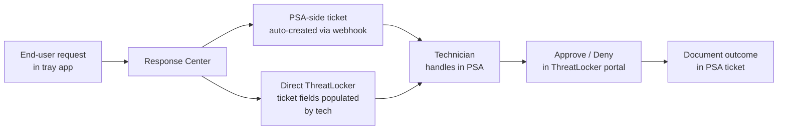

The previous lessons in this course were about designing what ThreatLocker does on endpoints. This one is about the operational seam where ThreatLocker activity meets the rest of the MSP's tooling.

## How requests turn into tickets

ThreatLocker has direct ticketing fields on the Approval Request: `ticketId`, `ticketApprovalManager`, `requestorEmailAddress`, plus a free-form `comments` field. They populate from the Tickets Details tab on a request in the portal, or via the API when you process a request programmatically.

The integration patterns:

Two patterns exist in the field:

1. **PSA-led**: a webhook on the request creates a PSA ticket. The technician works in the PSA, and uses ThreatLocker's portal only to action the approve/deny. The ticket carries the audit trail.
2. **ThreatLocker-led**: requests live in the Response Center until handled, with the ticketId field populated either by the PSA's own integration or by the technician copying the ticket reference in. Reporting comes from ThreatLocker exports.

Pick one and stick with it per customer; mixing both means tickets fall in the gap between systems.

## What changes when Cyber Hero is subscribed

Cyber Hero is ThreatLocker's 24/7 managed-approval team. When the customer subscribes (the module shows in their org's enabled modules), end-user requests funnel to Cyber Hero engineers first.

The MSP-side workflow shifts:

| Without Cyber Hero | With Cyber Hero |
|---|---|
| Every end-user request lands in the MSP's Response Center | Most requests are handled by Cyber Hero before the MSP sees them |
| MSP techs are the first responders, all hours | MSP techs are the second-line, handling escalations and customer-specific judgement calls |
| Helpdesk capacity is the limiting factor on customer count | Policy design and exceptions are the limiting factor |
| MSP commits to an internal SLA per customer | Cyber Hero's SLA is in the customer's contract; MSP commits to escalation handoffs |

The MSP still owns:

- **Policy design.** Cyber Hero handles individual requests; they don't restructure your customer's allowlist for you.
- **Customer-specific judgement.** "Should this customer's contractor be allowed to install X?" lands with the MSP because Cyber Hero doesn't know your customer's contracts.
- **Genuinely unsanctioned software.** Cyber Hero will defer to the MSP rather than approve a product the customer hasn't said they're using.
- **Incident triage.** When a request looks like a genuine attack indicator, Cyber Hero escalates rather than approving.

A request that Cyber Hero declines and forwards to the MSP shows the status integer **`13` (Escalated from the Cyber Heroes)** in the API. That's the concrete signal a request landed in the MSP queue because Cyber Hero asked, rather than because the customer doesn't subscribe. Filter on it when you want to see only the requests that genuinely need MSP judgement.

## Notifications and where they go

The Notifications for Requests setup determines who gets pinged when a request comes in. Three buckets:

- **Application Control requests** (the most common)
- **Storage requests** (USB / removable media)
- **Elevation requests** (per-app admin)

For each, the toggle controls Email, SMS, and which administrator email gets the alert. The pattern that holds up:

- Per-customer distribution list as the recipient (not personal email). Survives staff turnover.
- Email on by default; SMS on for after-hours customers who pay for it.
- For Cyber Hero customers, route the customer-side notifications to Cyber Hero's intake, and the MSP-side notifications only on escalation.

## Reporting back to the customer

The customer wants to know: "what is ThreatLocker actually doing for me?" Three artefacts answer that:

1. **Monthly activity summary**: number of approval requests handled, how many were denied, top categories of blocked applications, any incidents. A short PDF or shared dashboard.
2. **Quarterly policy review**: a walk through the policy list, highlighting changes made, unused policies that should be removed, ringfences that have accumulated stale exclusions.
3. **Ad-hoc incident reports**: when ThreatLocker blocked something genuinely malicious. Specific, named, with the audit trail. These are the artefacts that justify the renewal.

The Unified Audit's export-to-CSV mode (the API's `exportMode: true` flag) is what underlies the monthly summary. Pull the period's denies, group by application or category, paste into the customer's preferred format.

## A worked monthly report: Able Moose Accounting

The MSP's monthly summary for the customer:

- **Total approval requests this month**: 47.
- **Handled by Cyber Hero**: 34 (72%).
- **Handled by MSP**: 13 (28%); average response 24 minutes during business hours.
- **Approved**: 41 (87%).
- **Denied**: 6 (13%); reasons: 3 unsanctioned consumer software, 2 outdated installer versions, 1 escalated to incident review and confirmed safe.
- **Notable block this month**: a phishing email asked Sarah to run an installer that mimicked a QuickBooks update. ThreatLocker blocked the execution. The certificate was forged; the binary wasn't a real Intuit signature. Cyber Hero declined the request and flagged the email for review. *No data loss; no further action required.*

The notable-block paragraph is the part that justifies the customer's spend better than any vendor brochure.

<Checkpoint slug="threatlocker-l2-checkpoint-cyberhero" client:load />

## What this is NOT

- **Not a substitute for customer comms.** "Cyber Hero will handle it" doesn't mean the customer doesn't need to know about a policy change or a major denial. Cyber Hero handles requests; the customer relationship is still yours.
- **Not the same as PSA integration in other products.** ThreatLocker's PSA connectors vary by tooling (ConnectWise, HaloPSA, Kaseya BMS, etc.). Confirm what the connector actually does for your customer's specific PSA before promising "every request becomes a ticket automatically."

<Callout type="info" title="Sources">
[Approval Request fields including ticket info](https://threatlocker.kb.help/portalapiapprovalrequest/), [Notifications for Requests](https://threatlocker.kb.help/notifications-for-requests/), [Module options on the Organizations page](https://threatlocker.kb.help/understanding-and-changing-the-module-options-on-the-organizations-page/), [Unified Audit export](https://threatlocker.kb.help/unified-audit-portalapiactionlog/).
</Callout>
