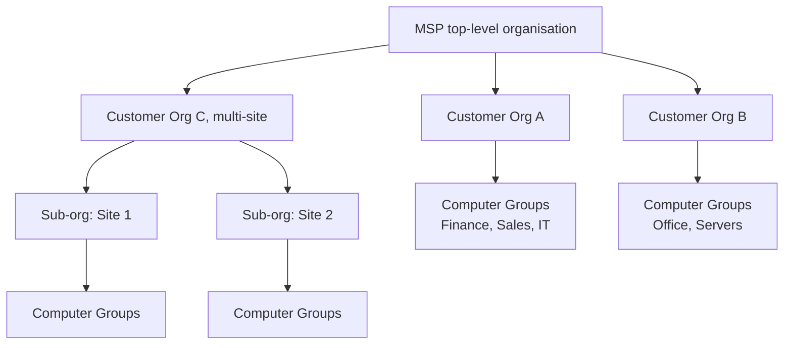
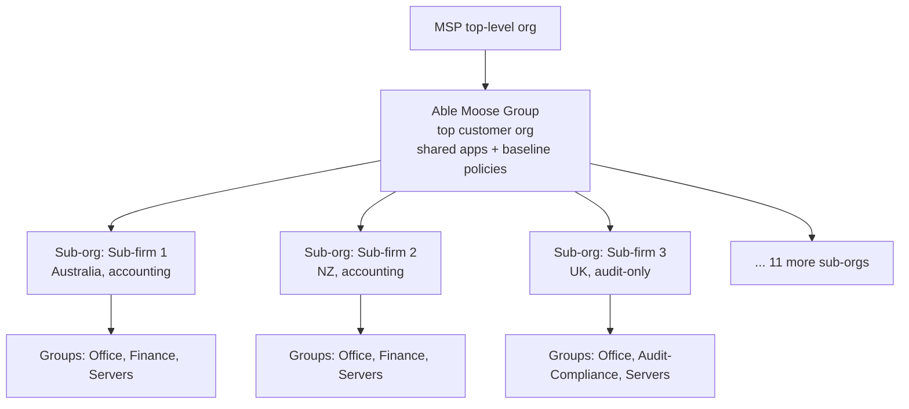

The Beginner and Intermediate courses worked at the single-customer level. This course is operating ThreatLocker across many. The first move is understanding how the hierarchy actually composes; what cascades, what doesn't, and which buttons in the portal cross between tenants.

## The shape of the tree

Three concepts compose:

- **Organisation**: a tenant in ThreatLocker. The MSP has one top-level organisation; each customer is a child. Customers with their own internal complexity can have grandchildren.
- **Computer Group**: a subset of computers inside one organisation. Roles (Finance, Sales, Servers), sites, or deployment cohorts.
- **Computer**: a single endpoint, in exactly one computer group.

## What lives where

| Object | Lives at | Can it be referenced from a child? |
|---|---|---|
| Module enablement (Application Control, Storage, Detect, etc.) | Per organisation | No, per-org decision |
| Application definition (Built-In or custom) | Per organisation, *plus* parent-org applications are visible to children | Yes; vendor docs explicitly document the prefix pattern for tags as `ParentOrganization\\TagName`, and the same convention extends to applications across the org tree |
| Policy | Scoped to organisation, computer group, or computer | Cascade is by `orderBy` and explicit copying, not implicit inheritance |
| Tag (used in Network Control, Storage exclusions, ringfences) | Per organisation; parent-org tags visible to children | Yes, with the prefix `ParentOrganization\\TagName` |
| Computer group | Per organisation | Visible across the tree with `showAllGroups` / `includeAvailableOrganizations` |
| Approval request | The org where the requesting computer lives | Aggregatable across child orgs via `includeChildOrganizations` |
| Unified Audit | Per organisation | Aggregatable via `showChildOrganizations` |
| User | Per layer (MSP-layer or customer-org-layer) | An MSP user can have rights into multiple child orgs |

## Cross-tenant action: how the portal handles it

Several portal actions cross between organisations explicitly. The pattern: the API exposes a `managedOrganizationId` header that says "act on this org's data even though I'm logged into a different one." The portal flips this header automatically when you switch the org switcher; if you call the API directly, you set it.

The implication for the helpdesk: actions that look like "do the same thing for several customers" need to be performed once per `managedOrganizationId`. Even when they look like one click.

## Computer groups: design considerations at scale

The Intermediate course's group-by-role pattern (Finance, Sales, etc.) holds at scale, but you also pick up:

- **Server groups separate from workstation groups.** Different policy needs, different cutover cadence, different ringfence templates.
- **Deployment-stage groups.** "Pilot", "Rolling", "Steady state" can be transient computer groups during rollout. The agent moves machines from one to the next; the policies follow.
- **Compliance groups.** Endpoints subject to a stricter standard (a customer's PCI-scope machines, an insurance-required posture for finance staff) live in a compliance group with a tighter baseline.

When designing groups for a customer with sub-orgs, decide first whether the differentiation is "different sub-orgs" (with a separate tenant per division) or "different groups within one org." Sub-orgs cost more setup but isolate cleanly. Groups within one org are lighter but bleed at the org-level policy layer.

## RBAC and user scoping

ThreatLocker has two distinct user layers:

- **MSP-layer users**: log in at the top-level org. Permissions can include `View Approvals`, `Approve for Entire Organization`, `Edit Application Control Policies`, `Edit Application Control Applications`, etc., scoped to which child orgs they have access to.
- **Customer-org-layer users**: scoped to their own organisation only. Customer-side IT staff who do their own approvals live here.

Three RBAC anti-patterns that recur across MSPs:

### 1. MSP staff with permanent Super Admin on every customer

Looks efficient. Becomes a problem when:

- A tech leaves the MSP and someone forgets to remove their access from one customer's grandchildren.
- An audit asks "who changed policy X and when?" and the answer is "any of these eight people."

The discipline: per-tech accounts, role assignments scoped to what they actually need, periodic reviews.

### 2. Customer admins given MSP-layer roles

A customer's internal IT lead asks for "MSP access" so they can self-serve. Granting it gives them visibility into other customers' policies and Audit logs. That's a confidentiality breach and, depending on geography, a regulatory one.

Customer admins go in their own organisation, never at the MSP layer.

### 3. Shared MSP credentials

A single shared MSP login among ten techs means System Audit shows "GenericAdmin" instead of "Sarah". When a change goes wrong, nobody knows who made the previous one. Per-tech accounts; SSO if the MSP runs an IdP.

<Callout type="warn" title="Only Owner can cancel the organisation">
Operational fact: only the Owner role can cancel an organisation. Document who holds it for both the MSP top-level org and any customers where the MSP is the Owner. Make sure cover exists (multiple Super Admins so day-to-day work doesn't depend on Owner availability), and rotate on personnel changes. A departed Owner with no documented handover is a six-month-long unblocking exercise.
</Callout>

## A worked example: Able Moose Group (1,800 staff, 14 acquired sub-firms)

Able Moose Group is the customer at the Advanced scale. The MSP set up:

Why a top customer org *and* sub-orgs:

- **Group-wide allowlist**: Office, browsers, Teams, the corporate VPN client. Applied at the top customer org with the policy copied (not inherited) to each sub-org.
- **Group-wide deny baseline**: known-bad utilities, miners, consumer-grade VPNs. Same pattern.
- **Sub-org specificity**: a UK audit firm has tools the Australian accounting firm doesn't, and vice versa. Sub-org-level allowlist for those.
- **Tenant isolation**: a compromise in Sub-firm 2 doesn't bleed visibility into Sub-firm 1's audit log. RBAC scoped per sub-org enforces the wall.

The MSP's tech accounts have `Approve for Entire Organization` rights at the top customer org, with implicit scope down to each sub-org via `managedOrganizationId`. Customer-side IT staff have rights only at their own sub-org.

<Checkpoint slug="threatlocker-at-scale-checkpoint-hierarchy" client:load />

## What this is NOT

- **Not policy inheritance.** ThreatLocker doesn't propagate a parent-org policy down to children automatically. The pattern is *copy-with-discipline*: PolicyInsertForCopyPolicies (or the portal equivalent) duplicates a policy across target locations, and you have to remember the deploy step. Treat it like inheritance and the children sit on stale policy.
- **Not a substitute for the customer's IdP roles.** ThreatLocker RBAC governs what a user can do in *ThreatLocker*. M365 admin rights, SharePoint access, VPN privileges; all separate identity surfaces. Designing one without the others leaves seams attackers exploit.

<Callout type="info" title="Sources">
[Computer Group API](https://threatlocker.kb.help/portalapicomputergroup/), [Organization API](https://threatlocker.kb.help/api-documentation/), [Module options on the Organizations page](https://threatlocker.kb.help/understanding-and-changing-the-module-options-on-the-organizations-page/), [Approval Request count with includeChildOrganizations](https://threatlocker.kb.help/portalapiapprovalrequest/), [Unified Audit with showChildOrganizations](https://threatlocker.kb.help/unified-audit-portalapiactionlog/).
</Callout>
