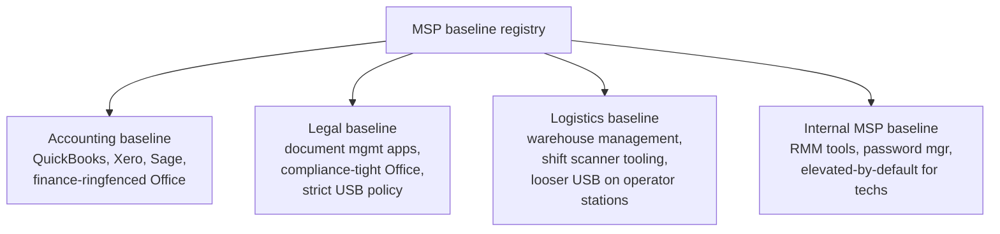

A baseline is the curated set of policies and ringfences the MSP applies as a starting point for every customer in a given vertical. It's not a feature with a button; ThreatLocker doesn't have an "MSP-level baseline template" object that propagates automatically. It's a discipline you maintain via the Copy Policies operation and clear version control.

## Why baselines

The Beginner course said "scope narrowly, name well." The Intermediate course said "design per customer." Without a baseline, scaling that to 50 customers means 50 hand-built allowlists. With one, you onboard customer 51 by copying baseline v3.2 and tuning where it meets reality.

The baseline pays for itself when:

- A new threat (a specific living-off-the-land binary, a newly weaponised certificate) needs to be denied at every customer. Update the baseline once, copy to all.
- A new common application (a vendor releases a new tool every customer ends up using) gets allowlisted in the baseline.
- A new technician joins the MSP. They learn one baseline, not 50 customer-specific quirks.

## Baseline design by vertical

The pattern that holds: one baseline per vertical the MSP serves, not one per customer. Examples:

Each baseline is a documented set of:

- **Built-in applications** to permit, with their default ringfences.
- **Custom applications** the vertical typically uses, with file rules.
- **Deny policies** at high `orderBy` priority for known-bad in the vertical.
- **Storage Control defaults** (USB / DVD posture).
- **Elevation Control defaults** (per-vertical elevation policies for common admin tasks).
- **Network Control templates** for the vertical's common service tags.

Baselines are documents *plus* the implementing policies in a reference customer org. The reference org is the source for Copy Policies; the document is the rationale.

## Version control

The Copy Policies API doesn't carry a version number with it; you bring your own. Two patterns:

1. **Reference-org-by-version**. Maintain a separate ThreatLocker organisation per baseline version: `baseline-accounting-v3.0`, `baseline-accounting-v3.1`, etc. Old reference orgs aren't deleted; they're the rollback if v3.2 breaks something.
2. **Document-led versioning**. The implementing policies live in one reference org, but the change log is in the MSP's policy-as-code repository or runbook system. Each release tagged with date and changes.

The first is heavier but more robust. Pick the one your team will actually maintain.

## Propagating an update without breaking customers

A new baseline version exists; a fix needs to reach every customer. The Copy Policies operation supports moving policies between source and target locations across organisations.

The workflow:

<StepThrough client:load>
  <Step title="Stage in the reference org">
    Build or update the policy in the reference org. Set it Monitor Only first, observe, then Secured.
  </Step>
  <Step title="Test on one canary customer">
    Pick a small, friendly customer for the canary. Copy the new policy from reference into that customer's org. Watch the Unified Audit and Response Center for a week.
  </Step>
  <Step title="Communicate the change">
    Email each customer (or their primary contact) with: what's changing, why, the planned date, and the rollback path. Sounds excessive; isn't.
  </Step>
  <Step title="Roll out by cohort">
    Group customers into cohorts of 5-10. Copy the policy to each cohort. Wait at least 2 days between cohorts.
  </Step>
  <Step title="Decommission old policy">
    Once the new policy is live everywhere, retire the old one. Don't leave both active; future-tech reading the policy list won't know which is canonical.
  </Step>
</StepThrough>

The Copy Policies operation has a deploy step. The API note: *"Once you have called this API to copy your policy(s), be sure to deploy policies in the organization where the policy was copied into."* Forgetting the deploy is the most common Copy Policies mistake; the policy exists but doesn't take effect.

## Naming and tagging at scale

The Intermediate course's `<scope>-<application>-<purpose>` convention extends with a baseline marker:

- `org-baseline-accounting-v3.2-office-permit-ringfenced`
- `org-baseline-accounting-v3.2-quickbooks-permit`
- `org-custom-able-moose-cad-tool-permit` (this one is *not* from the baseline)

The baseline marker tells future-tech which policies came from the template (don't customise these directly, change the baseline instead) versus which are customer-specific extensions. Without it, drift is invisible: in two years, half the policies that look like baseline copies have been touched in random ways at random customers.

## Governance: who can change baselines, and how

A baseline change affects every customer it propagates to. Three controls:

1. **Authorisation**. Define who at the MSP can modify the reference org. Typically a senior tech or a security-engineering function, not the helpdesk.
2. **Review**. Every baseline change reviewed by a second person before it lands in the reference org. Avoids "I thought you tested it."
3. **Change record**. Every change recorded with: what changed, why, ticket reference, who approved. The MSP's runbook system or policy-as-code repo.

For audit-bound customers, this governance trail is what proves the policy you applied was deliberate rather than accidental. "This change was reviewed and approved on date X by person Y" is the answer auditors want.

<Checkpoint slug="threatlocker-at-scale-checkpoint-baseline" client:load />

## What this is NOT

- **Not a magic propagation feature.** ThreatLocker doesn't push baseline changes to children automatically. Every baseline update is a deliberate Copy Policies operation per target, plus the deploy step. Baselines are a *discipline* you implement, not a feature you enable.
- **Not a replacement for customer-specific tuning.** Baselines cover ~80% of a customer; the last 20% is their specific software, partners, and workflows. Stretching the baseline to cover everything is the path to bloat that breaks newer customers on copy.

<Callout type="info" title="Sources">
[PolicyInsertForCopyPolicies](https://threatlocker.kb.help/portalapipolicy/), [Module options on the Organizations page](https://threatlocker.kb.help/understanding-and-changing-the-module-options-on-the-organizations-page/), [Application API for application visibility across orgs](https://threatlocker.kb.help/portalapiapplication/).
</Callout>
