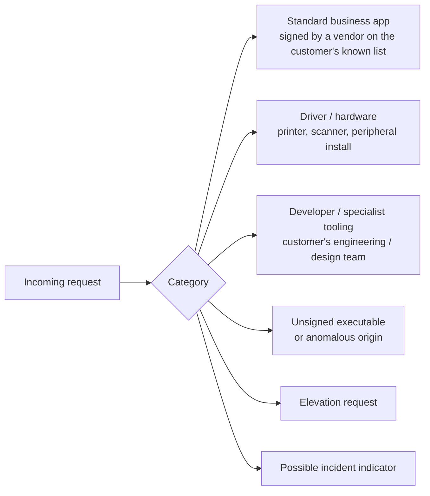

The Intermediate course covered what changes when a customer subscribes to Cyber Hero. This lesson is the design behind running it across many customers; how requests get categorised, who handles which categories, and where escalations land.

## The approval permission tree

ThreatLocker's permissions for handling requests are layered:

| Permission | Granularity |
|---|---|
| `Approve for Single Computer Application Only` | One machine, one app |
| `Approve for Single Computer` | One machine |
| `Approve for Group` | One computer group |
| `Approve for Entire Organization` | The whole tenant |
| `View Approvals` | Read-only |
| `Elevation Administrator (User)` | User-scoped elevation; the role documented in the API permissions block |

These are assigned per-user, per-organisation. An MSP tech can have `Approve for Group` on Customer A but `Approve for Single Computer` on Customer B; the granularity matches what the customer's contract requires.

## Categorising requests

Without explicit categorisation, every request looks the same in the Response Center: a path, a hash, a user. Categories make routing decisions tractable. The categories that earn their place:

Routing:

| Category | First responder | Escalates to |
|---|---|---|
| Standard business app, on the customer's pre-approved list | Cyber Hero (24/7) | MSP if Cyber Hero is uncertain |
| Driver / hardware install | Cyber Hero | MSP if the device isn't customer-supplied |
| Developer / specialist tooling | MSP | Customer's IT lead for their internal sign-off |
| Unsigned / anomalous | MSP only | Security-engineering / IR retainer |
| Elevation | MSP, scoped to authorised techs | Customer if it's an in-scope elevation policy change |
| Possible incident indicator | MSP IR / customer IR | Customer's incident-response retainer |

The categorisation isn't a ThreatLocker feature; it's an operational layer the MSP overlays on top of the request flow. Some MSPs implement it via PSA workflow; some via Notes / Tags fields on the request itself.

## Notification routing

The Notifications for Requests page lets you set, for each of Application Control / Storage / Elevation request types:

- Whether email is sent
- Whether SMS is sent
- Which administrator email receives it

For an MSP running Cyber Hero customers and direct-customers in parallel:

- Cyber Hero customers: notifications routed to Cyber Hero's intake; MSP receives only escalation notifications.
- Direct-customer (no Cyber Hero): notifications to the MSP's per-customer distribution list.
- After-hours coverage: SMS on the on-call rotation list, with documented handoff to whoever's awake.

## Customer-specific escalation matrices

Each customer has a contractual answer to "who approves what." The matrix lives in the customer's onboarding doc and the PSA. Sample for Able Moose Group's UK sub-firm:

| Request type | Within scope of automatic approval? | Approver | SLA |
|---|---|---|---|
| QuickBooks updates / known business apps | Yes (Cyber Hero) | Cyber Hero engineer | 15 min business hours / 1 hr OOH |
| New peripheral driver | Yes (Cyber Hero) | Cyber Hero engineer | Same |
| Internal LOB tool from approved vendor list | Yes (MSP) | MSP day-shift tech | 1 hr business hours |
| Software the customer's UK CFO needs urgently for board prep | No, escalate | Customer's UK IT lead + MSP senior | 4 hrs |
| Anything unsigned | No, escalate | MSP security tech | 24 hrs |
| Suspected incident | No, immediate escalation | MSP IR + customer IR retainer | Immediate |

The matrix matters when the helpdesk is asked to approve something edge-of-scope. "Per the agreement, this needs sign-off from your IT lead" is a clearer answer than "let me check with my manager."

## Audit trail across the whole flow

For every approval, the chain of custody you want to preserve:

1. **Original request**: who requested, from which machine, what file. (ThreatLocker captures this.)
2. **Categorisation**: which category was assigned, by whom. (PSA or Notes field.)
3. **Reviewer**: who approved or denied. (`ticketApprovalManager` field on the request, plus the System Audit's user-action log.)
4. **Justification**: why approve / deny. (`comments` field, plus the PSA ticket body.)
5. **Resulting policy**: which policy was created, with what scope and ringfence. (Captured in the policy itself's `ticketInfo` and notes.)
6. **Customer comms** (if the request was edge-of-scope): the email or PSA message confirming the customer's authorisation.

Together that's a defensible record. Half of it without the others isn't; auditors and incident-response teams want all six.

## A worked escalation: Able Moose Group

A finance manager at the Australian sub-firm requests a tool called "PaymentReconciler.exe" that nobody at the MSP has seen. Path is in Downloads, no certificate, originating process is Edge.

<StepThrough client:load>
  <Step title="Cyber Hero sees it first">
    Unsigned, anomalous origin, no matching application. Cyber Hero declines automatic approval and forwards to MSP.
  </Step>
  <Step title="MSP day-shift triage">
    Tech reviews. Customer's pre-approved list doesn't include this product. Need to escalate.
  </Step>
  <Step title="Customer escalation">
    MSP emails the sub-firm's IT lead and the requesting user's manager. "User X requested this tool. We don't have it on your approved list. Can you confirm scope, vendor, and expected use?"
  </Step>
  <Step title="Decision">
    The manager confirms the user was experimenting with a third-party tool not vetted by the firm. Decline; user is asked to use the firm's existing reconciliation flow. Outcome documented in PSA and on the request.
  </Step>
  <Step title="Audit trail">
    The ticket links: original request, MSP triage notes, the email thread with the customer, the deny action in ThreatLocker, the System Audit row. If audited later, the chain answers "why was this denied" without anyone reconstructing.
  </Step>
</StepThrough>

<Checkpoint slug="threatlocker-at-scale-checkpoint-cyberhero" client:load />

<Callout type="info" title="Sources">
[Notifications for Requests](https://threatlocker.kb.help/notifications-for-requests/), [Approval Request permissions](https://threatlocker.kb.help/portalapiapprovalrequest/), [System Audit (action history)](https://threatlocker.kb.help/portalapisystemaudit/), [Module options on the Organizations page](https://threatlocker.kb.help/understanding-and-changing-the-module-options-on-the-organizations-page/).
</Callout>
