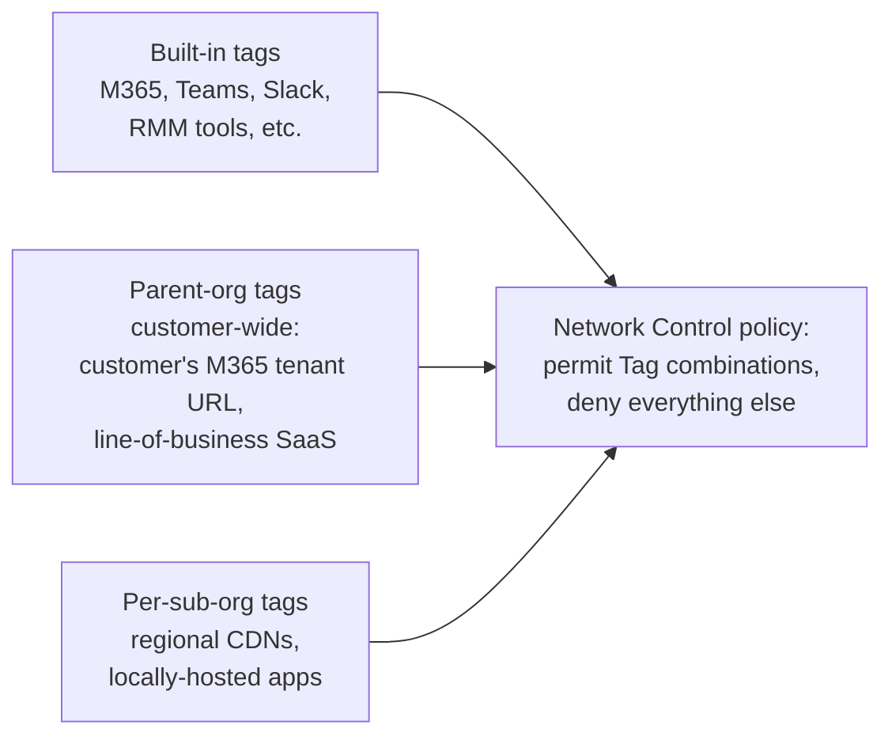
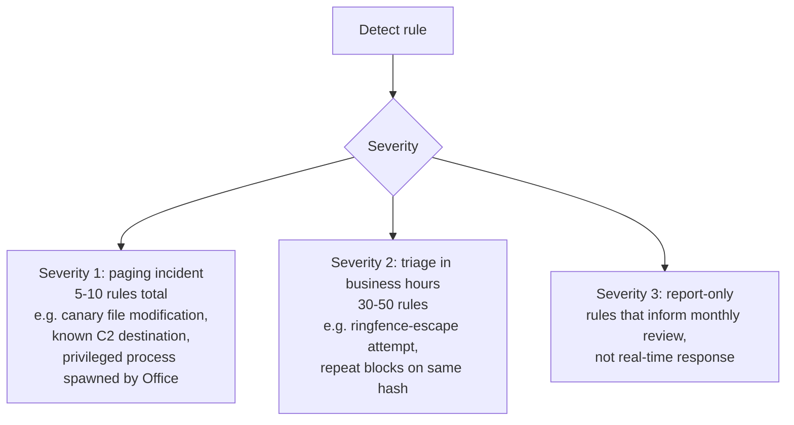

The Beginner course mentioned Network Control and Detect; the Intermediate course used Network ringfencing. This lesson is the Advanced layer: running both at scale, using tags as the dimensional axis that scales across customers, and tuning Detect so its alerts are signal not noise.

## Network Control as policy, not as firewall

Network Control is a host-firewall replacement that lives inside ThreatLocker's policy engine. Where a firewall has rules; ThreatLocker has policies that match by:

- **Direction** (Inbound or Outbound)
- **Destination location**: an IPv4 range, an IPv6 range, a Tag (more on these), or for outbound only, a domain
- **Port(s)**: individual ports or comma-separated ranges
- **Action**: Permit or Deny
- **Schedule** (no schedule, an expiration, or a recurring schedule)

The first time you see Network Control, the temptation is to recreate the customer's existing firewall rules in the agent. Don't. The point of Network Control is *role-based* network policy that travels with the endpoint, not perimeter rule duplication.

## Tags: the abstraction that scales

A Tag is a named bag of network destinations. ThreatLocker ships built-in tags for many vendors (`ThreatLocker\\NinjaOne(Built-In)`, M365 endpoints, common SaaS). You can also define custom tags per organisation.

The pattern that pays off:

A policy referencing `ThreatLocker\\Microsoft365(Built-In)` plus the customer's parent-org `Able-Moose-Internal-SaaS` tag scales across every sub-org without copy-paste. New vendor endpoints? Update the tag, every policy referencing it picks up the change.

Tags are addressable across the org tree using the prefix `ParentOrganization\\TagName`. A child can reference a parent's tag without duplicating it.

## Designing Network Control at scale

Three policies most customers benefit from:

1. **Outbound: permit only the customer's known service tags.** Default-deny everything else. The customer's Office, M365, Teams, line-of-business SaaS, and the MSP's RMM endpoints are tagged; anything else hits a deny.
2. **Inbound: permit on specific ports for specific machines, deny everything else.** Servers permit RDP / SSH from MSP RMM tags only. Workstations deny inbound entirely.
3. **Per-app network ringfences**: covered in the Intermediate ringfencing lesson, complementary to the Network Control policies above.

Network Control and application Ringfencing **compose**. A permitted application still has its network access scoped by Network Control rules; a browser permitted by Network Control to reach the entire `Microsoft365(Built-In)` tag can still be further restricted by its ringfence to specific M365 endpoints. Design the two layers deliberately, knowing both apply.

## ThreatLocker Detect: telemetry-driven detection

Detect is the validation layer on top of prevention. Its rules evaluate conditions against the agent's telemetry: process events, network events, file events, registry events, Windows Event Log entries.

The condition vocabulary is wide:

| Condition family | Examples |
|---|---|
| Process / file | Full Path, Process Path, Created By Process, File Size, SHA256, ThreatLocker Hash, Certificates, Country |
| Network | Destination Domain, Destination IP, Destination Port, Network Direction |
| Policy outcome | Policy Action, Policy Name, Previously Matched Policies |
| Threat / risk | Current Threat Level, Encryption Status, Elevation Status |
| Windows Event Log | Event Log ID, Event Log Level, Event Log Source, Event Log Message |
| Behavioural | Canary File Path manipulation, CMD Line Parameters, Occurrences |

A Detect rule combines conditions with one of five action types and an optional Occurrences threshold (this happens N times in T minutes). The five actions, per vendor docs:

- **Create Alert.** Logs the event in the portal as an alert.
- **Send Email.** Emails the configured recipients.
- **Isolate Machine.** Cuts the endpoint off the network at the agent level.
- **Lockdown Machine.** Stronger containment; requires explicit operator action to release.
- **Call Webhook.** Hands off to an external system (PSA, SIEM, automation platform).

There is no plain "Notify" action; if you've inherited a Detect runbook that names one, that's a label drift, the action is one of Create Alert / Send Email.

### Threat Levels

ThreatLocker assigns each Detect signal a Threat Level on a numeric scale: Low (1-50), Medium (~100), High (200+). The MSP-side Severity 1 / 2 / 3 overlay (paging vs business-hours vs report-only) is a layer you map onto the Threat Levels in your runbook, not a vendor-shipped concept. Document the mapping in the customer's runbook so a tech reading a Detect alert at 2am knows whether to page out without thinking.

## Designing Detect rules that earn their alert budget

Detect rules can drown an on-call rotation if not designed with discipline. The patterns:

### 1. Tier rules by severity

Severity 1 fires the pager. Severity 2 lands in a triage queue. Severity 3 generates monthly trend lines. Most rules belong in Severity 2 or 3; if every rule is Severity 1, none of them are.

### 2. Use Occurrences, not single events

A single denied execution of `nmap.exe` could be an admin running ops. The same denial happening 50 times in 10 minutes is a red flag. The Occurrences condition lets you set "fire only when this happens N times in T period."

### 3. Build rules from real audit data, not paranoia

The Unified Audit's group-by feature aggregates events. Group by Application Name + Action Type + Destination Domain over the last 30 days; the patterns you see are the basis for Detect rules. Rules built from "I imagine this could happen" usually don't fire on real threats and do fire on legitimate edge cases.

### 4. Always tie Detect to a documented response

Every Detect rule should have a runbook entry: when it fires, what does the responder do? The rule that fires with no documented response is the rule that gets ignored after the third 2am wake-up.

## A worked Detect rule: the canary file pattern

Place a non-business "canary" file in a path attackers typically scan: `c:\users\public\financials_2026.xlsx`. Tooling (ransomware, credential-grabbers) often touches files matching that pattern.

| Field | Value |
|---|---|
| Canary File Path | `c:\users\public\financials_2026.xlsx` |
| Threat Level | High (paged in the MSP runbook) |
| Action Type | Create Alert + Send Email + Isolate Machine |
| Occurrences | 1 in any window |
| Response runbook | Page on-call, run incident response playbook, contact customer security lead |

A real user has no business reading or modifying that file. The first hit is a strong signal; the isolate action contains it; the runbook is what turns the alert into a contained incident.

<Checkpoint slug="threatlocker-l3-checkpoint-detect" client:load />

## What this is NOT

- **Not a SIEM replacement.** Detect runs on ThreatLocker agent telemetry, not on the customer's full IT estate. SIEM aggregates across endpoints, network gear, identity, SaaS; Detect covers what its agent can see. Big overlap, different scopes.
- **Not on every plan.** Detect is bundled with Unified Endpoint and Unified Security + Cloud, not the lower tiers. Confirm enabled modules on the Organizations page before designing rules; if Detect isn't enabled, none of them fire.

<Callout type="info" title="Sources">
[ThreatLocker Detect overview](https://threatlocker.kb.help/the-threatlocker-detect-page/), [Network Access Policy API](https://threatlocker.kb.help/portalapinetworkaccesspolicy/), [Tag API for cross-org references](https://threatlocker.kb.help/api-documentation/), [Module options on the Organizations page](https://threatlocker.kb.help/understanding-and-changing-the-module-options-on-the-organizations-page/).
</Callout>
