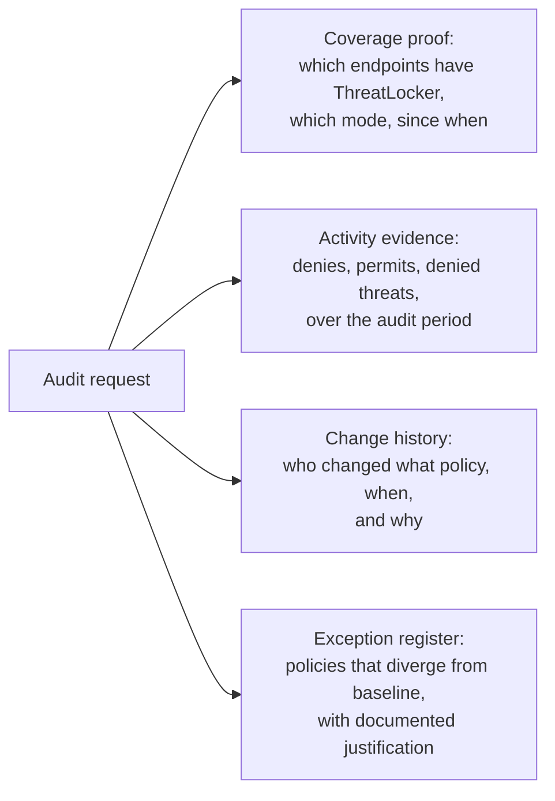

ThreatLocker is a control that maps cleanly to several common compliance frameworks. Customers ask for evidence of those mappings. This lesson is how to produce that evidence cleanly, and what to keep documented so audits don't turn into archeology.

## What ThreatLocker covers in common frameworks

| Framework | Control area | What ThreatLocker provides |
|---|---|---|
| **Essential Eight (Australian)** | Application control | Allowlisting (default-deny) plus ringfencing |
| Essential Eight | User application hardening | Ringfencing of browsers and Office, blocked spawn of script interpreters |
| Essential Eight | Restrict admin privileges | Elevation Control with per-app, time-bounded admin |
| Essential Eight | Microsoft Office macro settings | Ringfencing of Office combined with Configuration Manager controls |
| **NIST 800-171** | 3.1.5 Principle of least privilege | Elevation Control |
| NIST 800-171 | 3.4.1 Configuration management | Application Control + the System Audit |
| NIST 800-171 | 3.4.6 Least functionality | Default-deny allowlisting |
| NIST 800-171 | 3.13.16 Protection of CUI on devices | Storage Control |
| **CIS Controls v8** | Control 2 (Inventory of Software Assets) | Application list per organisation |
| CIS Controls v8 | Control 4 (Secure Configuration) | Configuration Manager + Application Control |
| CIS Controls v8 | Control 10 (Malware defenses) | Allowlisting + Ringfencing + Detect |
| **Cyber-insurance questionnaires** | "Do you enforce application allowlisting on endpoints?" | Yes, ThreatLocker, with monthly evidence |

The mapping above is a defensible reading; it's not an official certification from any framework body. When a customer needs formal mapping for an auditor, the MSP supplies the evidence and the auditor maps it to the framework. Don't over-claim certification language.

## The four artefacts an audit asks for

### 1. Coverage proof

The Health Center plus the Devices page show:

- Total endpoints with the ThreatLocker agent
- Their current state (Secured by default, or one of the Maintenance Modes when in maintenance)
- Last check-in time
- Agent version

**Secured is the default protected state**, what an endpoint sits in when no Maintenance Mode is active. The Maintenance Modes (per `portalapimaintenancemode`) are Monitor Only, Installation, Learning, Elevation, Tamper Protection Disabled, Isolation, and Lockdown. Don't list Secured alongside them in audit evidence; it's the absence of Maintenance, not one of its values.

For an audit covering a period (say, the last quarter), screenshot or export the Devices listing showing every machine in Secured Mode for that period, plus any exceptions (endpoints that spent time in Tamper Protection Disabled, Installation, etc.) with documented justification.

### 2. Activity evidence

The Unified Audit's CSV export (`exportMode: true` on the API) is the bulk activity dump. For a typical audit:

- Filter to the audit period
- Filter to True denies (`onlyTrueDenies: true`)
- Group by Application Name and Action Type for the summary
- Provide the full row-level export as the underlying evidence

The summary-plus-rows pattern is what auditors prefer; raw exports without summaries are unactionable, summaries without underlying rows are unverifiable.

### 3. Change history

Two sources cover the change history:

- **System Audit (`portalAPI/SystemAudit/*`)**: every administrative action with username, IP, action type (Create / Delete / Logon / Modify / Read), the affected ObjectId, and the human-readable description.
- **Policy `ticketInfo` and notes fields**: what business reason attaches to each policy change.

For an audit, the export of System Audit rows for the period plus a review of the policy change log answers "who changed what, when, and why."

### 4. Exception register

For every customer, maintain a register of policies that intentionally diverge from the baseline. Each entry:

- Policy name and scope
- What it does
- Why the customer needed it (ticket reference, business justification)
- Who approved the divergence (MSP senior + customer authorisation)
- Review date

The register is what proves divergences are deliberate, not drift. Without it, an auditor sees "policy X exists, baseline says Y, what's going on" and has no answer.

## Cyber-insurance questionnaires

Insurers commonly ask:

- "Do you enforce application allowlisting on all endpoints?"
- "Do you restrict local-administrator rights?"
- "Do you control removable media?"
- "Do you have 24/7 monitoring with documented response procedures?"

For a customer running ThreatLocker (with Cyber Hero or equivalent), the answers are yes, but the supporting evidence is what insurers verify. Be ready with:

- Coverage proof for the period the policy covers
- Evidence of recent activity (the monthly summaries already produced for the customer)
- The escalation matrix and runbook for response
- Records of any incident handled (anonymised summaries are fine for the questionnaire; full details available on request)

## A worked audit pull: Able Moose Group

A UK sub-firm's audit-prep request: "Provide evidence of application control across our 142 UK endpoints for the last 12 months."

<StepThrough client:load>
  <Step title="Coverage">
    Devices page filtered to UK sub-firm: 142 endpoints, 140 in Secured Mode, 2 in Tamper-Protection-Disabled with documented justification (server upgrades). Export as CSV.
  </Step>
  <Step title="Activity summary">
    Unified Audit, last 12 months, True denies only, group by Application Name + Action Type. 1,847 unique blocked applications, 6,300 individual deny events. Top categories: untrusted utilities (43%), unsigned PowerShell scripts (18%), unsanctioned consumer SaaS (14%). Export the summary plus the full row-level CSV.
  </Step>
  <Step title="Change history">
    System Audit export for the period: 89 policy modifications, all with named MSP technician users, with ticket references. Policy notes show business justification for each. Provide as a separate CSV plus a 1-page summary of major changes.
  </Step>
  <Step title="Exception register">
    Customer-specific register: 7 policies diverging from baseline, each with ticket reference and customer sign-off. Provided as a structured document.
  </Step>
  <Step title="Hand off to the auditor">
    Bundle: 4 CSVs, 2 summary PDFs, the exception register. The auditor maps these to the framework's controls; the MSP doesn't claim the certification on the customer's behalf.
  </Step>
</StepThrough>

<Checkpoint slug="threatlocker-l3-checkpoint-compliance" client:load />

## What this is NOT

- **Not "Essential Eight in a box".** ThreatLocker is one of the eight (Application Control), plus partial coverage of two others (User Application Hardening, Restrict Admin Privileges). Frameworks like NIST, ISO 27001, and SOC 2 cover much more, network segmentation, identity, change management, training, BCP. Don't let a salesperson tell a customer otherwise.
- **Not free in tech time.** Quarterly compliance pulls take real hours per customer. Build them into the MSP contract as a billed line item or a clear service-level deliverable; "we'll just pull the reports" erodes margin fast.

<Callout type="info" title="Sources">
[Unified Audit / portalAPI ActionLog (export)](https://threatlocker.kb.help/unified-audit-portalapiactionlog/), [System Audit (administrative action history)](https://threatlocker.kb.help/portalapisystemaudit/), [Module options on the Organizations page](https://threatlocker.kb.help/understanding-and-changing-the-module-options-on-the-organizations-page/), [Computer API for coverage](https://threatlocker.kb.help/portalapicomputer/).
</Callout>
