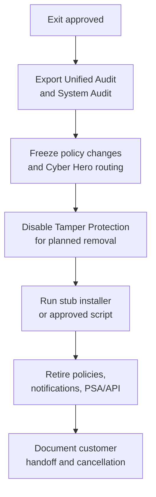

ThreatLocker offboarding has one rule that saves hours: preserve evidence before you remove the control. After the agent is gone, you lose the cleanest path to prove what it blocked, who changed policy, and why an exception existed.

## The exit sequence

## Endpoint offboarding

<StepThrough client:load>
  <Step title="Confirm the reason">
    Record whether the endpoint is retiring, moving to another org, leaving the customer, or being rebuilt. Do not uninstall ThreatLocker to troubleshoot a live issue; contact Cyber Heroes or use the normal maintenance workflow.
  </Step>
  <Step title="Export endpoint evidence">
    Pull the relevant Unified Audit rows and any System Audit entries tied to recent policy changes. Attach them to the PSA ticket before removal.
  </Step>
  <Step title="Disable Tamper Protection for the target computer" image="/img/threatlocker/maintenance-tab.png" imageAlt="Computer card for DESKTOP-1GHLFA1 (Windows 10 Pro) with a red Tamper Protection Disabled pill below the hostname">
    In the Devices page, open the Computer Details panel, Maintenance tab, and schedule Disable Tamper Protection. ThreatLocker cannot be stopped or uninstalled while Tamper Protection is enabled. The endpoint card shows the red `Tamper Protection Disabled` pill once the maintenance window opens; that's the visual confirmation you need before running the uninstall.
  </Step>
  <Step title="Run the uninstall method">
    From an elevated Command Prompt: `ThreatLockerStubX64.exe uninstall`. The Stub Installer is the primary uninstall path; match x64 or x86 to the endpoint. ARM devices use the x64 Stub or MSI. Vendor docs flag this as the supported route, anything else is "approved uninstall script" territory and needs a ticket reference.
  </Step>
  <Step title="Verify cleanup">
    Confirm the service is gone, the device no longer reports, and the PSA asset or RMM record reflects the change. If the device will be rebuilt, confirm the deployment automation will not reinstall it into the wrong organization.
  </Step>
</StepThrough>

## Customer-exit cleanup

| Surface | Cleanup task | Proof |
|---|---|---|
| **Policies and baselines** | Mark customer-specific policies retired; remove them from template copy paths. | Exception register updated. |
| **Cyber Hero / notifications** | Remove request notifications, routing addresses, and customer-specific escalation paths. | Test request no longer routes to the old queue. |
| **PSA / ticket workflow** | Disable webhooks, ticket mappings, and customer-specific queues. | PSA integration view or ticket rule export. |
| **API credentials** | Revoke or rotate keys used for that customer. | Secret store and API credential record match. |
| **Audit evidence** | Export Unified Audit and System Audit for the agreed window. | Stored exports and summary in the PSA ticket. |
| **Customer cancellation** | Hand billing and contract closure to the account owner. | Approval note with effective date. |

## Stale policy cleanup

After endpoint removal, look for policies that only existed for the departing customer:

1. Customer-specific applications, file paths, storage devices, and elevation rules.
2. Ringfences that copied into a shared baseline during troubleshooting.
3. Temporary policies with expired business reasons.
4. Cyber Hero request routes that still name the customer.

Do not delete shared baselines during the exit. Remove customer-specific attachments first, then review the baseline with the normal governance process.

## What this is NOT

- **Not a troubleshooting fix.** Vendor docs are explicit: uninstalling is not the path for live issues. It also burns the diagnostic context, the Unified Audit and System Audit rows that would have explained what was happening.
- **Not just Tamper Protection.** Disabling Tamper Protection *enables* removal; it doesn't perform the removal. The Stub Installer (or an approved uninstall script) is still the next step. Walking away after toggling Tamper Protection leaves the agent installed and now unprotected.

<Checkpoint slug="threatlocker-l3-checkpoint-offboarding" client:load />

<Callout type="info" title="Sources">
[Uninstalling the ThreatLocker Agent](https://threatlocker.kb.help/uninstalling-the-threatlocker-agent/), [Disable Tamper Protection](https://threatlocker.kb.help/disable-tamper-protection/), [Notifications for Requests](https://threatlocker.kb.help/notifications-for-requests/), [Unified Audit](https://threatlocker.kb.help/unified-audit-portalapiactionlog/), [System Audit](https://threatlocker.kb.help/portalapisystemaudit/).
</Callout>
