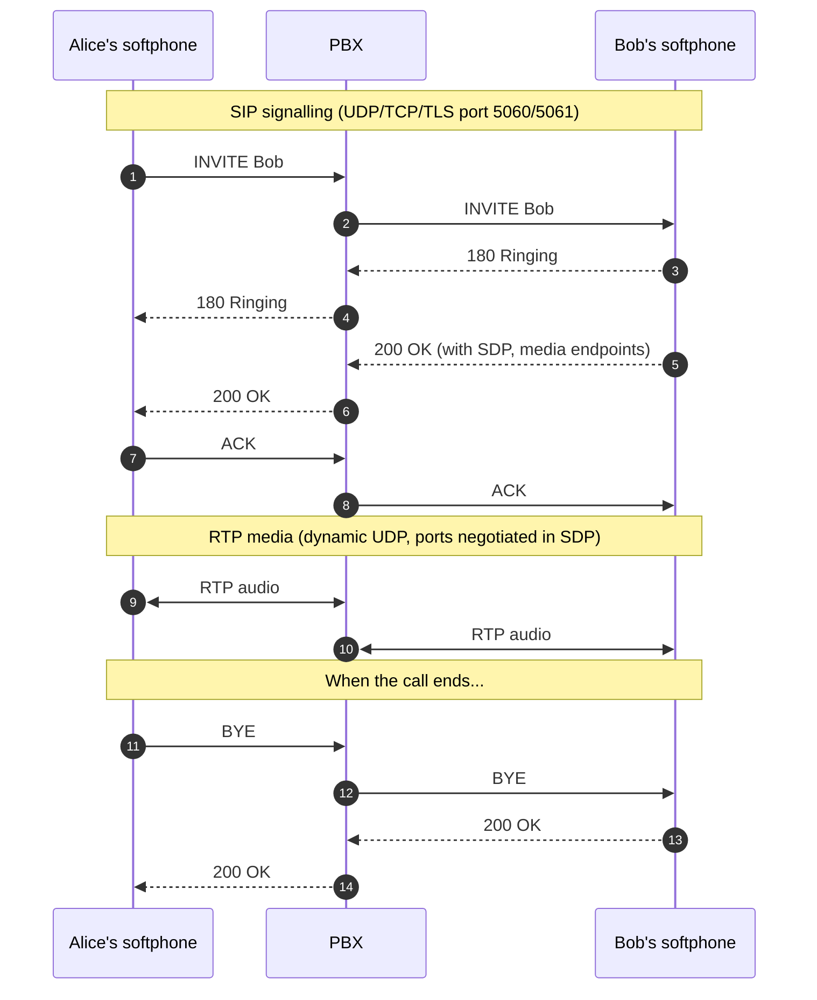

A voice call is not one thing on the wire. It's two: a control conversation, and an audio stream. They use different protocols, different ports, and often different network paths through the customer's firewall. The most important fact in this whole course is **the two can succeed or fail independently**.

## The two streams

The control conversation is **SIP** (Session Initiation Protocol, RFC 3261). It runs over UDP, TCP, or TLS, typically on port 5060 (or 5061 for TLS). SIP messages set up the call ("here's who I want to talk to", "I'm ringing", "I picked up", "I'm done"), and they describe the audio channel that's about to open. SIP itself never carries voice.

The audio is **RTP** (Real-time Transport Protocol, RFC 3550). It runs over UDP on dynamic high ports negotiated during the SIP handshake. Each direction is its own RTP stream. Once SIP has done its bit, RTP packets fly between the endpoints at typically one packet every 20 milliseconds (50 packets per second per direction).

## Why this matters for triage

Because SIP is on a fixed well-known port and RTP is on a dynamic range, they have **different firewall and NAT behaviour**. SIP usually gets a stable rule in the customer's firewall. RTP needs a wide range of UDP ports allowed out, which a tighter firewall might not have.

The failure modes that follow:

- **Phone rings, you answer, no audio.** SIP succeeded all the way (call set up). RTP didn't make it (audio path blocked). This is the classic NAT/firewall problem.
- **One side hears the other but not vice versa.** SIP succeeded. RTP succeeded *one way*. The route or NAT rule is asymmetric.
- **Can't register at all.** SIP failed even before media negotiation. Auth, transport, or firewall problem on the SIP side.
- **Call rings, you pick up, both sides hear each other, but call disconnects after 30 minutes.** SIP and RTP both worked initially. Something on the SIP side intervened later, usually session timers or a stateful firewall ageing out a UDP binding.

A tech who treats VoIP as one stream blames "the phone system" for all four. A tech who knows it's two streams asks one extra question and goes to the right place.

## Alice → PBX → Bob, step by step

Walk the diagram once more, with intent:

1. Alice's softphone sends an `INVITE` to the PBX.
2. The PBX consults its inbound/outbound routes and decides to send the call to Bob's extension (also registered to the PBX).
3. The PBX relays the INVITE onward to Bob's softphone.
4. Bob's softphone rings; it sends `180 Ringing` back to the PBX.
5. The PBX forwards `180 Ringing` to Alice (her client plays a ringing tone or its own visual ring).
6. Bob picks up. His softphone sends `200 OK` with an **SDP body** (more on SDP in lesson 3) describing the codec he supports and the RTP port he's listening on.
7. The PBX relays `200 OK` to Alice. Alice's client picks the codec and reports its own RTP port (often a renegotiated SDP back through the PBX).
8. Alice sends `ACK` to close the 3-way handshake.
9. RTP starts flowing between the two endpoints (in a PBX-mediated call, both legs go via the PBX; the PBX is bridging media).
10. When the call ends, either side sends `BYE`, the other replies `200 OK`, and the RTP streams stop.

The PBX doesn't "make" the call. It mediates the SIP between the two endpoints and bridges the RTP audio. The endpoints think they're talking to each other; really both are talking to the PBX.

## What lives in SIP, what lives in RTP

| Concern | Lives in | Why |
|---|---|---|
| Who's calling whom | SIP | INVITE has From / To URIs. |
| Whether the call is set up correctly | SIP | Final response code (200, 4xx, 5xx, 6xx). |
| Audio quality | RTP | Packet loss, jitter, codec all show up here. |
| One-way audio | RTP path problem, even though SIP looks fine | Most often NAT / firewall asymmetric to the RTP port. |
| Call drops mid-call | Usually SIP | A BYE arrived, or session timers expired. |
| Authentication failure | SIP | 401 / 403 / 407 in the response. |
| Network jitter | RTP (RTCP reports it) | Quality is purely a media-path concern. |

The next lesson walks through what a real SIP handshake looks like message by message, so when you open any PBX's SIP trace viewer (or Wireshark on a packet capture) you know what you're reading.
