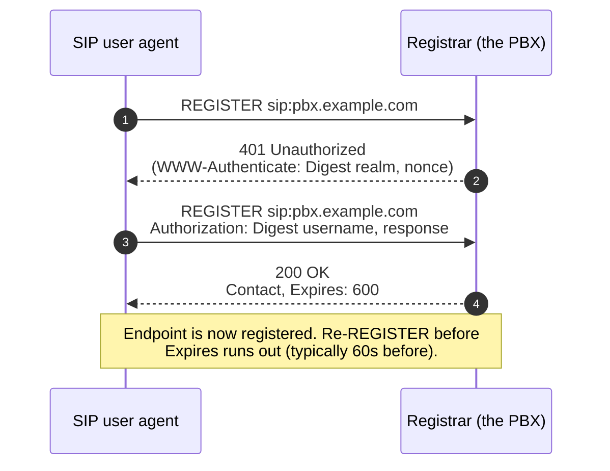

A SIP trace is a list of messages with timestamps. To read one you need the message structure, the two main transactions (REGISTER and INVITE), and the response code classes. Once you have those, every PBX vendor's trace screen looks the same and so does Wireshark.

## Anatomy of a SIP message

Two flavours: **requests** and **responses**.

A request starts with a method name (`REGISTER`, `INVITE`, `ACK`, `BYE`, `CANCEL`, `OPTIONS`, etc.) followed by a Request-URI. A response starts with `SIP/2.0` followed by a numeric code (200, 401, 486, 503...) and a reason phrase.

Both have headers. The ones you'll read constantly:

| Header | Purpose |
|---|---|
| `From` | The originator (often the caller's URI). |
| `To` | The target (the dialled number / extension URI). |
| `Call-ID` | A unique ID for the whole call. Persists across REGISTER / INVITE / BYE within one dialog. |
| `CSeq` | Sequence number + method. Ordering inside a dialog. |
| `Via` | Routing breadcrumb, one entry per proxy hop. Responses retrace this. |
| `Contact` | Where the UA wants future messages sent. For REGISTER, the address the registrar binds to the extension. |
| `Max-Forwards` | Hop count. Decrements through proxies; prevents loops. |
| `Content-Type` | If there's a body. For INVITE / 200, usually `application/sdp`. |
| `Expires` (in REGISTER 200) | How long the registration is valid before re-REGISTER is required. |

Bodies are optional. INVITE almost always has an SDP body (the codec + RTP port offer). 200 OK to an INVITE almost always has an SDP body (the answer). REGISTER has no body.

## REGISTER, putting an extension online

When a softphone client launches, it sends REGISTER to the PBX. The first one almost always fails on purpose, because the PBX wants to authenticate.



The two-step is the digest-auth challenge from RFC 3261 §22:

1. UA sends REGISTER with no Authorization header.
2. Registrar replies `401 Unauthorized` with a `WWW-Authenticate` header containing a realm and a nonce.
3. UA hashes its password with the nonce and sends a new REGISTER with an `Authorization: Digest` header.
4. Registrar verifies the digest; if it matches, replies `200 OK` with the `Contact` URI bound and an `Expires` value.

When REGISTER fails, it's almost always one of:

- **Wrong creds.** The 401 → 401 loop. After enough attempts most PBXs return 403 Forbidden and may temporarily block the source IP via their security rules.
- **Transport mismatch.** The endpoint is configured for TCP, the PBX SIP profile expects UDP, or vice versa. Trace shows the REGISTER arriving on the wrong transport (or not arriving at all).
- **NAT keepalive missing.** Behind a strict NAT, the binding between the endpoint and the PBX times out faster than the re-REGISTER. The endpoint disappears off the registered list between calls and re-appears noisily.

## INVITE, setting up a call

INVITE is the most-traced transaction. Three patterns to recognise:

### Pattern 1, the happy path

```
INVITE sip:5000@pbx.example.com SIP/2.0   <- caller wants to talk to ext 5000
SIP/2.0 100 Trying                         <- PBX acknowledges
SIP/2.0 180 Ringing                        <- extension 5000 is ringing
SIP/2.0 200 OK (SDP body)                  <- 5000 picked up
ACK sip:5000@pbx.example.com SIP/2.0       <- caller acknowledges
... RTP starts ...
BYE sip:5000@pbx.example.com SIP/2.0       <- someone hung up
SIP/2.0 200 OK                             <- the other side confirmed
```

100 Trying is provisional, just a "I got your INVITE, working on it." 180 Ringing tells the caller's client to play ringing. 200 OK with SDP body is "answered, here's where to send media." ACK closes the 3-way.

### Pattern 2, the call doesn't connect

```
INVITE sip:5000@pbx.example.com SIP/2.0
SIP/2.0 100 Trying
SIP/2.0 486 Busy Here
ACK sip:5000@pbx.example.com SIP/2.0
```

486 = busy. Other common non-success codes: 404 (extension doesn't exist), 480 (temporarily unavailable, e.g. DND), 408 (request timeout), 503 (service unavailable, often a trunk gone bad).

### Pattern 3, the early hangup

```
INVITE sip:5000@pbx.example.com SIP/2.0
SIP/2.0 100 Trying
SIP/2.0 180 Ringing
CANCEL sip:5000@pbx.example.com SIP/2.0   <- caller hung up before answer
SIP/2.0 200 OK (to CANCEL)
SIP/2.0 487 Request Terminated (to INVITE)
ACK sip:5000@pbx.example.com SIP/2.0
```

CANCEL is the right way to abandon a ringing INVITE. 487 confirms the INVITE was terminated. You'll see this constantly; not a problem.

## Response code classes

Memorise the five classes; you'll deduce specifics from context:

| Class | Meaning | Common examples |
|---|---|---|
| **1xx** | Provisional / progress. The transaction is alive but not finalised. | 100 Trying, 180 Ringing, 183 Session Progress |
| **2xx** | Success. | 200 OK |
| **3xx** | Redirection. The target has moved or the call should go elsewhere. | 302 Moved Temporarily (some PBXs use this for external forwarding scenarios) |
| **4xx** | Client error. The request was bad, or the called party isn't available. | 401, 403, 404, 408, 480, 486, 487 |
| **5xx** | Server error. The receiving server failed. | 500 Server Internal Error, 503 Service Unavailable |
| **6xx** | Global failure. The request fails *everywhere*, don't retry elsewhere. | 603 Decline (rare; some carriers use it) |

Two rules of thumb when staring at a trace: a 4xx code means *the called side* said no for a specific reason; a 5xx means *infrastructure* failed. A 6xx means no point retrying.

<Checkpoint slug="voip-fundamentals-checkpoint-handshake" client:visible />

## What the trace doesn't show you

SIP signalling tells you whether the call was set up, by whom, and why it ended. It tells you nothing about the audio. For "the call connected but I couldn't hear anything", SIP is innocent. RTP is the next lesson.
