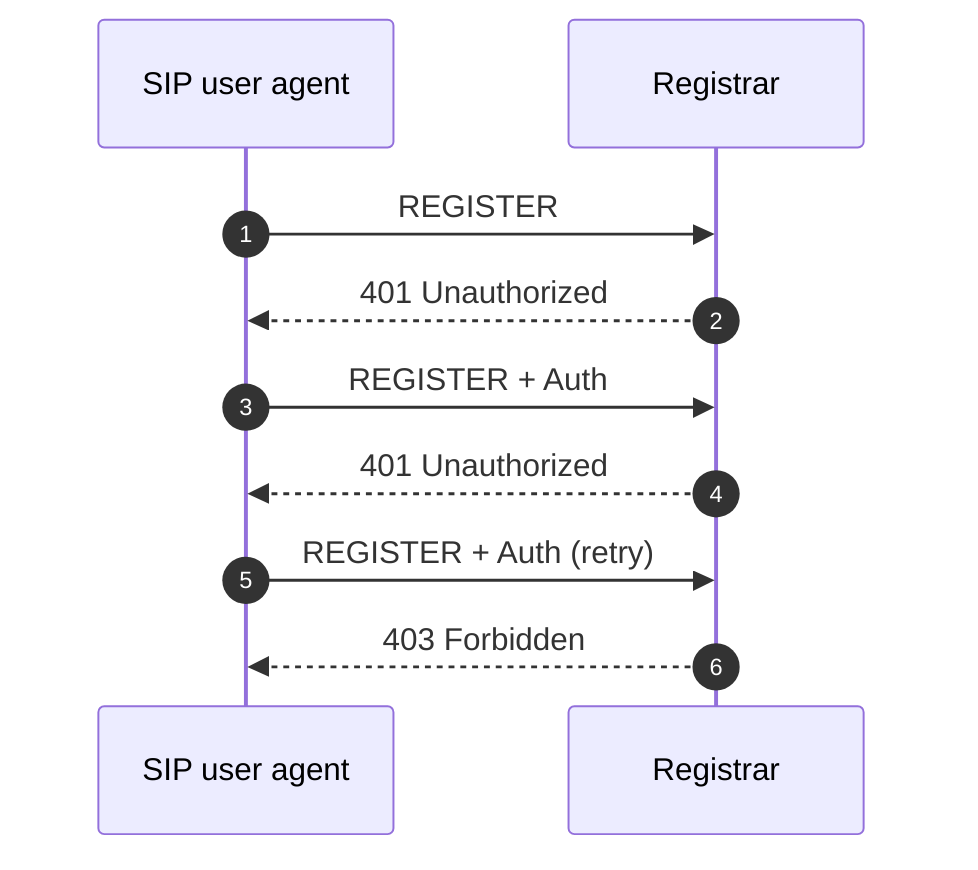
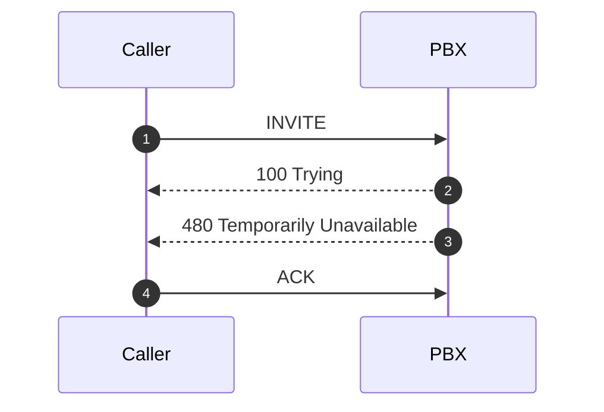
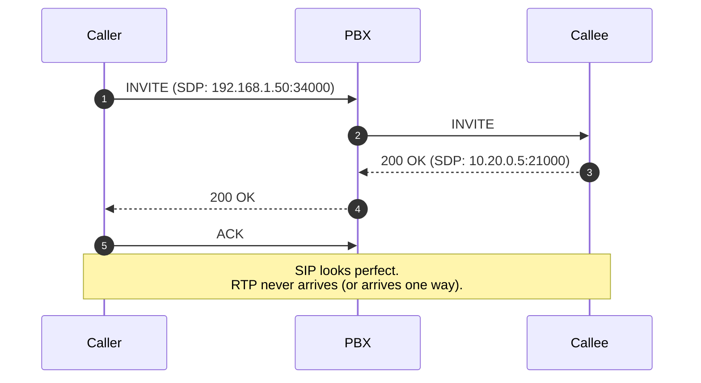

A SIP trace is a vertical timeline of messages with timestamps. Reading one is pattern-matching: there are four shapes that cover most field tickets, and once you recognise the shape, the diagnostic path follows quickly.

## Where the trace comes from

Almost every modern PBX has a built-in SIP trace and packet-capture feature. The menu's called something different per vendor (Maintenance, Diagnostics, Troubleshooting, Logging, Activity Log, Packet Capture, pjsip CLI), but the capability is universal. Open the admin portal, find the diagnostics or troubleshooting section, look for "SIP trace" or "PCAP" or "packet capture".

When the PBX-side capture isn't enough (or the issue is on the LAN between the endpoint and the PBX), the universal tool is **Wireshark** on a packet capture from a span port or a host. Wireshark's `Telephony → SIP Flows` view draws ladder diagrams from any captured pcap; `Telephony → RTP Streams` summarises media stats. Wireshark works on captures from any PBX or endpoint, so once you can read its views you can diagnose any voice system.

## How to capture sensibly

Whichever tool you use, the general rules:

```
Start the capture
  Filter by:  extension / trunk / called number / time window
Reproduce the symptom
Stop the capture
Download or read the ladder diagram
```

Don't run an unfiltered trace on a busy PBX longer than the time it takes to reproduce the problem; you'll capture every call in flight and the result is too big to read. **Always filter** to the user, trunk, or number that's failing.

## What you're looking at

A SIP trace is a vertical timeline of messages, each tagged with timestamp, source IP/port, destination IP/port, and message summary. The ladder diagram view is easier to read for one specific call; the raw list view is necessary when you don't yet know which call you're chasing.

Pattern-match against four shapes:

## Shape 1, registration loop



Two 401s in a row mean the password digest didn't match. After a few tries most PBXs return 403 and (if security rules are configured) auto-block the source IP for some minutes.

What to check:

- Extension password actually matches what the client is using. If the customer recently rotated extension creds, every endpoint needs to update.
- The client is talking to the right server URL. After a PBX URL migration, old client installs may still point at the old URL and hammer it forever.
- SIP transport is right. If the extension is configured for TLS only and the client is offering UDP, the registration never reaches the auth stage cleanly.

## Shape 2, INVITE → 4xx (call doesn't connect)



The 4xx code tells you why:

| Code | Meaning | Common cause |
|---|---|---|
| 403 Forbidden | Policy denied | Outbound route forbids this destination; user role forbids the call. |
| 404 Not Found | Extension or number doesn't exist | Typo, deleted extension, wrong inbound route. |
| 408 Request Timeout | No response in time | Onward trunk down, or PBX waited too long for the called endpoint. |
| 480 Temporarily Unavailable | Extension can't take the call | DND, presence rule, all clients offline. |
| 486 Busy Here | Already on a call (and follow-me not set) | Normal busy. |
| 487 Request Terminated | INVITE was CANCELled | Caller hung up before answer. |
| 503 Service Unavailable | Trunk problem | Carrier rejecting the leg, often "no more sessions" or "auth failed". |

## Shape 3, INVITE → 2xx but no audio



This is the one that bites. The trace looks normal until you realise the customer is on the call with nothing to hear. **Look at the SDP bodies.** They contain `c=` (connection address, an IP) and `m=audio` (the port). If the IP in SDP is a private address that's not routable to the other side, or the port is firewalled, RTP can't flow.

When this shape lands, escalate to packet-capture diagnostics (covered in the intermediate and advanced courses) or check the simple things first:

- **Was the call between two endpoints on the same network?** If so, NAT isn't the cause; check codec mismatch.
- **Is one endpoint behind NAT and the trunk on the public Internet?** The SDP might be advertising private addresses. Most PBXs have a NAT setting per SIP profile; verify it's right.
- **SIP ALG on the customer's router.** Disable it. SIP ALGs corrupt SDP more often than they help.

## Shape 4, mid-call BYE

```mermaid
sequenceDiagram
    autonumber
    participant C as Caller
    participant P as PBX
    participant B as Callee
    C->>P: INVITE
    P->>B: INVITE
    B-->>P: 200 OK
    P-->>C: 200 OK
    C->>P: ACK
    Note over C,B: ... 8 minutes of audio ...
    P->>C: BYE (Reason: Q.850;cause=16)
    P->>B: BYE (Reason: Q.850;cause=16)
    C-->>P: 200 OK
    B-->>P: 200 OK
```

Who sent the BYE, and why? The trace tells you. Common patterns:

- **Reason: timer; reason=timeout** — RFC 4028 session timer expired because the refresh INVITE didn't happen. Either endpoint silently dropped or a stateful middlebox blocked the refresh.
- **BYE from the trunk side** — carrier hung up. Look at the carrier's reason header.
- **BYE from the PBX during a transfer** — normal; the PBX legitimately tears down one leg during attended transfer.
- **No reason header, just a BYE** — endpoint hung up cleanly. Look at the endpoint logs for the why.

<Checkpoint slug="voip-fundamentals-checkpoint-trace" client:visible />

## Two practical habits

- **Capture short, filtered windows.** A 5-minute trace filtered to one extension is twenty times easier to read than a 30-second trace on the whole PBX.
- **Match the shape first, then the details.** Identifying which of the four shapes you're looking at narrows the next question fast.

The last lesson in the course flips the question: given a customer-reported symptom (no audio, choppy, can't register, mid-call drop), what's the right place to start looking?
