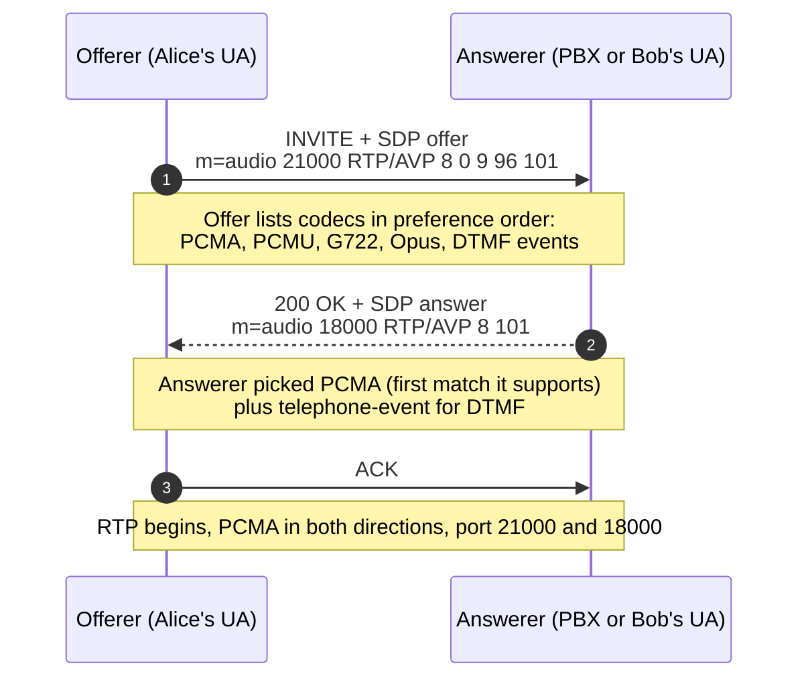

When a call connects but the audio is wrong (missing in one direction, scrambled, IVR doesn't hear keypresses), the answer almost always lives in the SDP bodies of the INVITE and the 200 OK. The fundamentals course skimmed over SDP. This lesson reads it line by line and walks through the offer/answer mechanics from RFC 3264.

## Where SDP lives inside a SIP message

The SDP body sits below the SIP headers, separated by a blank line. The `Content-Type: application/sdp` header tells you it's there. Both INVITE and 200 OK carry SDP for an answered call: INVITE has the offer, 200 OK has the answer.

```
INVITE sip:5000@pbx.example.com SIP/2.0
Via: SIP/2.0/UDP 198.51.100.20:5060;branch=z9hG4bK...
From: <sip:1001@example.com>;tag=abcd
To: <sip:5000@pbx.example.com>
Call-ID: 8f2a@198.51.100.20
CSeq: 1 INVITE
Contact: <sip:1001@198.51.100.20:5060>
Content-Type: application/sdp
Content-Length: 312

v=0
o=alice 2890844526 2890844526 IN IP4 198.51.100.20
s=-
c=IN IP4 198.51.100.20
t=0 0
m=audio 21000 RTP/AVP 8 0 9 96 101
a=rtpmap:8 PCMA/8000
a=rtpmap:0 PCMU/8000
a=rtpmap:9 G722/8000
a=rtpmap:96 opus/48000/2
a=rtpmap:101 telephone-event/8000
a=fmtp:101 0-16
a=ptime:20
a=sendrecv
```

That body is what RFC 4566 defines. Every line is a key=value pair on a single line; the order matters (session-level lines first, then one or more media-level blocks).

## Line-by-line, the ones you actually read

| Line | Purpose | What you check |
|---|---|---|
| `v=0` | SDP version. Always 0. | Nothing to check. |
| `o=...` | Origin: username, session-id, version, network type, address type, source IP | The source IP. If this is a private RFC 1918 address but the call traverses the Internet, NAT handling is wrong. |
| `s=-` | Session name. `-` for SIP-negotiated calls. | Nothing to check. |
| `c=IN IP4 198.51.100.20` | Connection address: where RTP should be sent. | The IP again. The PBX or far endpoint will send RTP here. If it's private and not routable to the answerer, RTP won't arrive. |
| `t=0 0` | Time, indefinite. | Nothing to check. |
| `m=audio 21000 RTP/AVP 8 0 9 96 101` | Media line: audio, port 21000, profile RTP/AVP, codecs in priority order. | The port (the local RTP port for this leg). The list of payload types (the offerer's preference order). |
| `a=rtpmap:N codec/rate[/channels]` | Maps payload type N to a codec name and sample rate. | The codecs offered. |
| `a=ptime:20` | Packet time, milliseconds per packet. | 20 is typical for narrowband. |
| `a=sendrecv` | Direction. Other values: `sendonly`, `recvonly`, `inactive`. | If the call's on hold, one side will be `sendonly` and the other `recvonly`. |
| `a=fmtp:N params` | Format-specific parameters for codec N. | DTMF event range for telephone-event; bandwidth and channels for Opus; etc. |

Two lines do the lion's share of diagnostic work: `c=` (where to send media) and `m=audio` (which codecs are in play).

## The offer/answer mechanics

Codec negotiation in SIP is RFC 3264. Three steps:



The answerer picks **one** codec from the offer (plus telephone-event if both offered it). The chosen codec is whatever the answerer supports highest in the offerer's priority list, by convention; carriers and PBXes pick policy here, so don't assume it's strictly the first match.

If no codec in the offer is supported, the answerer returns **488 Not Acceptable Here**. The trace looks like a normal failure but the cause is a codec mismatch, not a routing or auth problem.

## The codec catalogue, in negotiation terms

The fundamentals course introduced these. The intermediate angle is what each one looks like in SDP and what trade-offs it forces.

| Codec | Payload type | Bitrate / band | Typical SDP line | Notes |
|---|---|---|---|---|
| **G.711a (PCMA)** | 8 (fixed) | 64 kbps narrowband | `a=rtpmap:8 PCMA/8000` | EU/AU default. Always available. |
| **G.711u (PCMU)** | 0 (fixed) | 64 kbps narrowband | `a=rtpmap:0 PCMU/8000` | NA default. Always available. |
| **G.722** | 9 (fixed) | 64 kbps wideband | `a=rtpmap:9 G722/8000` | Same bandwidth as G.711, much better quality. Most modern endpoints. |
| **Opus** | dynamic (96+) | 6-510 kbps | `a=rtpmap:96 opus/48000/2` | Often offered first by softphones. Carriers rarely accept it on the trunk; transcoding usually needed. |
| **G.729** | 18 (fixed) | 8 kbps narrowband | `a=rtpmap:18 G729/8000` | Legacy low-bandwidth. Still on some old carrier trunks. |

Payload types 0-95 are reserved (mostly fixed). 96 and above are dynamic; both sides must agree via `a=rtpmap` what each number means.

A typical mismatch story: the softphone offers Opus, G.722, then G.711. The carrier trunk supports G.711 only. The PBX has to either (a) transcode (CPU cost, slight quality hit) or (b) restrict the offered codecs on the trunk side. Either is configurable per trunk; what you can't do is ignore it.

<Callout type="warn" title="Opus on a carrier trunk almost never works directly">
Most SIP carriers terminate to TDM (the legacy phone network) and only accept G.711. If your softphone is doing Opus end-to-end, that's a softphone-to-PBX or softphone-to-softphone leg. Anything that goes out via the carrier trunk will transcode or fail.
</Callout>

## DTMF: telephone-event is the third codec

A payload type that isn't audio but lives in the same RTP stream: `101 telephone-event` (RFC 4733). When the user presses 5 on the keypad, the endpoint sends an RTP packet with payload type 101 and a body that encodes the event (event 5, duration, volume). The receiver passes the event to the call-handling logic.

In the offer SDP above, `101` is listed in `m=audio` alongside the audio codecs, and `a=fmtp:101 0-16` says "events 0 through 16 are supported" (0-9 for digits, 10 for `*`, 11 for `#`, 12-15 for A-D, 16 for the flash hook). Both sides need to advertise telephone-event for RFC 4733 DTMF to work.

The three DTMF transport modes from the source note:

- **RFC 4733 telephone-event** (the standard). Carried as RTP payload type 101.
- **Inband**. The DTMF tone literally plays as audio in the RTP stream. Works on G.711 but degraded codecs (Opus, G.729) corrupt the tone shapes.
- **SIP INFO**. Carried as a SIP INFO message, not RTP. Reliable but support varies.

If both sides agree on telephone-event, IVRs work. If one is sending telephone-event and the other expects inband, the IVR hears nothing.

<Callout type="info" title="Reading DTMF capability from SDP">
The presence of `a=rtpmap:101 telephone-event/8000` plus `a=fmtp:101 0-16` in both the offer and answer is what you want. If either side omits payload type 101, RFC 4733 isn't negotiated and DTMF won't traverse RTP.
</Callout>

## Reading SDP to diagnose the classic mistakes

### "Connected, no audio"

Open the SDP in 200 OK. Read `c=`. If it's a private RFC 1918 address (10.x, 172.16-31.x, 192.168.x) and the offerer is somewhere on the public Internet, the offerer's RTP will go to a private address that doesn't reach. Either the answerer is behind NAT and the PBX hasn't rewritten the SDP, or the answerer's SIP profile thinks it's on a public IP and isn't.

Fix is on the answerer side: NAT handling on that SIP profile, or set the external IP/hostname so the PBX rewrites the SDP correctly.

### "IVR can't hear my keypresses"

Read the `m=audio` line and any `a=rtpmap:101` line on both sides. If only one side advertises telephone-event, that side is doing RFC 4733 and the other is expecting inband or SIP INFO. Fix on the PBX trunk config: align the DTMF mode for that trunk.

### "488 Not Acceptable Here"

The trace shows INVITE → 488 with no other failure. The answerer rejected because no overlap in the codec lists. Compare the `m=audio` lines: offerer's list vs the codecs the answerer supports. Add a codec to the trunk's allowed list, or restrict the offerer to codecs the trunk will accept.

<Checkpoint slug="voip-sip-in-practice-checkpoint-sdp" client:visible />

## What this is NOT

- **Not a complete SDP reference.** RFC 4566 has many more attribute lines (`a=group:BUNDLE`, ICE candidates, fingerprints, etc.) for video, screen-share, and WebRTC. This lesson is the audio-trunk subset.
- **Not codec selection guidance.** Choosing which codecs a customer offers is a design decision driven by their bandwidth, their carrier, and their endpoints. The next lesson covers the trunk-side mechanics; this one is the protocol.
- **Not encryption.** SRTP and DTLS-SRTP have their own SDP attributes (`a=crypto`, `a=fingerprint`); the advanced course covers those.

## Sources

RFC 4566 (SDP), RFC 3264 (offer/answer), RFC 4733 (DTMF over RTP), RFC 3550 (RTP).
