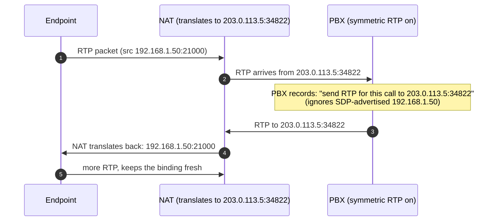
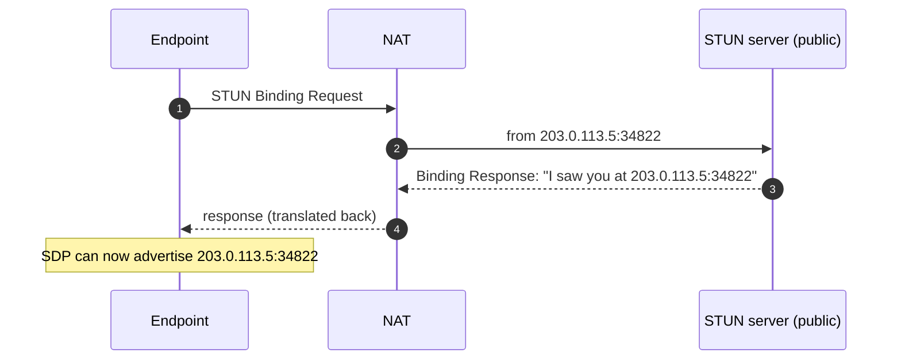

A SIP INVITE carries SDP that advertises an IP address and port where the offerer wants to receive RTP. If that IP is private (10.x, 172.16-31.x, 192.168.x), the far end can't route to it. The call connects on SIP; the audio never arrives. That's NAT, and it's the single most common cause of "rings and connects, no audio" in the field.

This lesson covers the four mechanisms voice systems use to work around NAT, the configuration knobs you'll set on a PBX or endpoint, and the one router feature you should turn off immediately.

## Why NAT and SIP fight

```mermaid
sequenceDiagram
    autonumber
    participant E as Endpoint (192.168.1.50)
    participant N as Customer NAT (203.0.113.5)
    participant P as PBX (public Internet)
    E->>N: SDP body: "send RTP to 192.168.1.50:21000"
    N->>P: INVITE forwarded (source IP rewritten to 203.0.113.5)<br/>BUT SDP body unchanged: still says 192.168.1.50:21000
    Note over P: PBX reads SDP, prepares to send RTP to 192.168.1.50:21000.<br/>That's a private address; can't route.
    P--xN: RTP never arrives
    Note over E: Caller hears silence
```

The SDP body is application-layer data inside the SIP message. The NAT box rewrites the IP header of the SIP packet but does nothing to the payload. The endpoint advertises its private IP because that's the IP it knows about; the NAT doesn't tell it the public one. RTP then targets the private IP and never arrives.

Four ways to fix this. They're not mutually exclusive; PBX configs commonly stack symmetric RTP plus a NAT-aware Contact rewrite plus keepalive.

## Symmetric RTP, the cheapest fix

The receiving side (PBX or SBC) ignores the SDP-advertised RTP address and instead sends RTP back to wherever the inbound RTP arrived from. The endpoint's first outbound RTP packet teaches the PBX the right public IP and port; the PBX then sends its RTP to that learned address.



This works because the endpoint sends RTP first (the offerer expects to send and receive). The NAT picks an external port for that flow and now has a binding `203.0.113.5:34822 ↔ 192.168.1.50:21000`. As long as one side keeps sending, the binding stays open.

Most PBXes call this **"NAT"** or **"Symmetric RTP"** or **"rtp_symmetric"** in trunk/extension configuration. RFC 3581's `;rport` parameter does the equivalent for SIP signalling: the receiver uses the source IP/port of the request, not the Via header, for sending back responses.

**Limitation**: symmetric RTP only works when the endpoint sends first. If the call is one-way and the endpoint receives first (rare for voice but happens with announcements / hold music from the PBX), the PBX has no learned address and sends to the SDP-advertised private IP. Combine with NAT-aware SDP rewrite on the endpoint side to be safe.

## STUN, TURN, ICE: the WebRTC family

The three mechanisms WebRTC clients use, and increasingly SIP softphones too.

### STUN (RFC 8489)

Session Traversal Utilities for NAT. The endpoint asks an external STUN server "what IP and port do you see me from?" The STUN server replies with what it sees in the IP header. The endpoint puts THAT address in the SDP `c=` and `m=` lines instead of its own private address.



STUN works for most NAT types. It doesn't work for **symmetric NAT**, where the NAT picks a different external port for each destination IP. The address STUN reports is the one used to talk to the STUN server; talking to the far endpoint gets a different translation.

### TURN (RFC 8656)

Traversal Using Relays around NAT. When STUN can't establish a direct path, the endpoint relays media through a public TURN server. The far endpoint sees the TURN server as the source; the TURN server forwards to the real endpoint.

Always works. Costs bandwidth and adds latency (one extra hop). Used when STUN fails and a direct path can't be found.

### ICE (RFC 8445)

Interactive Connectivity Establishment. The endpoint gathers **candidate** addresses (its host IPs, the STUN-reflexive address, the TURN-relayed address) and lists all of them in the SDP. The two sides do connectivity checks against each candidate pair to find the best working path, preferring direct (host) over reflexive (STUN) over relayed (TURN).

ICE is overkill for a typical SIP-on-LAN deployment. It's what WebRTC apps use because they can't assume any specific NAT topology. Some SIP softphones implement ICE; many don't.

| Mechanism | When to use | Cost |
|---|---|---|
| Symmetric RTP | PBX/SBC config; most SIP deployments. | None; just a setting. |
| STUN | Endpoint discovers its own public IP. Doesn't help with symmetric NAT. | Requires a STUN server (public ones are free). |
| TURN | Worst-case: nothing else works. | Bandwidth and latency (extra relay hop). |
| ICE | When connectivity is unpredictable (WebRTC, mobile softphones across many networks). | Complexity in the endpoint. |

## SIP ALG, the router feature to disable

Many off-the-shelf routers (the kind a customer's office buys at retail) ship with **SIP ALG (Application Layer Gateway)** enabled by default. Its theory is benign: the router inspects SIP messages, rewrites SDP IPs to the public address, and opens pinholes for the RTP ports the SDP names.

Its practice is broken. SIP ALG implementations are typically:

- **Out of date.** Router firmware lags the SIP spec; ALGs don't handle newer headers, encryption, registrations over TCP, or unusual but legal message shapes.
- **Mid-stream corrupting.** ALGs that touch Contact, Via, From, or SDP often break dialog continuity, breaking re-INVITEs and call transfers.
- **Hostile to keepalive.** Some ALGs see the OPTIONS keepalive and decide the binding is dead.
- **One-way protective.** ALGs assume the PBX is outside and the endpoint is inside; reverse topologies (PBX in the office, customer endpoints elsewhere) get worse.

Industry consensus is unequivocal: **turn SIP ALG off** on customer routers. Configure NAT handling at the PBX or SBC, where it's done correctly.

<Callout type="warn" title="The first ticket to debug on any new customer site">
"Disable SIP ALG" is so reliably the right answer that it's worth checking on every new VoIP deployment, even before any tickets land. Many consumer-grade routers re-enable it after firmware updates.
</Callout>

The router-by-router method varies (it's sometimes called "SIP Transformations", "VoIP Helper", or hidden under "WAN passthrough"). Check the customer's router model documentation; if you can't find the setting, replacing the router with one that lets you turn it off is sometimes the cheaper option.

## NAT keepalive

A NAT binding ages out if no traffic flows. For UDP-based SIP (the common case), the binding's idle timeout on a typical NAT is 30-60 seconds; for TCP it's much longer.

If the endpoint registers, then sits idle waiting for an inbound call, the binding times out and the PBX's inbound INVITE can't reach the endpoint. The endpoint shows as registered but doesn't ring.

The fix is **keepalive**: the endpoint sends a small packet periodically (an OPTIONS request, or a SIP CRLF heartbeat, or just an empty UDP packet) to keep the binding fresh. Typical interval: 15-30 seconds for UDP. The PBX or endpoint config has a keepalive setting; the default is usually sensible, but on aggressive NATs (some carrier-grade NAT, some hotel wifi) you may need to lower it.

For TCP/TLS SIP, keepalive intervals can be much longer (a few minutes) because the binding timeouts are longer. UDP is where the tight intervals matter.

## Configuration checklist for a new customer

Working through a new site:

<StepThrough client:load>
  <Step title="Check for SIP ALG on the customer's router">
    Look up the router model. Find the SIP ALG / VoIP Helper / SIP Transformations setting. Turn it off. If you can't access the router, this is the first thing to ask the customer to do.
  </Step>
  <Step title="Set the PBX's external IP/hostname">
    If the PBX is in the customer's office (on-prem), it needs to know its public IP or DDNS hostname so it can rewrite SDP/Contact correctly when talking to endpoints outside the LAN. Without this, the PBX advertises its private IP to the carrier and inbound audio fails.
  </Step>
  <Step title="Enable NAT handling on endpoint SIP profiles">
    For extensions used from outside the LAN (remote workers, mobile softphones), turn on NAT handling in the profile. The wording varies: "NAT", "Rewrite Contact", "Symmetric RTP", "rport". Defaults are usually right; verify per-extension when something doesn't work.
  </Step>
  <Step title="Set NAT keepalive interval">
    UDP-based SIP needs 15-30s keepalive. Most PBXes default to ~30s. If endpoints keep going unregistered between calls, lower it.
  </Step>
  <Step title="Test from outside the LAN before going live">
    Register a softphone from a mobile data connection or a different office. Make a test call in both directions. If audio fails one-way, the SDP body is your evidence (see the previous lesson).
  </Step>
</StepThrough>

<Checkpoint slug="voip-sip-in-practice-checkpoint-nat" client:visible />

## What this is NOT

- **Not a NAT-type tutorial.** Cone vs symmetric NAT distinctions matter for STUN's success rate; for most SIP deployments, knowing that symmetric NAT exists and breaks STUN is enough. The rest is in the RFCs.
- **Not a configuration manual.** Each PBX has its own labels for these knobs. The point of this lesson is to know what to look for; the vendor-specific configuration courses cover specific menus.

## Sources

RFC 3581 (`;rport`), RFC 8489 (STUN), RFC 8656 (TURN), RFC 8445 (ICE).
