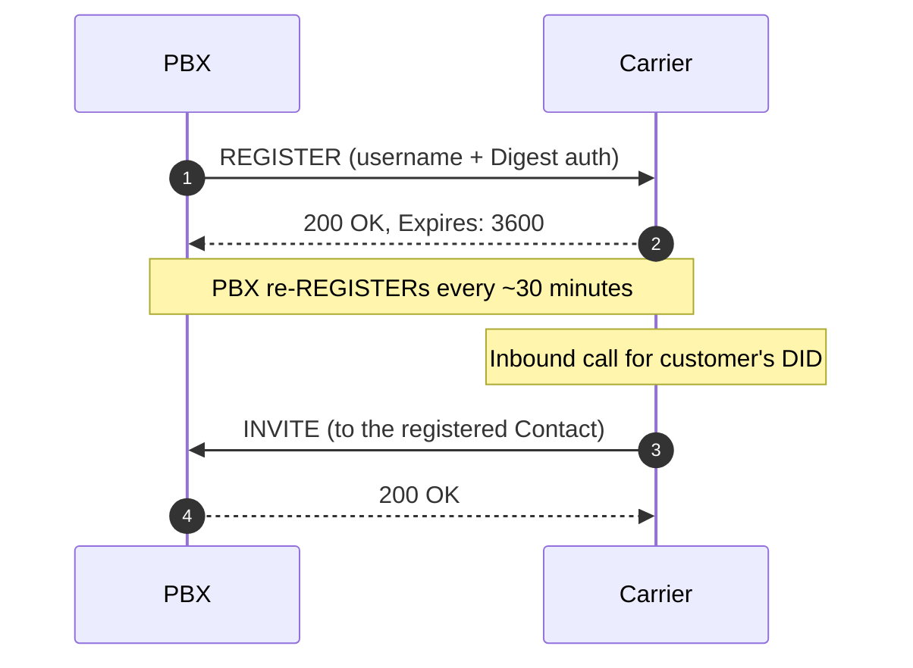
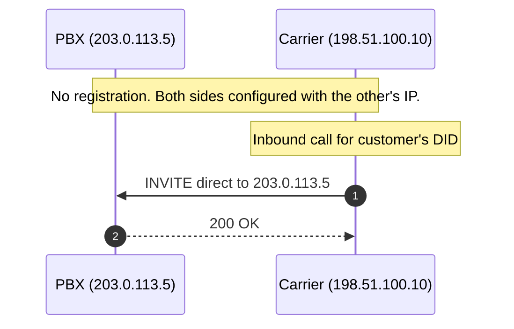
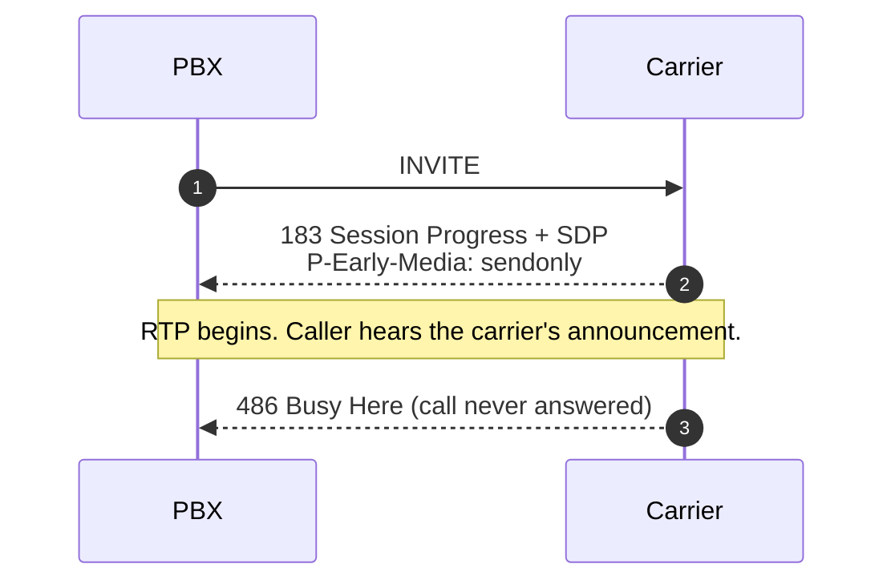

A SIP trunk connects a PBX to a carrier. Most of the failure modes on trunks reduce to four design choices: how the trunk authenticates, how DTMF crosses it, whether early media is honoured, and how the From header is rewritten on outbound calls. This lesson covers each.

## Registration vs peer-trust trunks

Two ways a carrier can identify your PBX:

### Registration trunk

The PBX behaves like an extension on the carrier's PBX. It sends REGISTER with a username and password; the carrier replies with 200 OK and an Expires; the PBX re-REGISTERs before the expiry. When the carrier receives an inbound call for one of your numbers, it knows where to route it because the PBX is currently registered.

What this gets you:

- **Works behind NAT without a static IP.** The PBX initiates; the binding is established by the outbound REGISTER.
- **Simple to provision.** The carrier hands you a username, password, and SIP host. Punch them into the trunk config.
- **Slower to fail over.** If the PBX restarts, calls miss until the next REGISTER lands.

Most SMB carriers offer registration trunks because their customers don't have static IPs.

### Peer-trust trunk (IP-authenticated)

The PBX and the carrier identify each other by IP address. No REGISTER, no auth. Both sides have to know each other's IPs in advance and configure them in their respective allow lists.

What this gets you:

- **Faster setup.** No REGISTER round trip; calls start setting up immediately.
- **No registration to drop.** If the PBX restarts, inbound calls still work (they queue at the carrier and arrive when the PBX is back).
- **Requires static IPs on both sides.** And firewall rules permitting SIP from the carrier IP.

Larger deployments prefer peer-trust because of the operational simplicity once it's set up. SMB customers usually can't get a static public IP from their ISP without paying a premium.

## DTMF transport modes

DTMF is "the user pressed 5 on the keypad". Three transport modes exist; a trunk's config picks one and both sides must agree, or the IVR doesn't hear the keypresses.

| Mode | What happens | Where it shows in SDP |
|---|---|---|
| **RFC 4733 telephone-event** | Keypresses are RTP packets with payload type 101 (typically). Standard, well-supported, codec-independent. | `a=rtpmap:101 telephone-event/8000` and `a=fmtp:101 0-16` on both sides |
| **Inband** | The DTMF tone literally plays as audio in the RTP stream. Works on G.711 (lossless to source). Destroyed by lossy codecs (Opus, G.729). | Nothing in SDP; just a regular audio stream |
| **SIP INFO** | DTMF carried as a SIP INFO message during the call. Reliable but not all carriers/endpoints support it. | Nothing in SDP; SIP messages mid-dialog |

RFC 4733 is the right default in 2025. Most carriers and PBXes negotiate it automatically when both sides offer it. Trouble appears when:

- The trunk is configured to expect inband but the endpoint is sending RFC 4733 (or vice versa). The IVR receives audio that doesn't decode as tones, or RTP packets it doesn't know what to do with.
- The carrier accepts only SIP INFO. The PBX has to be told to translate the endpoint's RFC 4733 events into SIP INFO on the trunk side.

When IVRs don't respond to keypresses, the trunk's DTMF mode is the first place to check.

## P-Early-Media

Sometimes audio plays before the call is officially answered. A carrier announcement ("the number you have dialled is not in service"), an IVR ringback that the carrier generates, a network-side hold music while routing.

In SIP, the call is "answered" at 200 OK. Audio before that is **early media** and arrives on RTP between 183 Session Progress and 200 OK. Whether the called system signals that the early media is real audio (vs locally-generated ringback the caller's UA could play instead) is what P-Early-Media (RFC 5009) negotiates.

If P-Early-Media is enabled, the caller hears the carrier's announcement. If it isn't, the caller hears local ringback and never knows the call failed for a specific reason.

Most carriers send early media in real-world scenarios:

- "The number you have dialled has been disconnected."
- "All circuits are busy; please try again later."
- "Your call is being transferred."
- Mobile carriers' "the person you have called is unavailable; please leave a message."

Enabling P-Early-Media on the trunk side is almost always the right default. Disabling it produces tickets like "the customer says calls are connecting but they don't hear the message".

## From-header rewriting (DOD)

By default, when extension 1001 places an outbound call, the From header is `sip:1001@pbx.example.com` and the carrier presents the originating number as whatever the extension's caller-ID is set to. For business calls, the customer wants:

- The company's main number to display, not the extension's direct number.
- A department-specific number sometimes (sales calls present the sales number, support calls present support).
- A specific user's mobile number when that user is allowed to "set From" for outbound calls from their desk extension.

The PBX rewrites the From header (or P-Asserted-Identity, depending on what the carrier honours) on outbound INVITEs before sending to the carrier. Most PBXes call this **Direct Outward Dialling (DOD)** or **outbound caller ID override** in trunk config.

What the carrier accepts varies:

- **Whitelist of allocated numbers.** Most carriers only let you present a number they've allocated to your account. Trying to spoof an unrelated number returns 403 from the carrier.
- **Any plausible number.** Some carriers accept any well-formed E.164 number. This is less common in regulated markets like Australia where CLI rules force carriers to validate.
- **P-Asserted-Identity vs From.** A carrier may trust P-Asserted-Identity (set by the trust domain) but rewrite the From header to a verified number anyway. The trunk config should match what the carrier expects.

<Callout type="warn" title="DOD policy is a regulated area">
Australian Communications and Media Authority (ACMA) and equivalent regulators in other jurisdictions tightened CLI (calling line identification) rules in the early 2020s after spoofing-based fraud. Don't rewrite caller ID to a number the customer doesn't legitimately use; the carrier may block the call or hand a complaint to the regulator.
</Callout>

## A worked example: Able Moose Accounting

Able Moose has 120 staff across three offices, hybrid work, and one inbound number per office. They're moving from registration trunks to peer-trust because their new ISP gave them static IPs.

Decisions to capture on the trunk:

1. **Trunk type:** peer-trust. PBX IP is `203.0.113.5`, carrier IP is `198.51.100.10`. Firewall rule on the customer router allows SIP UDP from `198.51.100.10`.
2. **DTMF mode:** RFC 4733. Both the PBX and the carrier support it; endpoints will negotiate it via SDP.
3. **P-Early-Media:** enabled. Carrier signals network announcements via P-Early-Media; without it, the customer doesn't hear "this number has changed" messages on misdials.
4. **DOD:** the Brisbane office uses Brisbane's main number for outbound; Sydney uses Sydney's; Melbourne uses Melbourne's. The PBX has three outbound routes (one per office's extension range) with the appropriate DOD per route.

A 503 from the carrier under load indicates concurrent-session limit. Able Moose has 120 staff but bought 30 channels; a busy day at 30+ simultaneous calls produces 503s. The fix is a phone call to the carrier to add channels, not a config change.

## What this is NOT

- **Not a carrier-by-carrier configuration matrix.** Each carrier publishes their own trunk-setup guide; the patterns here are universal but the menu paths aren't.
- **Not a guide to building a multi-carrier SBC.** That's advanced. The patterns here assume one carrier per trunk.
- **Not encryption.** SRTP and TLS-encrypted SIP trunks have their own configuration. The advanced course covers them.

## Sources

RFC 3261 (SIP, including REGISTER), RFC 5009 (P-Early-Media), RFC 4733 (DTMF events).
