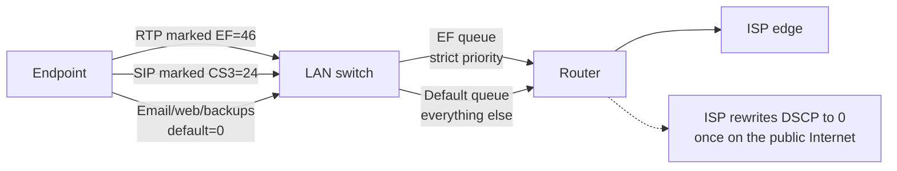

A customer reports "the line is choppy". You pull the call's CDR; it shows MOS 3.1, 4% packet loss, 80 ms jitter. Now what? This lesson covers the two halves of "voice quality": the configuration knobs that help (DSCP marking on the customer's network) and the diagnostic knobs that interpret what happened (RTCP fields, jitter measurement units, loss bursts).

## DSCP marking on the customer LAN

The IP header has a 6-bit **Differentiated Services Code Point (DSCP)** field. Network equipment that's been configured for QoS treats higher values as higher-priority, putting them in low-latency queues ahead of bulk traffic. Voice has standard values:

| Class | DSCP value | Used for |
|---|---|---|
| **EF (Expedited Forwarding)** | 46 | RTP media. Strict-priority low-latency queue. |
| **CS3** | 24 | SIP signalling. Higher than default, lower than EF. |
| **AF31** | 26 | Alternative for signalling (Assured Forwarding class 3, low drop). |
| **Default** | 0 | Best-effort. |

A PBX or endpoint sets these values when generating SIP and RTP packets. The customer's switches and routers then have to be configured to **honour** those markings: low-latency queue for EF, expedited queue for CS3 / AF31, default queue for everything else.

DSCP only matters on networks that respect it:

- **Customer LAN switches and routers**: yes, if the customer's IT has configured QoS. Many haven't.
- **Customer's ISP last-mile uplink**: depends on the ISP and the plan. Consumer plans usually don't honour DSCP. Business plans on managed circuits sometimes do.
- **Public Internet**: no. Almost every ISP rewrites DSCP to 0 at the network edge.
- **MPLS or SD-WAN**: yes, if the customer pays for a managed service that classifies voice. This is one of the reasons MPLS plans command a premium.

The practical effect: DSCP helps inside the customer's office, where it lets voice cut ahead of file transfers, backups, and video conferencing. It does nothing on the public Internet leg from the customer to the PBX or carrier.

**Configuration knobs on the PBX side**: most PBXes set DSCP values per SIP profile (EF for media, CS3 for signalling). Defaults are usually correct. The interesting work is on the customer's network gear, which is rarely the MSP's responsibility unless they manage the customer's networking too.

## RTCP, in the detail you'll actually need

The fundamentals course introduced RTCP as "the quality reporter". The intermediate angle is which RTCP fields tell you what, and how to interpret the units.

A Receiver Report (RR) from one side of the call carries:

| Field | What it means | Units |
|---|---|---|
| **Fraction lost** | Fraction of packets lost since the last report. | 0-255 (8-bit). Divide by 2.55 for percentage. |
| **Cumulative packets lost** | Total packets lost in this session, signed 24-bit. | Whole packets. |
| **Highest sequence number received** | Latest seq seen. Use with the cumulative count to compute total expected. | RTP sequence number space. |
| **Interarrival jitter** | Variance in inter-packet arrival time, smoothed. | RTP timestamp units. Divide by sample rate for ms. |
| **Last SR timestamp (LSR)** | Middle 32 bits of the NTP timestamp from the last Sender Report you received. | Fixed-point NTP. |
| **Delay since last SR (DLSR)** | Time between receiving the SR and sending this RR. | Units of 1/65536 second. |

Two of these need decoding:

**Jitter** is reported in RTP timestamp units. The conversion to milliseconds depends on the codec's sample rate:

- Narrowband (G.711, G.722, G.729): 8000 timestamp units per second. **Jitter in ms = (RTCP jitter value) / 8**.
- Wideband Opus: 48000 timestamp units per second. **Jitter in ms = (RTCP jitter value) / 48**.

So an RTCP jitter value of 240 on a G.711 call is 30 ms; on an Opus call it's 5 ms.

**Round-trip time** is computed from LSR and DLSR:

- The sender records when it sent its last SR.
- The receiver echoes LSR and adds DLSR (how long it took to turn around).
- The sender subtracts: RTT = now - LSR - DLSR.

The PBX usually does this calculation and exposes RTT in the CDR; you rarely compute it by hand.

## MOS as a derived metric

**MOS (Mean Opinion Score)** doesn't ride on the wire. It's computed from RTCP stats (loss, jitter, codec) using the E-model (ITU-T G.107) and written into the CDR by the PBX.

Field bands worth memorising (from the fundamentals course, restated here as the interpretation lens):

| MOS | What it sounds like | Action |
|---|---|---|
| 4.3 – 4.5 | G.711 on a healthy network. Indistinguishable from a landline. | None. |
| 4.0 – 4.3 | Solid. | None unless other signals say otherwise. |
| 3.5 – 4.0 | Audible drop. Slight loss or low-bitrate codec. | Investigate when reported. |
| 3.0 – 3.5 | "Sounds dodgy." Customer complaints expected. | Diagnose. |
| < 3.0 | "Broken." | Escalate. |

MOS lets you separate perception from reality. The fundamentals course made the point: a customer saying "really bad" with MOS 4.2 is reporting feeling, not audio. The intermediate point: **MOS distinguishes layers**. If MOS is below 3.5, the media path is the suspect; if MOS is above 4.0 and the complaint persists, the media path isn't.

## Interpreting loss and jitter together

The two RTCP numbers tell different stories depending on which one is high.

| Pattern | Likely cause | Where to look |
|---|---|---|
| **High loss, low jitter** | A lossy link with otherwise stable queueing. Often wifi with channel interference, or a port with bad cabling. | Test the same call on wired Ethernet. Check switch port error counters. |
| **Low loss, high jitter** | Variable queueing delay. Common on shared internet uplinks during backups or video meetings. | Time-of-day pattern in MOS; investigate what else uses the link. |
| **High loss AND high jitter** | Severe congestion. Customer-side bandwidth shortage or upstream network problem. | Bandwidth audit; ISP path test (traceroute, MTR). |
| **Loss bursts** (max-loss-burst is high, average is low) | Consecutive packets dropped. Audible as "robot voice" or gaps. Common on flaky wifi. | Wired-vs-wifi test; wifi channel audit. |
| **One-way bad stats** (RTCP from A→B is bad, B→A is fine) | Asymmetric path or asymmetric congestion. Often the upstream side of the customer's link. | Look at upstream bandwidth utilisation; the customer's uplink is often smaller than downlink. |

The diagnostic point isn't to fix the network from a single RTCP report. It's to **point at the layer**. RTCP either says "media path is unhealthy" or "media path is healthy". If unhealthy, the next steps are on the network side. If healthy and the customer still complains, the next steps are endpoints, codecs, or perception (echo, sidetone, headset choice).

<Callout type="info" title="The asymmetric uplink trap">
Consumer and small-business Internet plans almost always have lower upload bandwidth than download (e.g. 100/20 Mbps). VoIP needs symmetric headroom because each leg sends as much as it receives. On a busy uplink, voice quality drops on the OUTBOUND leg first, then both. RTCP loss reports from the carrier side back to the PBX are your earliest signal.
</Callout>

## A worked diagnostic

A customer at Able Moose Accounting reports their afternoon calls are choppy. Pull the CDR for an affected call.

The CDR shows:

- MOS: 3.4
- Packet loss: 0.5%
- Jitter: 65 ms (G.711 call, so RTCP jitter value would have been about 520)
- Round-trip time: 45 ms

Reading: low loss, high jitter. That's queueing variance, not a lossy link. Round-trip is fine (45 ms is normal for a domestic call). The afternoon timing combined with the high jitter suggests something else on the customer's link competes for upload bandwidth during business hours.

Next step: ask the customer what runs in the afternoon. Likely answers include cloud backups, video conferencing, or guest wifi opening up. Without changing the PBX, the fix is either a QoS rule that prioritises voice over those flows, or moving the offending traffic to a different time window.

## What this is NOT

- **Not a network engineering course.** Configuring QoS on switches and routers is the customer's network engineer's job. Knowing what DSCP values voice expects is the MSP's job.
- **Not a tuning manual for jitter buffers.** Endpoints typically tune buffers dynamically. If you're tempted to fix a quality issue by raising the jitter buffer, RTCP first.

## Sources

RFC 3550 §6 (RTCP), ITU-T G.107 (E-model for MOS), RFC 2474 (DSCP), RFC 4594 (DSCP-to-traffic-class mappings).
