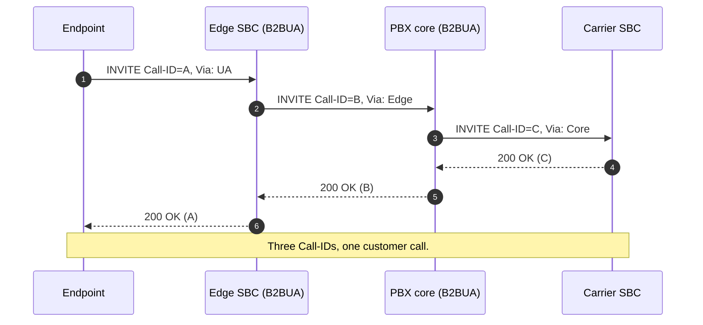

A SIP call you can see end-to-end in one Call-ID rarely matches what a customer ticket actually involves. By the time signalling has traversed an edge SBC, a PBX core, and a carrier-facing SBC, the wire shows three or four distinct dialogs with separate Call-IDs that need to be matched up before any failure mode makes sense. The first job in a deep diagnostic is reconstructing that chain.

## What the wire shows: Via, Record-Route, and the B2BUA breakpoint

A pure SIP proxy (RFC 3261 §16) leaves the dialog alone: it adds a Via header on the way in, removes it on the way out, optionally inserts itself into Record-Route so it stays in the path for BYE and re-INVITE. The Call-ID, From-tag, and To-tag survive end to end.

A B2BUA acts as a UAS to the originator and a UAC to the destination. It terminates the inbound dialog and starts a new one outbound. Two Call-IDs exist simultaneously for what the customer thinks of as one call. Most production deployments use B2BUAs (edge SBCs, PBX cores, trunk SBCs) so chained dialogs are the norm, not the exception.

The two header families that matter when chaining:

| Header | What it carries | Lifetime |
|---|---|---|
| `Via` | Stack of intermediaries the request traversed; response retraces it. | Per request. |
| `Record-Route` | Proxy's intent to stay in the dialog for in-dialog requests. | For the dialog (copied to Route on subsequent requests). |
| `Contact` | The endpoint where to send subsequent requests. | For the dialog. |
| `Call-ID` + `From-tag` + `To-tag` | The dialog identifier. | For the dialog. |

A B2BUA's outbound INVITE shows its own Contact (the B2BUA's address), its own Via at the top of the stack, and a fresh Call-ID. The To-tag is fresh too because the inbound side hasn't been answered yet when the outbound INVITE is constructed.

## Reading SIP Flows in Wireshark

`Telephony → SIP Flows` lists every SIP dialog in the capture by Call-ID. For a single-hop call you see one row; for a typical enterprise call you see three or four. The ladder-diagram preview shows each leg independently.

<StepThrough>
  <Step title="Identify the affected call">
    Run `sip` as a display filter. Find the call by time, by extension in the Request-URI, or by From/To. The customer ticket usually gives you the rough window and the called number.
  </Step>
  <Step title="Capture the Call-ID of the customer-facing leg">
    Click the first INVITE you can attribute to the affected call. Note the Call-ID from the message header. Filter to `sip.Call-ID == "<id>"` to see only that dialog.
  </Step>
  <Step title="Match the B2BUA's outbound INVITE">
    A B2BUA almost always produces its outbound INVITE within tens of milliseconds of receiving the inbound. Look at the time column for the next INVITE close in time, from the same SBC's IP, going to the next hop. Note its Call-ID.
  </Step>
  <Step title="Repeat per hop">
    Each B2BUA in the path generates another dialog. Three B2BUAs in series means four Call-IDs to chase. The carrier-facing leg's Call-ID is the last one in the chain.
  </Step>
  <Step title="Open two filter views side by side">
    Most SIP forensics involves reading two legs at once. Wireshark's Edit → Find lets you mark the matched packets; for serious comparison, open the same capture in two windows and filter each to a different Call-ID.
  </Step>
</StepThrough>

The signs that a row in SIP Flows is a B2BUA's leg rather than a true proxy hop:

- A single Via on the request, not a stack.
- A fresh Call-ID and tag.
- The Contact is the B2BUA's address, not the original UA.
- Timestamps cluster with another dialog's inbound INVITE.

A true proxy hop, by contrast, shows the same Call-ID and tag as the upstream dialog with additional Via headers stacked on top.

## RTP Streams for a B2BUA-bridged call

B2BUAs typically bridge media as well as signalling: the RTP between caller and B2BUA is a different five-tuple from the RTP between B2BUA and callee. `Telephony → RTP Streams` for a B2BUA-bridged call shows four streams (caller→B2BUA, B2BUA→caller, B2BUA→callee, callee→B2BUA) where a direct call would show two.

That's diagnostically useful: a failure on one side of the bridge often appears as one pair of streams looking fine and the other pair missing or troubled. The B2BUA is the most common source of one-way audio at scale because it has two media legs and they fail independently.

## A worked example: Able Moose Group

Able Moose Group operates 14 sub-firm tenants across regions. A senior tech is investigating a ticket from the Riverbend sub-firm: outbound calls to one specific carrier number drop after a few seconds. The customer-facing capture shows:

1. INVITE from the softphone to the edge SBC. Call-ID `c1@user`. Looks normal.
2. 200 OK back. Audio works. Then 28 seconds later, BYE arrives at the softphone with `Reason: SIP;cause=480;text="Temporarily Unavailable"`.

The investigation needs the carrier-facing leg to know who actually said no. The senior runs a second capture on the trunk SBC for the same time window:

1. INVITE from the PBX core to the trunk SBC. Call-ID `c3@core` (different).
2. 200 OK back. RTP flows for 28 seconds.
3. The trunk SBC sends a BYE upstream, carrying `Reason: Q.850;cause=21` from the carrier. The PBX core's B2BUA translates that to `480 Temporarily Unavailable` for the customer side.

The failure is on the carrier, not the customer's network. Without the chained capture, the customer-facing trace alone says "the SBC hung up" with no actionable detail. The chain gives the senior the carrier reason code, which is what they take to the carrier escalation.

<Callout type="info" title="Two capture points beat one twice as long">
A senior workflow for any multi-leg call: capture at two points simultaneously (edge SBC and trunk SBC), each filtered to the relevant five-tuples. Cross-reference Call-IDs and timestamps. The same insight reading one ten-minute capture would take twenty.
</Callout>

## What to do when a capture is missing the upstream leg

You only have the customer-facing capture and the dialog ends with a 4xx or 5xx the customer didn't initiate. Options, in order of usefulness:

- Re-run with the upstream capture point added (PBX pcap or carrier-side mirror).
- Read the response's Warning header if present (some SBCs include the upstream reason).
- Read the response's `Reason:` header if present (carries Q.850 cause codes from the PSTN).
- Correlate with the PBX core's CDR. The CDR often records both the customer-facing reason and the carrier-side cause.

Skipping straight to "escalate to the carrier" without these is a coin flip on whether the issue is theirs or yours.

<Checkpoint slug="voip-deep-diagnostics-checkpoint-flows" client:visible />

## Sources

RFC 3261 §16 (proxy behaviour) and §17 (transaction model), RFC 3261 §8.1 (Via header), RFC 3261 §10 (Record-Route and Contact), Wireshark User's Guide (Telephony chapter and Following SIP Streams), Asterisk Definitive Guide, advanced SIP/RTP chapters.
