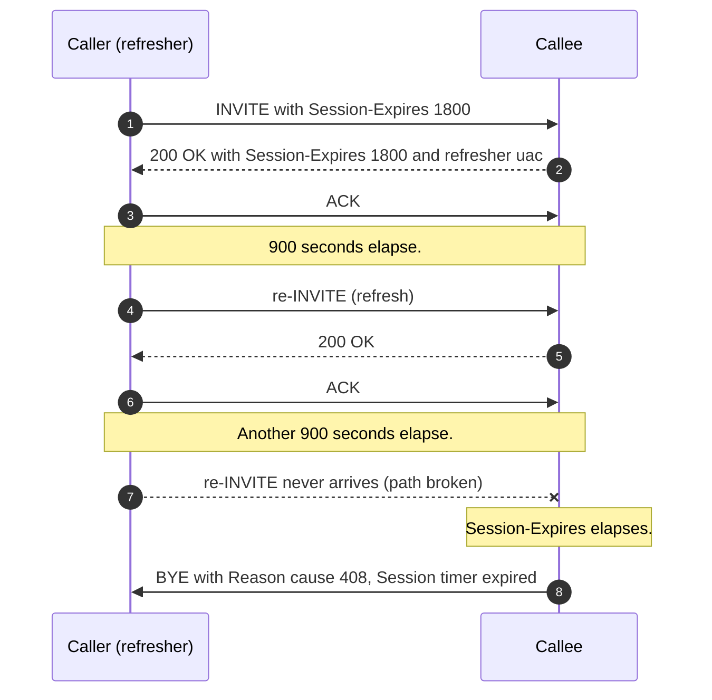
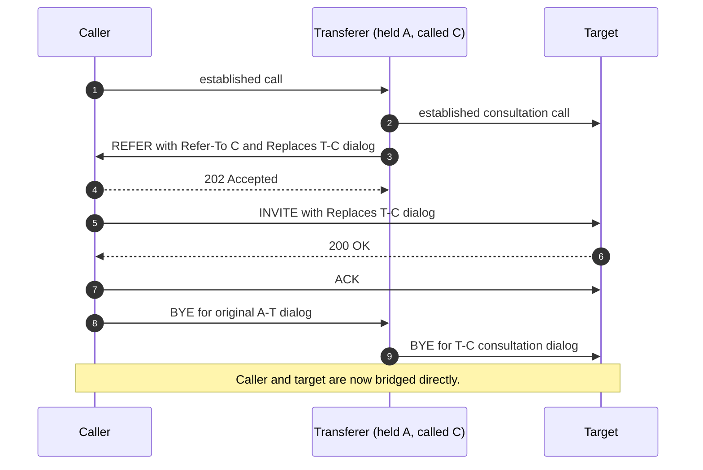

A call that fails to connect produces a single failed SIP exchange and one direction of investigation. A call that connects fine and then misbehaves several minutes in is harder. The capture spans both the SIP plane and the RTP plane, the failure can come from either, and B2BUA bridging means the same logical event shows up twice with different timings on the two legs.

This lesson catalogues the four mid-call failure modes that account for almost every "the call connected and then..." ticket, and the wire evidence that distinguishes them.

## Session timers (RFC 4028) and what expiry looks like

A session timer is a heartbeat for the dialog. When an INVITE includes `Supported: timer` and a `Session-Expires` header, the offerer is proposing a periodic refresh interval. The 200 OK either accepts (returns its own `Session-Expires` and names the refresher with `refresher=uac` or `refresher=uas`) or declines.

During the call, the named refresher sends a re-INVITE or UPDATE at half the agreed interval. If that refresh doesn't get a 200 in time, the other side sends a `BYE` with `Reason: SIP;cause=408;text="Session timer expired"`.



Three patterns to recognise from a capture:

1. **Calls drop at exactly N minutes.** Customer says "every long call ends at 30 minutes". The interval is the giveaway. Check the agreed `Session-Expires` from the call's INVITE and 200 OK; the drop time is half that, or that, depending on which side refreshed.
2. **Calls drop almost immediately.** A carrier or SBC that defaults to `Session-Expires: 60` or `90` and a PBX that doesn't refresh gives this pattern. The 200 OK's session-expires value is small and the BYE arrives at exactly that interval.
3. **One side hung up, the other thinks the call is still up.** A BYE was sent, a 200 to it never came back. The originator sees the call as terminated; the other side runs to session-timer expiry and clears it independently. Customer experience is "the call ended already but my phone still shows me on it for 30 seconds".

When the trace shows a session-timer BYE, the question is which side was supposed to refresh and why the refresh didn't reach the other side. Common answers: the trunk profile didn't enable session timers; a stateful middlebox dropped the refresh INVITE; the refresher was the side that lost connectivity entirely.

## Re-INVITE failure modes

A re-INVITE inside an established dialog modifies it. The most common reasons a re-INVITE happens:

| Reason | What changes in SDP | Common failure |
|---|---|---|
| Hold | `a=sendrecv` becomes `a=sendonly` (or `a=inactive`); MoH starts on the held side. | Resume's re-INVITE succeeds at SIP but RTP doesn't restart on the unholder's side. B2BUA didn't re-bridge media after the second re-INVITE. |
| Codec re-negotiation | New `m=audio` line with a different codec list. | Answerer's allowed-codec list doesn't overlap; re-INVITE 488s. The carrier hands off between gateways with different codec policies. |
| Contact change (network move) | New `Contact` URI; same Call-ID and tags. | SBC tracks contact by source IP/port and rejects the changed contact as a separate registration. Call drops. |
| Transfer (REFER + Replaces) | New dialog with a `Replaces` header citing the original dialog. | REFER 4xx (transferee can't initiate the new dialog); or the new dialog initiates but media never bridges. |

Hold/unhold is the failure mode you'll see most. It looks like:

```
re-INVITE (a=sendonly) → 200 OK → ACK   call goes on hold, MoH plays
[some time passes]
re-INVITE (a=sendrecv) → 200 OK → ACK   call resumes per SIP
```

But on the wire after resume, RTP doesn't reappear in one direction. The 200 OK to the resume re-INVITE confirmed media should flow; the B2BUA in the path didn't reconnect its media bridge. The customer says "I came off hold and they couldn't hear me".

Diagnosis: open `Telephony → RTP Streams` and look at the SSRC values across the hold/resume boundary. A B2BUA that re-bridges correctly often issues a fresh SSRC on resume. A B2BUA that fails to re-bridge shows the stream simply stopping at hold and never resuming.

## Transfer (REFER and Replaces) and where it goes wrong

A blind transfer is a REFER from the transferer telling the transferee to initiate a new INVITE to the transfer target, with a `Replaces` header citing the original dialog. An attended transfer is the same shape after the transferer has already established a dialog with the target.



Two things go wrong here:

- **The REFER 4xxs.** The transferee can't initiate the new dialog. Common cause is that the transferee is behind a B2BUA that doesn't allow REFER through; the transferer has to handle the bridge itself instead.
- **The Replaces INVITE 4xxs.** The target's UA doesn't recognise the `Replaces` value or refuses to swap dialogs. Some endpoints don't implement Replaces at all; the transfer falls back to a fresh INVITE without the dialog swap, or fails entirely.

In the capture: filter to the consultation dialog's Call-ID, then to the target endpoint's IP, and trace the REFER and the resulting INVITE Replaces. Both failures are 4xx responses that the customer perceives as "the transfer didn't go through".

## BYE delays and "the call won't hang up"

A clean call termination is BYE → 200 OK. If the BYE arrives but the 200 doesn't, or if the BYE never arrives at all, the receiving side runs until something else clears the dialog. The customer-facing version of this is "I hung up but it shows me still on the call for 30 seconds".

Wire patterns:

- **BYE sent, no 200 back.** The originator retransmits the BYE according to RFC 3261 timers. After enough retries (typically 32 seconds with default timers), the originator gives up and considers the dialog terminated. The other side, which never received any BYE, runs to session-timer expiry to clear.
- **BYE arrives but the dialog state was already gone.** The receiving side responds with `481 Call/Transaction Does Not Exist`. Common when one side cleared early due to a network glitch and the other side eventually sent BYE based on its own state.
- **BYE looped between B2BUAs.** Two B2BUAs each waiting for the other's BYE. Only resolves when one of them session-timer-expires.

## A worked diagnostic: Riverbend Legal's hold-and-fail pattern

Riverbend Legal reports that one specific extension cannot resume calls from hold. The customer-facing capture across three calls shows the same pattern:

1. Established call with normal RTP both directions.
2. re-INVITE with `a=sendonly` from Riverbend's side. 200 OK. ACK. RTP from Riverbend stops; the held side starts receiving MoH.
3. re-INVITE with `a=sendrecv` from Riverbend's side. 200 OK. ACK.
4. RTP from Riverbend resumes. RTP back to Riverbend does not.

`Telephony → RTP Streams` shows three streams across the lifecycle: Riverbend → far for the live portion, MoH → Riverbend during hold, then Riverbend → far for the resumed portion. The expected fourth stream (far → Riverbend on resume) is missing.

The PBX's CDR shows every call going through an edge SBC and a PBX core (two B2BUAs). A capture from the trunk side of the PBX core shows the carrier-leg RTP flowing in both directions throughout, including after the hold. The break is at the PBX core: it isn't re-binding media for the customer-leg RTP after the resume re-INVITE.

That's not a customer-network problem and not a carrier problem. It's a B2BUA configuration on the PBX core, which the senior tech can confirm by reproducing on a different PBX core in the cluster (works) and not reproducing on the affected core (fails). Escalation goes to the PBX core's vendor with the captures from both sides as evidence.

<Checkpoint slug="voip-deep-diagnostics-checkpoint-mid-call" client:visible />

## Sources

RFC 3261 §14 (modifying an existing session, re-INVITE), RFC 3261 §15 (BYE and dialog termination), RFC 3515 (REFER), RFC 3891 (Replaces), RFC 4028 (session timers), Asterisk Definitive Guide on call transfers and B2BUA bridging.
