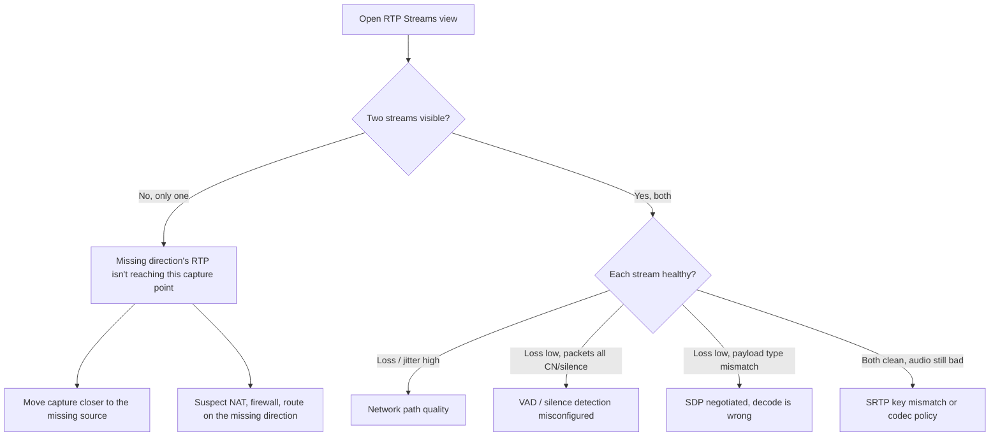

The intermediate course covered SDP, codec negotiation, NAT, and the basics of reading an RTCP report. The advanced angle is the menu of failure modes that all surface as "no audio one way" or "the audio is bad" and the wire evidence that distinguishes them. Most one-way tickets that escape the helpdesk land here because the surface symptom is identical across very different root causes.

## The decision tree, from the capture

Open `Telephony → RTP Streams` first. Two questions in order:

1. **Are both directions of RTP visible at the capture point?**
2. **If both are visible, are the streams readable end to end?**

Each branch leads to a different pattern catalogue.

The branch you land on tells you what to investigate and which capture to take next.

## Branch 1: only one stream visible

The missing direction's RTP isn't reaching the capture point. The capture is silent on whether it left the source; only that it didn't arrive here.

| Where you captured | What missing-direction RTP tells you |
|---|---|
| At the PBX | The far endpoint's outbound RTP isn't reaching the PBX. Move capture to the customer's network or the carrier side. |
| At the customer's LAN | Either the customer endpoint isn't sending outbound, or the customer's firewall is blocking the inbound from the PBX. Check both. |
| At the carrier side | The PBX isn't sending outbound to the carrier, or the carrier's path back is broken. |

Pattern catalogue for branch 1:

| Capture evidence | Network-side root cause |
|---|---|
| One stream from the start; SDP advertised an RFC 1918 address on the missing-direction side. | Endpoint behind NAT advertising private IP. Symmetric RTP not configured on the receiving side, or the endpoint's first RTP packet never left the customer network. |
| Two streams initially; one stops after about 30 seconds. | NAT binding aged out. The side that stopped is behind NAT and not sending keepalive. RTP can't traverse the closed binding. |
| One stream from the start; SDP looks correct (public IP both sides). | Firewall on the receiving side dropping inbound UDP, or RTP port range not open. |
| Stream stops then resumes after a hold/unhold. | B2BUA didn't re-bridge media after the resume re-INVITE. See the mid-call failures lesson. |

The first move when you see a missing direction is usually a second capture closer to the source you can't see. The PBX-side capture says "the customer's RTP isn't arriving"; the customer-side capture says whether it ever left.

## Branch 2: both streams visible but audio is broken

This is the more diagnostically interesting branch because the failure is happening to packets that are arriving. Open `RTP Streams → Analyze` for each stream and read the per-packet detail.

### Payload-type mismatch

The SDP negotiated payload type 0 (PCMU) but the answerer's audio processor is decoding payload type 8 (PCMA). RTP packets arrive at the right rate and SSRC, but the decoded audio is unintelligible. The wire evidence: the payload type byte in the RTP header doesn't match what the receiver's SDP answer said it would. This is an SDP-implementation bug at one end; capture confirms the wire format vs the negotiated answer.

### Silence detection (VAD / CN) misconfiguration

Voice Activity Detection (VAD) lets one side stop sending real audio when the speaker is silent and instead emit Comfort Noise (CN, payload type 13) markers. If the configuration is overaggressive on one end, the wire shows mostly CN packets and very few real audio packets. The customer hears nothing in one direction even though packets are flowing.

Wireshark's RTP analyse view shows payload type per packet. A stream that's almost entirely payload type 13 with occasional bursts of the negotiated codec is the giveaway. Fix is on the side that's silence-detecting.

### Codec / clock-rate drift

If both sides agreed on a codec but their clocks drift (rare but happens with cheap hardware), the timestamps in the RTP stream advance at slightly different rates than the receiver expects. Audio plays back too fast or too slow over a long call. Wireshark's analyse view shows the per-packet "delta" column; consistent delta drift is the clue.

### High jitter, low loss

Variable queueing on the network path. Read the jitter column in `RTP Streams`; values over 30ms on a 20ms-frame codec cause perceptible quality issues. The pattern with low loss and high jitter is classic uplink contention: backups, video calls, or guest wifi traffic competing on the same link as voice.

### Loss bursts

The fraction-lost column shows occasional spikes rather than a steady rate. Bursty loss is wifi interference, a flapping interface, or a brownouts on a link. Continuous low-rate loss is a different signature (oversubscribed link).

### Both streams clean but no audio

If RTP is flowing, payload types match the SDP answer, jitter and loss are fine, and the customer still hears silence: SRTP key mismatch (covered in the encryption lesson) or a codec the receiver's audio processor genuinely doesn't have, despite what the SDP answer claimed.

## The pattern catalogue, expanded

| Symptom | Capture evidence | Network-side root cause |
|---|---|---|
| One-way at call setup, persistent | One RTP stream visible; SDP shows a public IP on the missing-direction side. | Firewall on the receiving side dropping inbound UDP, or RTP port range not opened. |
| One-way after roughly 30 seconds | Both streams initially, one stops. Stopping side's last packet is around 1500 packets in. | NAT binding aged out; the stopped side is behind NAT and isn't sending keepalive. |
| One-way after hold/unhold | RTP stops at the hold re-INVITE, never resumes after the unhold. | B2BUA failed to re-bridge media for the resumed leg. |
| Choppy on calls longer than a minute | RTCP shows fraction-lost rising over time. | Customer-side uplink saturating. Voice losing to backups or video traffic. |
| Choppy only mid-afternoon | Time-of-day pattern in CDR; high jitter, low loss. | Backup window, or video meetings dominating uplink. |
| Audio garbled (robot voice) | Loss bursts in RTCP (max-loss-burst much higher than mean). | Lossy wifi, bad cabling. Reproduce on wired Ethernet to confirm. |
| One-way silent, RTP packets present | Payload type 13 (CN) dominates one stream. | Voice Activity Detection misconfigured on that endpoint. |
| Audio quality drops after a transfer | Post-transfer re-INVITE; stream SSRC changes; loss spike during the swap. | B2BUA re-bridge stutter. Usually clears within 200ms; longer means a B2BUA configuration review. |
| Both streams clean, customer hears nothing | RTP headers look right, SDP looks right. | SRTP key mismatch or codec the receiver lacks despite the SDP answer. See the encryption lesson. |

## Cross-referencing with the SDP

The SDP from the INVITE and 200 OK is the authoritative answer for where RTP should be sent and which codec each side will decode. When the wire and the SDP disagree, the wire wins for what's actually flowing and the SDP wins for what was promised. The gap between them is the bug.

A senior workflow: alongside the RTP Streams view, keep the INVITE's and 200 OK's SDP bodies open. The `c=` line names the destination IP for that side's RTP; the `m=audio` line names the port and codec list; the `a=rtpmap` lines bind payload type numbers to codec names. Verify wire-level facts against the SDP claims; mismatches are the lead.

## A worked diagnostic: Able Moose Group, mid-afternoon quality

Able Moose Group's London sub-firm reports systematic call quality drops on Tuesdays and Wednesdays from about 1pm to 3pm, only on calls placed from the meeting rooms. CDR for affected calls shows MOS dropping from a normal 4.2 to around 2.8 in that window.

Captures from the PBX show:

1. RTP flowing in both directions for every call.
2. Loss rate normal on both streams.
3. Jitter rising sharply through the affected window: 6ms baseline, peaks at 90ms.
4. Time-of-day correlation perfect.

This is branch 2, jitter pattern. Loss being low rules out wifi or bad cabling; jitter being high points at queueing variance. Investigation moves to the customer's network: their backup window for the file servers runs Tuesday and Wednesday afternoons and saturates the uplink. Their meeting rooms share the same office uplink as the file servers; calls from those rooms compete for bandwidth.

The fix is at the customer's network (QoS prioritisation for voice on the uplink, or a smaller backup window, or a separate uplink for voice). The capture didn't fix the problem; it located it precisely enough that the customer's network team knew where to look.

## What the capture cannot tell you

Three failure modes don't show in a wire capture and need different evidence:

- **Endpoint audio hardware failure.** A broken microphone or speaker on a softphone shows as silence at the customer end. RTP flows correctly. Reproduce on a different endpoint to rule this in.
- **OS-level audio routing.** Wrong default microphone, OS audio driver glitch, USB headset disconnected. Check the endpoint's local audio settings.
- **Echo or feedback.** Acoustic coupling between the local mic and speaker. Endpoint config; not a wire problem.

If the capture shows clean RTP both directions and the customer still has a problem, the next investigation is on the endpoint, not the network.

## Sources

RFC 3550 (RTP and RTCP), RFC 3551 (RTP profile for audio and video, payload types), RFC 4733 (telephone-event payload type), Wireshark User's Guide on RTP analysis and stream playback.
