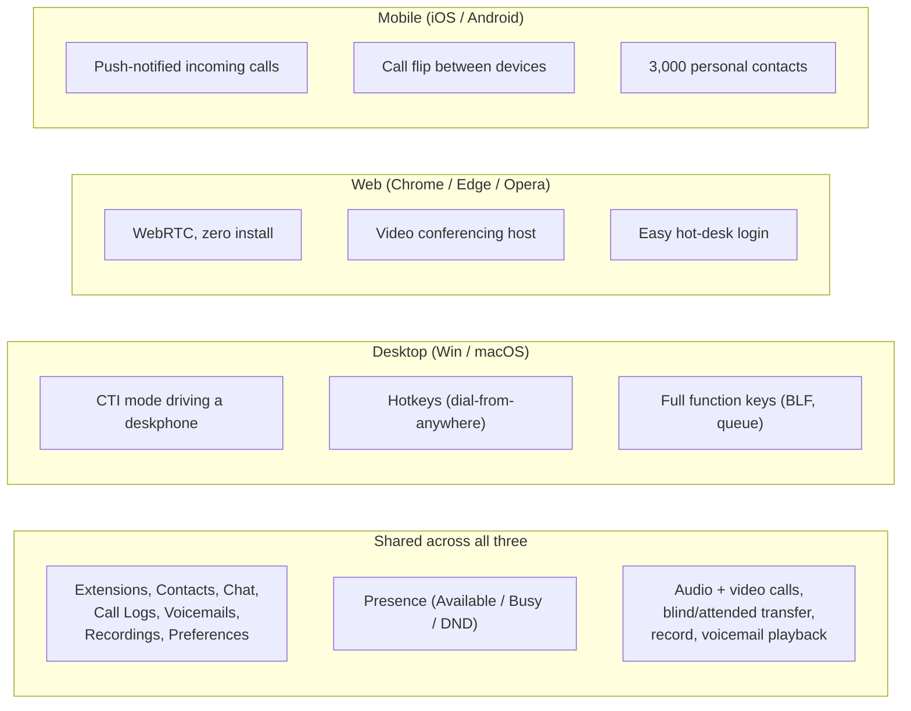

A user opens "the phone system" and they're looking at Linkus. They might be on a laptop, in a browser tab, or on their phone. From the user's perspective, the three are the same product. From a support perspective, they're three different installations with three different version numbers, three different sets of bugs, and three places to check when something doesn't work.

## What ships in each client

The navigation bar (Extensions, Contacts, Chat, Call Logs, Voicemails, Recordings, Preferences) is the same on all three. The headline call operations are the same: dial, answer, hold, blind transfer, attended transfer, record, voicemail playback. Presence (Available, Busy, Do Not Disturb, and any custom statuses the admin defined) syncs across all logged-in clients.

The differences matter for specific use cases:

- **Linkus Desktop** has CTI mode (drive a connected deskphone from the desktop UI), hotkeys (dial whatever you've selected anywhere on screen), and full function keys (BLF lamps for colleagues, queue agent toggle, presence shortcuts). Most "power user" features live here.
- **Linkus Web** is the only client that hosts video conferences directly. From Desktop, "video conferencing" redirects you to the Web client. Web also wins for hot-desk and contractor scenarios where installing software is painful.
- **Linkus Mobile** is the only client that gets push notifications when the app is backgrounded, and the only one with call flip (move an active call to your laptop without dropping). Limited compared to Desktop/Web for second-call and attended-transfer (per the CTI compatibility table; even in softphone mode, mobile has fewer in-call operations than desktop or web).

## Which client to reach for first when supporting a user

| Situation | First client to check |
|---|---|
| User says "I can't make calls from my laptop" | Linkus Desktop on their machine. Confirm logged in, server URL right, version up to date. |
| User says "my phone doesn't ring when I'm away from my desk" | Linkus Mobile. Notifications enabled? Push notifications working? Battery saver killing the app? |
| User says "I can't see who's calling on my screen" | Depends on their setup: if they use Desktop, check the incoming-call popup setting (location/enable). If web, browser notifications permission. |
| User can't join a video meeting | Linkus Web (where video conferencing actually runs). Browser version, mic/camera permissions. |
| Hot-desk user needs to log in on a different PC briefly | Linkus Web — zero install. |
| MSP-side support (you, troubleshooting another user) | Don't open Linkus on your own account; descend into PSE and look at the user's extension. Logging into the user's account from your machine pollutes the audit log and may confuse them with strange registrations. |

## Login methods, briefly

All three clients accept the same login methods:

- **QR code from the welcome email** (Mobile). Scans, fills in credentials, you're logged in.
- **Login link from the welcome email** (Desktop and Web). Clicking the link prompts to open the right client.
- **Manual login**: extension number / email + password + PBX server URL.
- **SSO**: Microsoft Entra ID (Microsoft account) or Google Workspace, where the admin has integrated them. Both Desktop and Web; Mobile gets the SSO flow too in newer versions.

QR codes and login links are **single-use**. If a user "forgets" and tries to scan the QR again, it won't work — generate a fresh welcome email from PSE.

<Checkpoint slug="yeastar-linkus-checkpoint-clients" client:visible />

Next lesson: the login flow in detail, plus how presence and the various status options work day to day.
