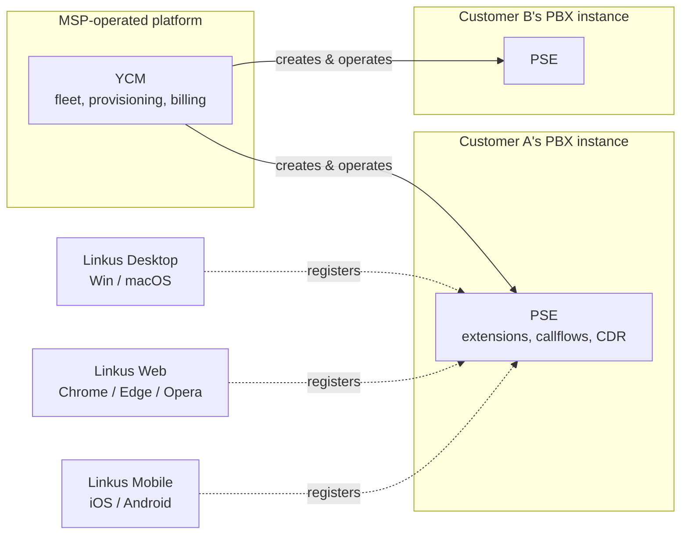

When you join the voice team, the operative word in "we run Yeastar" is *we*. The MSP runs a central portal. Every customer has their own PBX running inside that portal. Every end user has a softphone that talks to their customer's PBX. Three different consoles, three different audiences, one stack. The customer almost certainly does not call it "Yeastar."

## The problem this stack solves

The customer wants phones that work, voicemail, an auto attendant, ring groups when a call comes into reception, call recording when compliance asks, and a softphone on a laptop and mobile so people aren't tied to a desk. They don't want to run a PBX themselves.

The MSP wants to deliver that to fifty customers without running fifty different PBX boxes by hand. They want one place to spin up a new customer's PBX, one place to apply a standard template, one place to see capacity and alarms, one place to bill from. They don't want every customer admin tinkering with the same shared system.

Yeastar's three pieces map onto that split. YCM gives the MSP the fleet view and the provisioning lever. PSE is the PBX itself, with one instance per customer. Linkus is what the customer's people use to actually make and take calls. Each piece has a job.

## What the customer sees vs what the MSP sees

This bit catches new techs out: Yeastar is heavily white-labelled in the field. The customer's "phone system" is often branded with the MSP's name, custom domain, custom logo, and a Linkus client renamed to the MSP's product. The Yeastar BYOI platform supports two layers of branding: **YCM White Label** rebrands the YCM portal (so sub-resellers see the MSP's brand, not Yeastar's), and **PCE White Label** rebrands each Cloud PBX and its Linkus clients (so end users see the customer's MSP, not Yeastar).

Three consequences for the MSP tech:

- The customer reporting a ticket will say "Linkus is broken" or "the phone system is broken." Both mean the same thing to them, neither tells you which console to open.
- "Yeastar" is a word the customer's IT contact might recognise, but rarely the end user. Internally, the MSP tech needs to know all three names so docs and KB articles make sense.
- When walking a customer through something, use *their* brand for the product. "Open ContosoVoice" not "Open Linkus." The MSP marketing team will not enjoy you doing otherwise.

## The three pieces, one diagram

A call from Customer A's receptionist to a vendor in another country travels: Linkus on her laptop registers to her PBX (PSE_A); she dials; PSE_A's call routing engine matches an outbound route, picks a trunk, and sends the call out; the PSTN does its bit; the answer comes back to PSE_A; PSE_A bridges audio between her Linkus and the trunk. YCM never sees the call. YCM created the PBX, set its capacity, applied a template, monitors that it's running. The call itself is a PSE problem.

This is a logical view. The physical layer (SBC, SBC Proxy, PBXHub) is the next lesson.

## YCM, what it actually does

YCM is the MSP's multi-tenant control plane. The Cloud PBX Overview page describes it as "centralized management of P-Series Cloud PBXs, allowing you to quickly launch Cloud PBXs, perform comprehensive configuration and maintenance operations, and monitor resource usage in real-time."

Things you'll do in YCM, never anywhere else:

- Create a new Cloud PBX for a new customer.
- Resize a customer's PBX (more extensions, more concurrent calls, more recording capacity, more AI minutes).
- Apply a provisioning template to a brand-new PBX, so the customer gets a sensible starting config.
- Allocate AI Receptionist or AI Transcription minutes to a customer from the MSP's pool.
- Send a Cloud PBX activation email to the customer's admin.
- Add a colleague to the MSP team, or a Hosting User (a sub-reseller) under your account.
- Apply White Label branding, custom domains, custom email templates.
- Use passwordless login to delegate into any PBX without the admin password.
- Hit the YCM REST API to script any of the above.

Things YCM doesn't do: it doesn't handle a call. It doesn't know who's at their desk. Those are PSE territory.

## PSE, the PBX itself

PSE (P-Series Software Edition) is the PBX engine. The admin guide opens with "we describe every detail on the functionality and configuration of the Yeastar P-Series Software Edition" — it's a complete PBX product. A Cloud PBX instance inside YCM is a PSE instance; same software, just deployed and operated by YCM into the MSP's infrastructure.

Things that live in PSE, one per customer:

- Extensions (the user accounts and their desk/Linkus registrations).
- Trunks (the SIP connections to carriers).
- Inbound routes, IVRs, time conditions, ring groups, queues — the callflow.
- Recording rules and the recording library.
- The CDR (call detail records) for every call.
- The Reports module.
- Integration settings (CRM, Microsoft 365, Google Workspace, Teams CTI).
- Security rules and user roles for the PBX's own admin portal.

Each customer has their own PSE. They can't see each other. The MSP can see all of them from YCM and delegate into any of them.

## Linkus, the client suite

Linkus is the user-facing software, one product split across three platforms:

| Client | Where it runs | What it can do that the others can't |
|---|---|---|
| Linkus Desktop | Windows, macOS | CTI mode driving a deskphone; hotkeys to dial from any app; full function keys (BLF, queue toggle). |
| Linkus Web | Chrome, Edge, Opera (WebRTC) | Video conferencing host; zero-install for hot-desking. |
| Linkus Mobile | iOS, Android | Push-notified calls when the app is backgrounded; call-flip between devices in mid-conversation. |

What the three share: the navigation bar (Extensions, Contacts, Chat, Call Logs, Voicemails, Recordings, Preferences), presence (Available / Busy / DND), audio + video calls, attended and blind transfer, recording during a call, voicemail playback, internal chat, external chat for messaging-channel inbound. One extension can log in on several clients at once and they stay synchronised.

When the MSP white-labels, Linkus is the most visible piece. The icon, the app name, the splash screen, the "log in" branding — all rebrandable. End users may never see the word "Linkus" or "Yeastar."

## What each piece is NOT

- **YCM is not a PBX.** It never sees a call. It creates the PBX that does.
- **PSE is not a client.** Users open Linkus. Linkus registers to PSE.
- **Linkus is not a separate product.** It's the client for PSE. A site with no PSE has no Linkus.

Next lesson: the physical layer (SBC, SBC Proxy, PBXHub) and how multi-tenant identity actually works.
