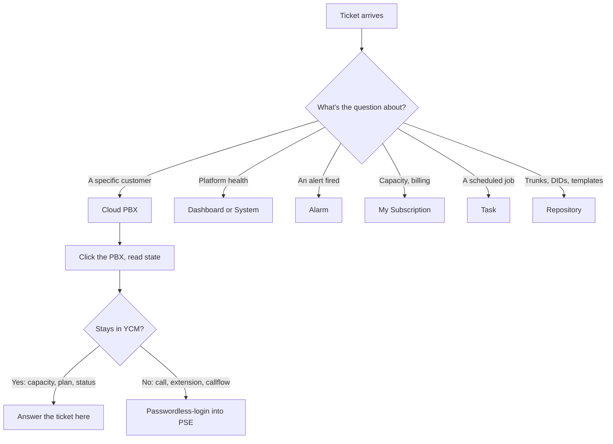

When a Yeastar ticket lands, YCM is where you start. The portal looks dense the first time, but nine sections cover the entire surface area of a hosted-BYOI estate. The map below is what a senior tech holds in their head when they triage; learning it once saves looking-it-up time on every ticket after.

## The main sections

| Section | What's there | When you open it |
|---|---|---|
| **Dashboard** | Monitor + Resources widgets (fleet health, alarms, capacity trends, offline trunks/phones) | Morning scan, "anything on fire?" |
| **My Subscription** | The MSP's pool: total extension / concurrent-call / recording / AI minute entitlement, white-label and HA flags | Capacity headroom, "do we have room for a new customer?" |
| **Device** | Remote P-Series **appliances** added via remote management | On-prem P-Series boxes you manage through YCM |
| **Group** | Logical bundles of Cloud PBXs and Devices | Scoping a dashboard or alarm to a region or team |
| **Cloud PBX** | The list of managed Cloud PBX instances | 90% of triage tickets land here first |
| **Alarm** | Active alarms + monitor-alarm settings | Investigating something the system flagged |
| **System** | YCM Server + SBC / SBC Proxy / PBXHub cluster servers, security, network | Platform-side issues, not per-customer |
| **Task** | Scheduled tasks: backups, upgrades, provisioning | "Did the nightly backup run?" |
| **Repository** | Provisioning templates, firmware files, backup files, shared trunks, DID numbers | Reusable assets you assign to PBXs |

## Device vs Cloud PBX, the one distinction worth getting right

Both Device and Cloud PBX list "PBXes". They mean different things:

- **Device** holds remote P-Series **appliances**, physical or virtual P-Series boxes installed on the customer's site (or yours) and added to YCM via remote management.
- **Cloud PBX** holds managed Cloud PBX **instances**, full P-Series Cloud PBXs that YCM provisioned onto a PBXHub Server.

For a typical BYOI MSP, every customer the team hosts lives under **Cloud PBX**. Device is for the occasional customer who keeps their own appliance on-prem and lets the MSP manage it remotely. If your team only hosts Cloud PBXs, you can ignore Device until you have a customer who needs it.

## The triage map

<Callout type="info" title="Why nine sections instead of one long list">
YCM groups operations by **what you're managing**, not by **what you're doing to it**. Capacity is My Subscription. Customer instances are Cloud PBX. Reusable building blocks are Repository. A tech who reaches reflexively for the right section spends triage time on the problem rather than the portal.
</Callout>

## The five sections you'll live in

In rough order of how often a hosted-BYOI MSP technician opens them:

1. **Cloud PBX** — find the customer, read state, click in.
2. **Alarm** — investigate something the system flagged, decide whether it's actionable now or absorbable.
3. **Repository** — assign a shared trunk to a customer, look up a DID, find a backup file.
4. **My Subscription** — confirm headroom before promising a customer more extensions.
5. **Dashboard** — start-of-shift glance, end-of-shift glance.

The rest (Device, Group, System, Task) come up less often per shift, but you should know they exist so you don't search the wrong section when you hit one of those tickets.

<Checkpoint slug="yeastar-ycm-triage-checkpoint-tour" client:visible />

Next lesson, the Cloud PBX list page itself: filters, status icons, capacity at a glance, and the click-in move that drops you onto a customer's PBX detail.
