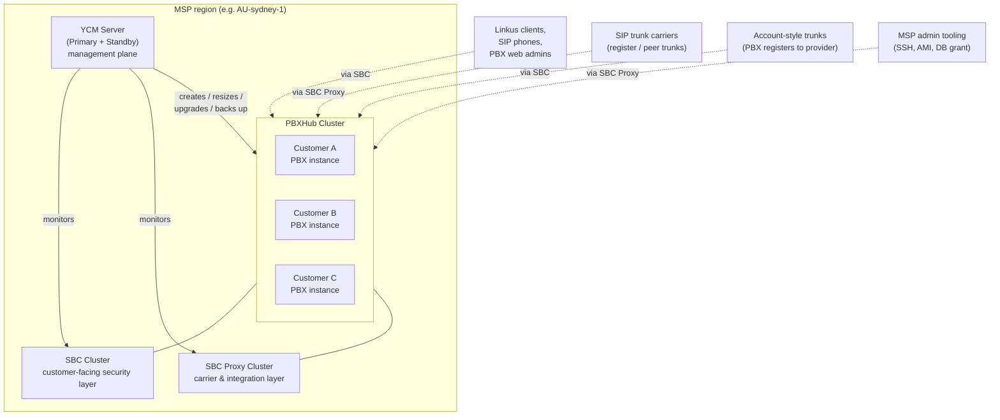

"BYOI" stands for **Bring Your Own Infrastructure**. The MSP runs the YCM software (and the cluster servers that make Cloud PBXs work) on infrastructure they own — typically VMs in AWS, Azure, or a colocation rack. The `yeastar-byoi` documentation set is for this deployment model specifically; PCE (Yeastar-hosted Cloud Edition) and standalone on-prem appliances live in different docs and aren't on this site.

## The four clusters

YCM isn't one box. A working BYOI platform has four kinds of cluster server, each scoped to a region:

**YCM Server** is the management plane. The MSP tech logs in here. It tells the other clusters what to do.

**SBC Cluster** is the security layer for customer-facing traffic, per the Yeastar Cluster Status doc. It handles PBX web admin access, SIP extension registration, Linkus client login and registration, and account trunks (where the PBX itself registers outbound to a carrier).

**SBC Proxy Cluster** is the security layer for carrier-side and integration traffic. Register Trunks, Port-based Peer Trunks, DID-based Peer Trunks all land here. So do the service ports for SSH, AMI, and database grants when the MSP integrates third-party tooling into the platform.

**PBXHub Cluster** hosts the actual PBX instances. Per the docs, one PBXHub Server hosts up to 100 Cloud PBXs and up to 2,000 extensions, with disk volumes for system data and recording files. When YCM "creates a Cloud PBX", PBXHub is where it actually runs.

A failure pattern that fits this map: extensions can't register but the PBX admin portal works. That points at SBC trouble (extension registration travels through SBC; web admin also travels through SBC, so this hint isn't perfect — but a partial outage at the SBC tier is consistent with one service path being affected and another not). Trunks dropping but Linkus working? Points at SBC Proxy. The PBX itself going dark? PBXHub.

## What a "Cloud PBX" actually is

When YCM creates a Cloud PBX, PBXHub launches a fresh, isolated PBX instance for that customer: its own URL, its own admin portal, its own extensions, its own CDR, its own SIP trunks. The YCM API record carries which PBXHub Server the instance lives on (`pbxHubCluster: { clusterName, ip }`). One PBXHub Server runs up to 100 of these in parallel without their data crossing.

Per-instance attributes the MSP allocates from YCM: subscription plan (Enterprise or Ultimate), extension capacity, concurrent call capacity, recording capacity, AI receptionist minutes, AI transcription minutes, region, expiration date, several feature flags (passwordless login, internal chat, PBX API, provisioning-via-template, trunk-config-access).

Two things follow:

1. **Customers can't see each other.** Their PBX instances are logically separate. Customer A's receptionist sees Customer A's extensions only.
2. **A Cloud PBX is PSE.** Everything in the PSE coursework applies, with the small addition that some maintenance (firmware upgrade, backup) can be triggered from either the YCM side or the PSE side.

## Who logs in to what

YCM has three account classes. PSE has its own users on a per-PBX basis. Linkus has end-user logins per extension. Confusing them is the most common new-tech mistake, so worth walking through.

| Class | Logs in at | Sees | Who fills this role |
|---|---|---|---|
| Super Administrator | YCM | Everything, every Cloud PBX, every Colleague, every Hosting User, every dollar | One designated root admin at the MSP. |
| Colleague | YCM | A scoped slice, controlled per-account by granular permission grants (see below) | MSP staff. Different colleagues can have different scopes. |
| Hosting User | YCM (their own subordinate view) | The Cloud PBXs and capacity allocated to their account; can create sub-resellers if `pbxCreationLimit` permits | A sub-reseller selling under the MSP's umbrella. |
| PBX Super Administrator | PSE (per Cloud PBX) | The single PBX they administer. **Not** an extension-bound account; YCM creates this when it provisions the PBX. | Usually the MSP keeps this; sometimes handed to the customer if they want self-service. |
| PBX administrator role (extension-bound) | PSE | The PBX with permissions scoped per the role; can be restricted (e.g. read-only CDR, no system settings) | The customer's IT contact, usually. |
| Extension user | Linkus | Their own calls / contacts / chat | The end user. |

### The full-admin PBX account

When YCM provisions a Cloud PBX, it creates a Super Administrator account inside the PBX. This account isn't tied to any extension; it just has full admin of the PBX web portal. Most MSPs lock that account away and never share it with the customer. Customers get extension-bound accounts with whatever role permissions the MSP designed (typically read-only on CDR, no callflow editing, no trunk changes). Some MSPs hand the customer the full-admin credentials if the customer specifically wants total self-service. There's no right answer; both are common.

### Colleague permissions are per-action, not just by role

A Colleague account isn't a single privilege level. YCM gives you a permissions menu where individual actions can be granted or denied per Colleague: create Cloud PBX, delete Cloud PBX, resize, apply template, manage shared trunks, configure SNMP, set custom domains, manage branding, and so on. The MSP designs the permission set per role internally ("L1 support", "provisioning team", "platform lead") and stamps it onto each Colleague at account creation.

The practical consequence: a tech who can't see an option in YCM that the docs reference doesn't have that permission. The fix is in their YCM colleague profile, not in YCM settings. Take it to the Super Admin.

### Passwordless login

Each Cloud PBX has a `passwordlessLogin` flag. When enabled, an MSP user (Super Admin or a permitted Colleague) can click a Cloud PBX in YCM and land inside its PSE admin portal without typing the PBX admin password. There's also `allowSuperiorPasswordlessLogin`, which lets a parent account (typically the MSP's Super Admin) delegate into a Hosting User's PBXes the same way.

In practice, most MSPs turn this on by default at provisioning time and the MSP tech rarely sees a PSE login screen. They live in YCM, find the customer, click in.

## What this model is NOT

Three confusions worth pre-empting because they bite new techs:

- **It's not Yeastar-hosted.** PCE (P-Series Cloud Edition) is Yeastar's own SaaS offering, runs in Yeastar's infrastructure, and uses different docs. If you're reading `help.yeastar.com/en/p-series-cloud-edition`, you're in PCE-land, not BYOI-land.
- **It's not appliance-based.** A standalone P-Series appliance in the customer's server room, connected to YCM only for remote management, is the "Device" path. Possible but rare for an MSP running BYOI Cloud PBXs.
- **It's not single-tenant.** A YCM cluster with one customer is the same architecture as one with five hundred. Don't design ops around "we only have one customer right now"; the multi-tenant model bites later if you do.

Next: where to actually click when a ticket lands.
