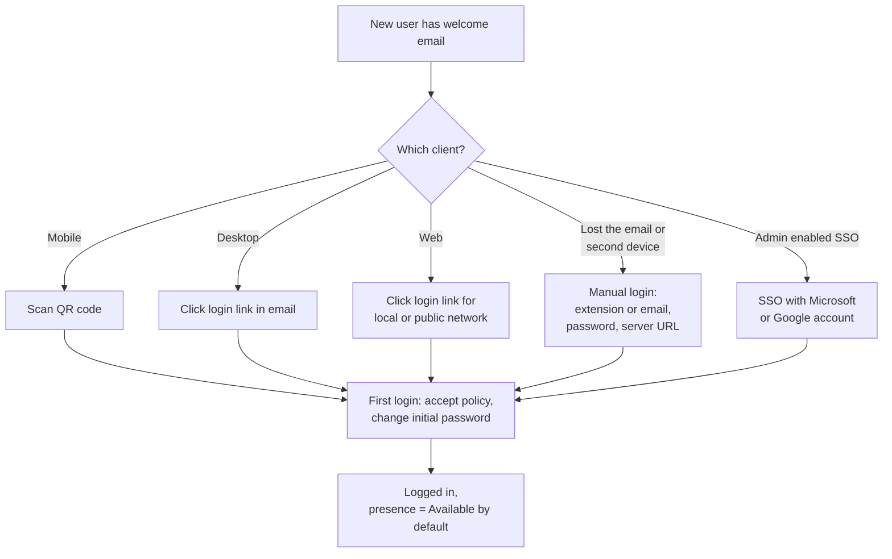

A user opening Linkus for the first time is the most-supported moment in their relationship with the system. Get this right and they stop calling you. Get it wrong and you'll spend two weeks resetting passwords.

## The welcome email is the seed

When a new extension is created in PSE, the admin sends a Linkus welcome email to the user. That email is the canonical login seed and contains everything they need:

- **A QR code** (used by the Mobile Client). One scan and they're logged in.
- **A login link** for Linkus Desktop. Click the link in the email on the machine where Desktop is installed; it auto-fills.
- **A login link for Linkus Web**, with separate links for local-network and public-network access. Click; you're in the Web Client with no credentials prompt.
- **Manual login details** (extension number, initial password, server URL). For anyone who lost the email and needs to enter creds by hand.

Three rules worth remembering:

- **All three quick-login options are single-use.** Once the QR or the link has logged someone in, it can't do it again. If a user needs to log in a second time (new device, reinstalled app), they need a fresh welcome email or to use manual login.
- **First login forces a password change.** Linkus presents the privacy-policy acceptance and a "change initial password" dialog the first time. After that, the new password is what they use.
- **SSO is separate.** If the admin enabled Microsoft Entra ID SSO or Google SSO on the PBX, users can log in with their Microsoft or Google account instead of the extension password. They still need the PBX server address to set up SSO.

## The four login methods

Things that go wrong:

- **"I never got the email."** Check the user's spam folder; check PSE's email-sending settings (SMTP); resend from the extension's page in PSE.
- **"The QR code says invalid."** It's been used already. Resend a fresh welcome email.
- **"I'm getting 'wrong password'."** First-time login failure usually means they're using the initial password but the system already enforced a change (a previous device logged in). Reset via PSE.
- **"SSO doesn't work."** Confirm SSO is enabled at the PBX level for that user's domain. In Linkus Desktop / Web, the SSO option appears only after the server URL is entered. The full setup and admin-side configuration are covered in the PSE intermediate and advanced courses; if SSO isn't set up at all for the customer, fall back to a fresh welcome email and let the user log in manually.

## Presence, what it actually controls

Presence is more than a coloured dot on someone's contact card. It drives **call-handling rules** in PSE: per-presence, the user (or the admin) configures what happens to inbound calls.

Out of the box, Linkus has five presence states (and the admin can define custom ones at the system level):

| Presence | Common interpretation |
|---|---|
| Available | Normal. Calls ring normally. |
| Busy | "I'm on something, take a message." Calls typically go to voicemail or follow ring-forward rules. |
| Do Not Disturb | Calls go directly to voicemail. Linkus suppresses its own notifications. |
| Lunch Break | Soft "back soon" status. |
| Off Work | "Don't ring me at all." |

For each presence, the user (or the admin) can set what should happen to a ring-group call, what should happen to a queue call, whether to ring all devices or only specific ones, and whether to follow a different ring-forward chain. This means presence is the user's main self-service knob; before the helpdesk gets called about "phone keeps ringing when I'm in a meeting", the answer is often "switch to DND for the meeting".

## Coaching a user on presence

A two-minute conversation that prevents a month of tickets:

- **Make sure they know they HAVE presence.** Find the dropdown in their navbar. Cycle through it once. Show them the indicator on their Extensions list.
- **DND is their friend during meetings.** Turn it on at the start of a Zoom; turn it off at the end. Voicemail handles the rest.
- **Linkus Mobile gets a separate presence in some setups.** If the customer's PBX is configured to let mobile + desktop have independent presence, the user has two switches not one. Worth flagging in their training.
- **Microsoft Teams integration can sync presence two ways** if the admin enabled it. A user in a Teams meeting can appear Busy in Linkus automatically; conversely, going DND in Linkus can show as Do Not Disturb in Teams. The setup lives in the advanced PSE course; users should know it exists so they aren't surprised by it.

Presence is the cheapest call-routing tool in the box. The PSE admin builds the rule machinery once; the user flips a switch ten times a day and everything routes correctly.

Next lesson: actually making and managing a call.
