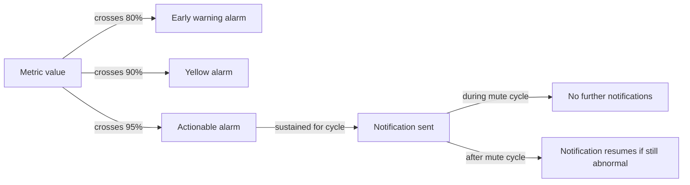

A good MSP voice team hears about a problem from YCM before they hear about it from a customer. Alarms are the mechanism: thresholds the platform watches, and a feed of every condition that crossed one. Reading the alarm view well means knowing which alarms need action right now and which are routine signal you absorb into the next shift's planning.

## Where alarms live

```
Alarm
```

Two related pages sit under the Alarm section:

- **Alarm List**, every alarm event that has fired, with severity, target, time, and (where applicable) the linked Cloud PBX, Device, or cluster server.
- **Monitor Alarm settings**, the rules that produce alarm events. Default rules ship with YCM; you can edit them and add up to 100 total.

A triage tech mostly reads the Alarm List. Editing the Monitor Alarm settings is a configuration move, intermediate-course territory.

## The three objects YCM can watch

Every monitor alarm targets one of three object types:

| Object | What's being watched | Typical metric |
|---|---|---|
| **Yeastar Central Management** | The YCM Server itself | CPU, memory, storage on the management plane |
| **Cluster servers** | SBC Server, SBC Proxy Server, PBXHub Server | Resource utilisation, port-pool usage, queue depth |
| **P-Series Cloud PBX** | The customer's PBX instance | Concurrent-call use, extension count, recording quota, AI-minute consumption, registration health |

The object scope decides who needs to act. **YCM and cluster** alarms are platform-side, often the infrastructure team's problem. **Cloud PBX** alarms map to a single customer; usually the front-line MSP voice team's problem.

## Event thresholds, the 80 / 90 / 95 tier

Capacity-style alarms fire at thresholds expressed as a percentage of the limit. YCM ships three default threshold levels:

- **80%** — early warning. Tells you to plan capacity, not to act this hour.
- **90%** — yellow zone. The customer probably isn't feeling it yet, but the runway is short.
- **95%** — actionable now. Resize or escalate before the customer notices.

Custom threshold levels can be created, but the 80 / 90 / 95 ladder is what most MSPs work with. When an alarm row says **Event Threshold: 90%**, that's the tier: the metric crossed 90% of its limit and stayed above for the configured cycle.



The **cycle** is how long the metric must stay above the threshold before YCM treats it as a real alarm rather than a transient spike. A 15-minute concurrent-call cycle filters out the lunchtime peak that goes back down on its own.

The **mute cycle** is how long YCM stays quiet after firing. During the mute window, no extra notifications go out even if the metric keeps tripping. After the mute window ends, if the metric is still abnormal, the notification resumes.

## Reading an alarm row

Each row in the Alarm List carries:

- **Alarm Name**, the rule that fired.
- **Severity** (custom alarms default to **Alert**; built-in rules carry their own levels).
- **Object**, what got watched (which PBX, which cluster server, or YCM itself).
- **Triggered Time**, when the cycle expired and the alarm fired.
- **Status**, active or recovered.
- **Trigger Condition**, the metric and threshold that crossed.

Three reads a triage tech runs on every alarm:

1. **Is it for a specific customer, or platform-wide?** Cloud PBX object = one customer. Cluster or YCM object = the whole fleet is downstream.
2. **What's the severity?** Alert-level alarms are loud but not necessarily urgent. The cycle and mute settings matter; an Alert that's been firing every 15 minutes for two hours is different from an Alert that fired once.
3. **Is the customer feeling it yet?** A PBX at 90% concurrent-calls isn't refusing calls, just near the ceiling. A PBX at 100% is refusing calls. Read the metric value, not just the alarm name.

<Callout type="warn" title="One alarm rule can hit many PBXs at once">
When you build an alarm rule that targets "all Cloud PBXs", an event fires when the **sum** of the chosen metric across that set crosses the threshold (per the docs: for Cloud PBX targets, the system evaluates conditions across the collection, not per-PBX). A "concurrent calls > 80%" rule on the whole fleet is not the same as "this customer is at 80%". Read the trigger condition before assuming you know who's affected.
</Callout>

## A worked example: SBC Proxy port pool

Friday afternoon. An alarm fires:

- **Alarm Name:** SBC Proxy Port Pool High
- **Object:** sbc-proxy-eu-a (a cluster server)
- **Severity:** Alert
- **Event Threshold:** 90%
- **Status:** Active

The triage read:

1. **Object is a cluster server**, not a single customer's PBX. This is platform-side; nobody's specific call is broken yet.
2. **90% threshold**, not 95%. Yellow zone, not actionable in the next ten minutes.
3. **Port pool** is what SBC Proxy uses to register peer trunks (carrier-side) and handle integration ports. If it fills up, new trunk registrations get refused, which would eventually break carrier connectivity.

The right move from triage is to log the alarm, ping the infrastructure team, and watch whether it climbs to 95% before the weekend. The wrong move is to do nothing because no customer has called yet; once it hits 100%, customers will call, and the runway will be measured in minutes rather than hours.

## What this is NOT

- Alarms **are not a substitute for the Dashboard glance.** The Dashboard's Cloud PBX Resource Overview and Alarm Trend widgets show the longer arc that one alarm row doesn't. Start-of-shift, scan the Dashboard; through the shift, react to alarms.
- Alarms **don't fix anything.** They notify. The fix lives in YCM (resize, allocate, provision more cluster capacity) or in PSE (per-PBX configuration), depending on the object. Don't expect to clear an alarm by acknowledging it; you clear it by acting on the underlying condition.

Next lesson, where to find the per-customer records (billing, trunks, DIDs, backups, sub-user ownership) when a ticket asks for them.
