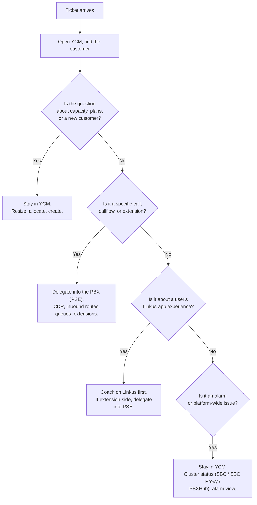

A ticket lands. The instinct that wastes ten minutes per ticket is "let me open the customer's PBX and have a look." With passwordless login set at provisioning time, you don't have to choose between consoles. You start in YCM, find the customer, and decide from there.

## The default move: start in YCM

YCM is the entry point for almost every MSP tech ticket because:

- Almost every Cloud PBX has `passwordlessLogin: Enabled`. One click from the YCM list and you're in PSE with full admin, no password.
- YCM holds the records that tell you which PBX, which capacity tier, which alarms are firing, which colleague provisioned it, which template was applied last and when.
- If the answer is capacity, billing, provisioning, or "spin up a new customer", you're already where you need to be.

The mental shortcut: **YCM is the lobby; PSE is the room.** You walk through the lobby every time, then open whichever door the ticket needs.

## When you delegate into PSE (the common case)

Most customer-experienced symptoms (a call dropped, the IVR went to the wrong place, voicemail isn't being delivered, extension won't register) need PSE-side diagnosis. From YCM:

- **Find the Cloud PBX** for the customer in the list.
- **Click in.** Passwordless login (if enabled, which it usually is) drops you into the PSE admin portal as Super Administrator.
- **CDR is your friend** for "what happened on this specific call." Inbound routes / time conditions / IVRs / queues are for "what the system did when the call arrived." Extensions panel shows registration status and which Linkus clients are logged in.
- **Back to YCM when you're done.** Don't leave the PBX admin open in another tab forever; the audit logs see your session.

## When you stay in YCM

These don't need a PSE descent:

| Symptom | YCM-side fix |
|---|---|
| "Add three more extensions to ABC's PBX, they're hiring" | Check extension capacity in YCM. If at limit, resize. Extension *creation* happens in PSE; the *capacity* is YCM. |
| "Customer wants more recording storage" | Resize recording capacity in YCM. |
| "We bought a new customer; spin up their PBX" | Create Cloud PBX in YCM. Apply a provisioning template. Send activation email. |
| "Customer needs an extra SIP trunk added" | Assign a shared trunk to the customer's PBX in YCM. Per-trunk codec/auth lives in PSE, but the assignment is YCM. |
| "AI Receptionist minutes have run out" | Allocate more from the MSP pool in YCM. |
| Alarm fires: PBXHub at 90% disk | Cluster Status page in YCM. May need infra-side action (add a PBXHub Server, migrate PBXs). |
| Alarm fires: SBC Proxy port pool exhausted | Cluster Status page in YCM. Means too many trunks for the current SBC Proxy capacity; provision more. |
| New colleague joining the MSP voice team | Create a YCM Colleague account, design the per-action permission set, hand them a login. |

## When the question is really about Linkus

Linkus-side symptoms are usually user-side: "my notifications aren't working", "I can't see my colleague's presence", "the transfer button is greyed out." Three steps:

1. Confirm the user's Linkus version (Mobile and Desktop track separate version numbers; the customer's PBX firmware may require a Linkus minimum).
2. Confirm they're logged in with the right server URL — easy gotcha when the customer has been migrated between PBX URLs.
3. If the symptom persists, descend into PSE and check the extension's status / role / call-handling rules / presence-rules / function-key config.

Linkus-only fixes are rare. Almost every "Linkus is broken" ticket has its cause in PSE.

## A worked example, Able Moose Accounting

Sarah at Able Moose Accounting opens a ticket: "Our front desk gets calls but my new iPhone doesn't ring."

What the experienced tech does:

1. Open YCM. Find Able Moose's Cloud PBX. Check it's `Running`, capacity isn't exhausted, no fresh alarms.
2. Passwordless-login into the PBX.
3. Open Sarah's extension. Is her iPhone registered? Linkus Mobile shows up in the extension's registered endpoints list when it's logged in and reachable.
4. If yes, check the front-desk ring group (or queue): does the ring strategy include Sarah's extension? Is her presence set to a status that filters out group calls?
5. If her phone isn't registered, walk her through Linkus Mobile: notifications enabled, server URL correct, app foregrounded for a test.

The tech who reflexively opens Linkus on their own phone to "see what it looks like" wastes the diagnosis time. The tech who opens YCM, descends, reads the extension page is two clicks to the answer.

## When the tree gives the wrong answer

About one ticket in ten won't fit the pattern. Two to watch for:

- **The symptom is in Linkus but the cause is per-PBX policy.** "I can't transfer to an external number." Linkus has the transfer button; the policy that blocks external transfer is a PSE user-role setting on the extension. Linkus is innocent.
- **The symptom is in PSE but the cause is YCM-side capacity.** Recording silently stops when the recording quota is exhausted. PSE shows "no recording produced" but the fix is allocating more recording capacity from YCM.

Default to the obvious place first; if the answer's not there, walk outward (YCM → PSE → Linkus, or the reverse for user-skinned tickets) rather than guessing.

You now know what each console is for and how to move between them. The next courses in the path pick one and go deep.
