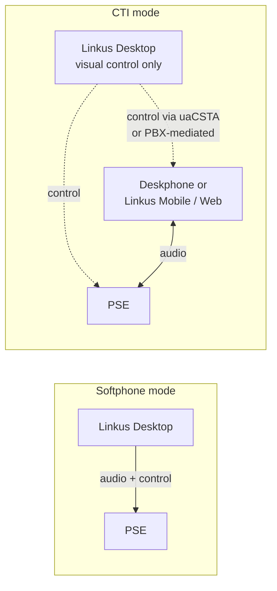

A power user with a deskphone wants both: the deskphone for handset comfort, Linkus on screen for everything else. Linkus CTI mode is the answer. Same product, different role.

## The two modes

**Softphone mode** (default): Linkus is the phone. You make and receive calls through your computer's microphone and speakers (or a USB headset). Linkus is the audio path.

**CTI mode**: Linkus is the control panel. The user has a registered deskphone (or a Linkus Mobile, or Linkus Web) somewhere; that other device is the audio path. Linkus Desktop becomes a visual control surface that lets you dial, answer, transfer, and record from your computer, but the actual conversation happens on the deskphone.

The trade-off:

- Softphone mode is simpler. One device, one app, one place audio lives. Good for users who work from a laptop and don't want a desk hardware investment.
- CTI mode is for users who want a deskphone's microphone + handset experience but a screen-based dial pad and contact list. Common in receptionists, call-centre agents, and users who hate USB headsets.

## What's supported in each mode

The compatibility matrix is precise. Linkus's own docs publish it as a table:

| Operation | Softphone mode | CTI mode, compatible phone (Yealink / Fanvil / Snom / Grandstream) | CTI mode, other IP phone | CTI mode, Linkus Web or Mobile as the audio path |
|---|---|---|---|---|
| Make / End a call | ✓ | ✓ | ✓ | ✓ |
| Make a second call | ✓ | ✓ | ✗ | Web ✓, Mobile ✗ |
| Answer / Reject a call | ✓ | ✓ | reject only | reject only on Mobile |
| Mute / Unmute | ✓ | ✗ | ✗ | ✗ |
| Blind transfer | ✓ | ✓ | ✓ | ✓ |
| Attended transfer | ✓ | ✓ | ✗ | Web ✓, Mobile ✗ |
| Record a call | ✓ | ✓ | ✓ | ✓ |
| Hold / Resume | ✓ | ✓ | ✓ | ✓ |
| Swap hold | ✓ | ✓ | ✗ | Web ✓, Mobile ✗ |
| Add participant | ✓ | ✗ | ✗ | Web ✓ |
| Merge calls | ✓ | ✗ | ✗ | Web ✓ |
| Call flip | ✓ | ✓ | ✗ | ✓ |
| Transcribe a call | ✓ | ✗ | ✗ | ✓ |
| Video call | ✓ | ✗ | ✗ | ✗ |
| Function keys | ✓ | (on the phone) | (on the phone) | ✗ |

Two takeaways:

- **CTI with an incompatible IP phone is restrictive.** Make / End / Reject / Hold / Resume / Blind transfer / Record only. No mute, no attended transfer, no second call. Worth flagging in user training: "your phone isn't on the compatibility list; you have fewer features in CTI mode."
- **Video and function keys are not in CTI.** A user who needs video conferencing should still use Linkus Web (which redirects from Desktop's video button anyway).

## Setting up CTI mode

The user-facing setup is fast. The admin-side enablement matters more.

### Admin side (one-time)

For compatible Yealink / Fanvil / Snom / Grandstream phones, the PBX needs the **uaCSTA** feature enabled. PSE: PBX Settings → SIP Settings → uaCSTA, or per-extension where the option appears. Yealink phones need uaCSTA enabled on the phone too; the phone's web UI exposes the toggle under Account → Advanced Settings.

For Fanvil specifically: the SIP Line Advanced page has a `uaCSTA Number` field that should be set to the extension number, plus an `Enable uaCSTA` checkbox in SIP Global Settings.

For an "incompatible" phone (anything not on the four CTI-supported brands), no uaCSTA dance is needed; PSE handles the control via standard SIP, but only the restricted feature set works.

### User side

In Linkus Desktop:

1. Top-right corner, click the device-selector icon.
2. From the dropdown, pick the deskphone (or another Linkus client) that's already registered with the same extension.
3. Linkus switches to CTI mode and shows a visual indicator that calls are going through that device.

To switch back to softphone mode, the same dropdown has a "Linkus Desktop Client" entry — pick that.

## When users complain about CTI behaviour

- **"Mute doesn't work on my deskphone via Linkus."** Correct — mute isn't supported in CTI mode. The user mutes on the phone hardware itself.
- **"I can't do an attended transfer from Linkus."** Depends on the deskphone brand. Compatible ones support attended transfer; other phones get blind transfer only.
- **"The audio plays in my laptop and the deskphone."** They're probably still in softphone mode. Confirm the device-selector dropdown isn't set to "Linkus Desktop Client."
- **"Function keys don't work."** Function keys don't work in CTI mode. Function-key needs are why users keep one Linkus instance in softphone mode somewhere.

CTI is a tasteful feature when configured right. Customers love it. Get the setup notes into your runbooks and it's painless.

Next lesson: the productivity surface — hotkeys, function keys, chat, contacts.
