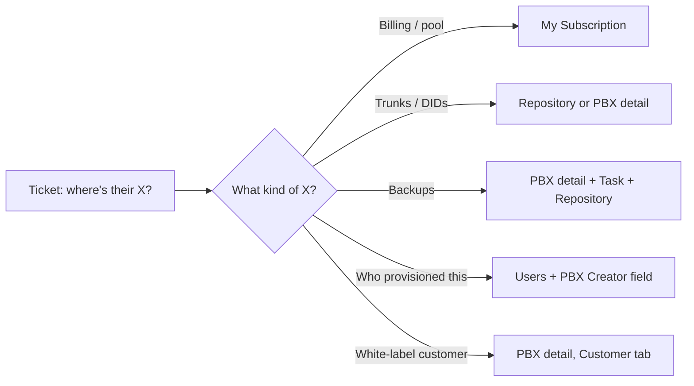

Half of YCM-side tickets are not "fix something" but "tell me what's there". Which trunk does the customer use? Did last night's backup run? Who provisioned this PBX? The records that answer those questions are spread across a handful of sections; this is the map.

## Billing and capacity, the MSP-pool view

```
My Subscription
```

The MSP's overall entitlement from their P-Series Hosting Package. Capacity here is **the pool**, not what's been allocated to any one customer.

What's on the page:

- **Extension capacity**: total / used / available across the whole estate.
- **Concurrent call capacity**: same shape.
- **Recording capacity**: minutes total / used / available.
- **Ultimate Plan capacity**: number of extensions the MSP can promote to Ultimate Plan.
- **AI transcription / receptionist capacity**: minutes the pool holds, and monthly quota packs.
- **Custom domains**: how many white-label domains the MSP can register per region.
- **Remote management connections**: pool of remote-management slots.
- **High Availability flag**, **White Label flag**: subscribed or not.
- **Expiration time** of the hosting package.

For a per-customer subscription breakdown (extensions assigned to one Hosting User, for example), the Users page shows the same shape scoped to one subordinate user.

| Question | Where to read |
|---|---|
| "Do we have pool capacity for a new 30-seat customer?" | My Subscription, available extensions |
| "Why did recording stop for ABC?" | Per-PBX detail: recording quota at zero. If pool is also low, My Subscription. |
| "When does our hosting package renew?" | My Subscription, expiration time |

## Assigned trunks and DIDs

```
Repository  →  Shared Trunks
Repository  →  DID Numbers
```

A **shared trunk** is a SIP trunk the MSP holds at the YCM level and assigns to one or more Cloud PBXs. DIDs are inbound numbers attached to a trunk.

Two angles on the same data:

- **From the Repository,** see every shared trunk and DID the MSP holds. Each DID record carries `id`, `did` (the number), `didName`, the trunks it's associated with (`trunkIds`), and the Cloud PBX it's currently assigned to (`cloudPbxId`).
- **From the Cloud PBX detail,** see only the trunks and DIDs assigned to this one PBX. The Assigned Trunks tab and the Assigned DID Numbers list are scoped to the PBX you're on.

For a ticket like "what's the customer's main number?", the Cloud PBX detail is the fast path. For "is this DID being used anywhere?", search the Repository.

<Callout type="info" title="DIDs can come from multiple trunks">
A DID record has a list of `trunkIds`, not a single trunk. In practice, MSPs usually have one trunk per DID; the multi-trunk shape exists to support failover or carrier diversity. If a customer asks "which carrier delivers our main number", the DID's trunk list tells you.
</Callout>

## Backup status

```
Cloud PBX detail  →  last backup timestamp
Task              →  scheduled backup tasks
Repository        →  Backup Files
```

Three places, three questions:

| Question | Where |
|---|---|
| "Did this customer's PBX get backed up last night?" | Cloud PBX detail; the `lastBackupTime` field shows the most recent YCM-task-driven backup. |
| "Is the nightly job scheduled?" | Task list; filter by backup tasks, confirm the schedule and last-run status. |
| "Restore Friday's backup onto a freshly provisioned PBX." | Repository → Backup Files holds every backup file. Each carries source PBX name, source SN, task ID, timestamp, file size. Restore is then a per-PBX action. |

Triage usually reads, not restores. The actual restore move is intermediate-course territory.

## Sub-user and colleague ownership

```
Users  (under the top-level menu, varies by firmware)
```

Every Cloud PBX has a creator. The Cloud PBX detail's **Creator** field tells you which YCM user provisioned it, and what role they hold:

- **Super Administrator**: the top-level MSP admin account.
- **Hosting User**: a tenant-style sub-account; in some MSP setups, an individual partner / reseller. A Hosting User has a `pbxCreationLimit` that caps how many PBXs they can create.
- **My Colleague**: an MSP staff member working under the Super Administrator or a Hosting User.

The Users page shows the same data in the other direction: pick a user, see their company, contact, type, two-factor state, and the number of PBXs they've created.

| Question | Where |
|---|---|
| "Which colleague set up this PBX?" | Cloud PBX detail, Creator field. |
| "Has this Hosting User hit their PBX cap?" | Users page, the row for that user. |
| "Show me only the PBXs created by this colleague." | Cloud PBX list, subordinate-user filter. |

## The customer record

The customer is the white-label end of the chain: the company the MSP hosts. The customer record carries Last Name, First Name, Company, Email, Mobile Number, Fax Number, and an External ID field for cross-referencing with the MSP's PSA or billing system.

Where the customer record lives depends on what you're doing. From a single PBX, the Customer tab on the Cloud PBX detail shows the customer(s) attached to that PBX (the API endpoint is `cloud_pbx/instances/{cloudPbxId}/customers`, which is the same data you'd see in the UI).

The customer never logs into YCM. They don't have a YCM identity. They're a contact record on the PBX, used for white-labelled communications (activation emails, welcome emails) and for the MSP's own bookkeeping.

## Putting it together



The pattern: **records about the pool** live in My Subscription and Repository. **Records about one PBX** live on the Cloud PBX detail page. **Records about who manages what** live in Users.

A senior tech runs that decision tree in under a second per ticket. Get it wrong twice in a shift, get it right the third time, and by the end of the week it's instinct.

Next lesson, the boundary: when a ticket stays in YCM, when it descends into PSE, when it's really a Linkus coaching call.
