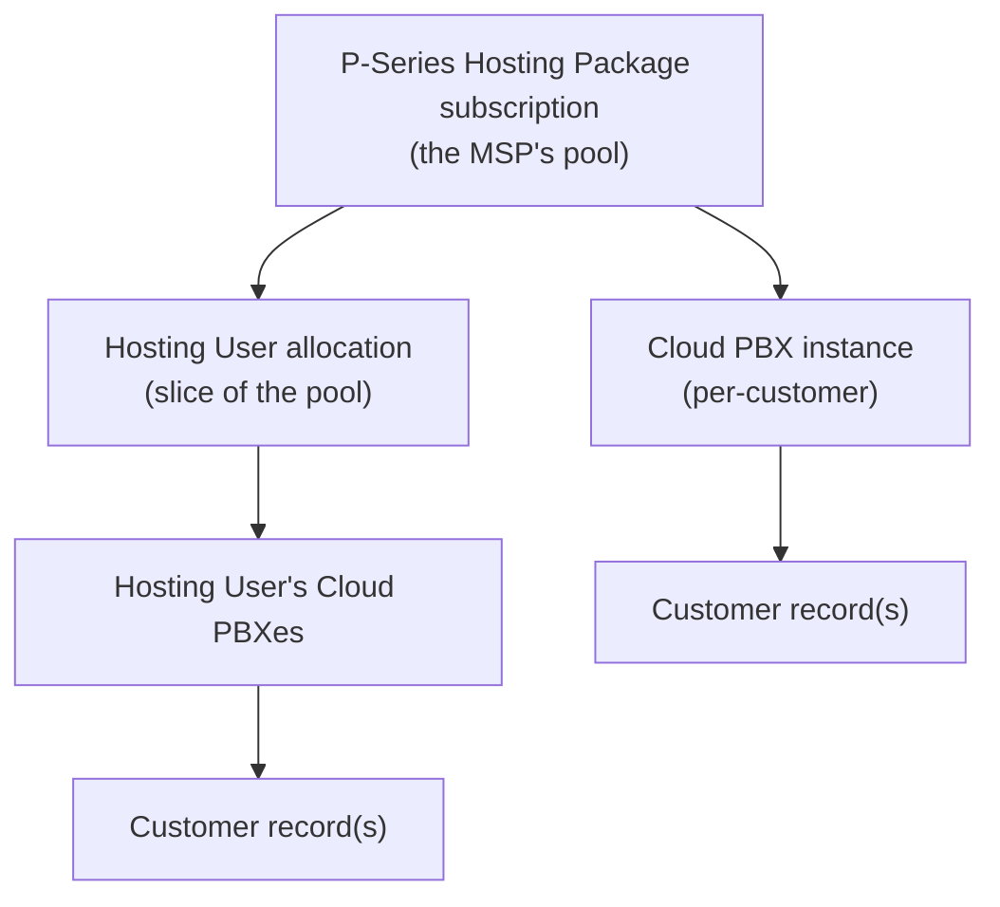

Provisioning starts before anyone clicks Create. The first question is "who's doing this?" The MSP-side YCM portal carries three different actor classes, three different record types, and a permission model that grants individual actions rather than coarse roles. Get the model wrong and you'll spend ten minutes wondering why an option is greyed out, or worse, hand a Hosting User capacity you can't get back without a support call.

## Three actors, three different things they're for

The Beginner foundations course named these without saying much about *what they're for in change work*. Here is that part.

| Actor | What they log into | What they own | Why provisioning cares |
|---|---|---|---|
| **Super Administrator** | YCM (one root account) | Everything the MSP holds | The only account with no ceiling on creation actions. |
| **Hosting User** | YCM (their own subordinate view) | A capacity slice carved out of the MSP pool, plus the Cloud PBXs they create within it | If your MSP runs a sub-reseller channel, this is the model. Each Hosting User has their own `pbxCreationLimit` and their own extension / call / recording / AI minute quotas. |
| **My Colleague** | YCM (scoped per-action) | Nothing of their own, just permitted actions | MSP staff. Different colleagues have different scopes via per-action permission grants. |
| **Customer** | Nothing, they don't log into YCM | A contact record on one or more Cloud PBXes (Last Name, First Name, Company, Email, Mobile, Fax, External ID) | The end company. Used for white-labelled communications and the MSP's PSA cross-reference. |

The customer is a record on the PBX, not a YCM login. They get a PBX admin account or an extension user account inside their own PSE; that's covered in `yeastar-pse-build`. The customer record is what gets named when you send an activation email or when finance needs to match a PBX back to a PSA contract.

## Three record types, three different things you allocate from

The records the MSP juggles in provisioning come in three layers. Knowing which layer holds what saves you from looking at the wrong page when something doesn't add up.

**Subscription record** lives at My Subscription. It's the full pool: `extensionCapacity`, `concurrentCallCapacity`, `recordingCapacity` (minutes), `ultimatePlanCapacity`, `transcriptionCapacity`, `receptionistCapacity`, plus monthly packs and the High Availability / White Label flags. When you create a new Cloud PBX directly, capacity is drawn from this pool.

**Hosting User allocation** is a slice carved out of the subscription. When you create a Hosting User, you fill in their Hosting Package fields and that capacity is deducted from the pool. They then create PBXes against their own sub-allocation. You can't reduce a Hosting User's recording minutes after issuing them, only increase, so be deliberate.

**Cloud PBX record** is the per-customer instance: name, plan, capacity, region, URL, status, creator, and a list of feature flags. Each Cloud PBX can have one or more **customer records** attached (the `customers` association is a one-to-many list).

A Cloud PBX is also a PSE installation. Once it's running, everything in `yeastar-pse-build` applies inside it. The YCM record is the wrapper; PSE is the contents.

## Colleague permissions are per-action, not per-role

The beginner foundations course flagged this; here's what it means when you sit down to provision.

A Colleague account isn't a single privilege level. When the Super Admin creates a Colleague, they pick checkboxes across permission tabs. Each tab is one feature area: Cloud PBX, Alarm, Repository, Task, System, and so on. Each checkbox is one action: Create Cloud PBX, Delete Cloud PBX, Resize Capacity, Apply Provisioning Template, Manage Shared Trunks, and so on.

The practical effect: two Colleagues with the title "support tech" can have completely different permission sets, depending on what their lead enabled when their account was created. If an action you expect to see isn't there, the answer is in your Colleague profile, not in YCM settings.

| You see | Likely cause |
|---|---|
| **Resize Capacity** missing from the action menu | Your Colleague profile doesn't have the permission. Take it to your Super Admin. |
| **Add** button on Shared Trunks is greyed | Same, but the **Manage Shared Trunks** permission. |
| **Send Activation Email** missing | Customer permission tab isn't checked. |
| The whole **Repository** menu isn't visible | The Repository feature area isn't granted on the Colleague's account at all. |

MSPs design these permission sets per internal role and stamp them onto each Colleague at account creation. A common pattern: a "provisioning team" Colleague has Cloud PBX create / resize / delete, Repository full, Customer full, and read on everything else. A "support tier" Colleague has Cloud PBX read + passwordless login, Alarm read, Repository read, and nothing destructive.

<Callout type="info" title="Hosting Users have permission tabs too">
When you create a Hosting User, the same User Permission section is on the form, with the same feature tabs. The difference is that Hosting Users start fresh with no permissions checked; you grant them the actions they need within their own sub-tenant. Customer admins (people who own a single Cloud PBX) never touch this; their permissions are on the PSE side, scoped to one PBX.
</Callout>

## The capacity-deduction rule

One non-obvious thing about Hosting Users. When you allocate them capacity, it leaves the MSP pool *immediately*, whether or not they've used it.

A worked example. The MSP pool has 1,400 extensions available. You create a Hosting User and give them `totalExtensions: 200`. The MSP's available extensions drops to 1,200, even before the Hosting User creates a single PBX. The 200 is theirs to allocate to their own PBXes. If they only ever create one 80-extension PBX, the other 120 sit reserved against them.

The same rule applies to concurrent calls, recording minutes, AI transcription, AI receptionist, and Ultimate Plan extensions. Allocating big and shrinking later is harder than allocating tight and adding more; recording minutes specifically cannot be reduced once issued.

<Callout type="warn" title="Recording minutes are one-way">
The Update User Subscription endpoint forbids reducing `totalRecordings`. The reason is that the minutes are paid-for and the customer has the right to use them through the period. If you issue a Hosting User 60,000 recording minutes by mistake, you can give them more, but not less. Read the field twice before clicking Save.
</Callout>

## When you can't passwordless-login into a PBX

A reminder from foundations: each Cloud PBX has a `passwordlessLogin` flag and an `allowSuperiorPasswordlessLogin` flag. The first lets the PBX's owner (a Hosting User, say) one-click into PSE. The second lets *their* superior (the MSP Super Admin) one-click into the same PBX through the chain.

For MSP-direct customers, both flags are typically on at provisioning time, and the Super Admin or a permitted Colleague clicks straight in.

For sub-reseller customers (PBX owned by a Hosting User), the MSP needs `allowSuperiorPasswordlessLogin` on to delegate in. The Hosting User can disable this if they don't want their parent reseller poking around in their customer's PBX. If they do, the MSP can still get in by asking the Hosting User to enable the flag temporarily, or by using the PBX's own Super Admin credentials, but neither is a routine operation.

## A worked scenario

Sarah at Able Moose Accounting (the MSP's mid-market customer) needs three things this week: a new Cloud PBX for an acquired firm, a resize on her main PBX, and a custom DID added.

Who does which:

1. **New Cloud PBX.** Provisioning team Colleague with Create Cloud PBX, Manage Shared Trunks, Apply Provisioning Template, Customer create.
2. **Resize.** Same Colleague (Resize Capacity is in the provisioning team permission set).
3. **DID add.** Repository → DID Numbers → Add, then the DID assignment lives on the PBX's Assigned DIDs tab. Manage Shared Trunks + Cloud PBX edit on the PBX gets you there.

If a different Colleague picks up the ticket and finds Resize Capacity isn't on their menu, they don't try to work around it; they hand back to the provisioning team or escalate to the Super Admin to add the permission. The reason is the same as why CDR access in PSE is scoped by role: granular permission grants are a deliberate audit-and-blast-radius choice, not an oversight.

<Checkpoint slug="yeastar-ycm-provisioning-checkpoint-tenancy" client:visible />

Next lesson: the create-a-Cloud-PBX flow itself, with Able Moose's instance as the worked example.
