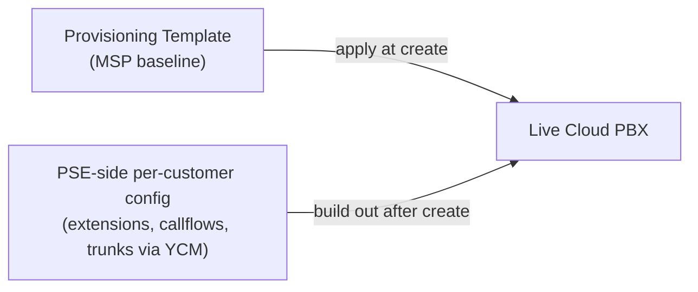

A provisioning template is the MSP's house style for a fresh Cloud PBX. The same allowed-IP rule, the same music-on-hold file, the same contact visibility setting, the same allowed country codes, stamped onto every new instance before the customer ever logs in. Without a template, the MSP relies on memory and a checklist; with one, the baseline is identical across customers and the next call into PSE starts from the same place every time.

## What a template carries

The list below is the **confirmed scope** as of YCM 87.14.0.31. These are the only configurations a template owns; anything not on this list is **not templatable** and must be set per-PBX inside PSE.

| Setting | What it controls |
|---|---|
| **Contact visibility** | The PBX-wide rule for who can see whose extension in the company directory |
| **Device Name** | The default naming pattern for auto-provisioned IP phones |
| **Distinctive Caller ID Name** | How the caller-ID name gets formatted on inbound calls (prepend trunk name, append, etc.) |
| **Music on Hold** | Which uploaded audio plays during hold; carries the audio file itself |
| **Allowed IPs** | The PBX firewall allow-list; usually the MSP's NOC IPs plus the customer's known egress |
| **Allowed country IPs** | Country-level allow-list for the firewall; lets customers in their home country reach the PBX, blocks the rest of the internet |
| **Allowed country codes** | Outbound dial restrictions by country code; the "you can dial AU and NZ, you can't dial Nigeria" rule |
| **Speech to Text** | Provider and language settings for the speech-to-text feature |

The template is one editable record in Repository → Provisioning Templates. The MSP can hold many templates (one per customer tier, one per region, one per industry) and pick the right one at create time.

## What a template does NOT carry

Read this list carefully. Every line is a thing technicians get wrong on their first template attempt.

- **Extensions**, the user list belongs to one customer, not a template. Lesson 01 of `yeastar-pse-build` covers extension creation paths (manual, CSV, M365 sync).
- **Departments**, same logic. Per-customer.
- **Inbound routes, queues, ring groups, IVRs, time conditions**, the callflow shape is the most customer-specific thing the PBX holds. None of it lives in a template.
- **Trunks**, lesson 4 covers the shared-trunk model. Trunks are assigned to the PBX from YCM after creation; they aren't templated.
- **DIDs**, same as trunks. Assigned, not templated.
- **Recording rules**, the policy for which calls record lives in PSE per customer.
- **Voicemail settings**, default voicemail behaviour and email-to-voicemail config is per-PBX.
- **User Role permissions**, the PSE-side RBAC roles like "Receptionist" or "Sales Manager" are per-customer.

If you find yourself wanting to template one of these, the answer is to template the *baseline* in PSE itself and clone the PBX from a backup. That's a different workflow, covered in `yeastar-ycm-scale`.



The template is the floor. PSE-side build is the rest of the house. Lesson 5 covers the handover from "PBX exists with template applied" to "PSE-side build hands off to the customer's IT contact".

## Building a template, the field-by-field

```
Repository  →  Provisioning Templates  →  Add
```

The template form has the same field labels as the equivalent PSE-side settings pages, plus a couple of YCM-specific framing fields.

<StepThrough client:load>
  <Step title="Name and remark the template">
    The Name field shows up in the picker on the Cloud PBX create form, so be descriptive: `MSP-baseline-au-au-2026`, not `template2`. The Remark field is for human notes (what's special about this template, when it was last reviewed).
  </Step>
  <Step title="Apply Object Type filter">
    The template is scoped to P-Series Cloud Edition (PCE), the appliance edition (PSE), or the software edition (PASE). Pick the one your customers use; a PCE-only template can't be applied to a PSE box.
  </Step>
  <Step title="Configure each section">
    The form walks through each settings area (Contact Visibility, Music on Hold, Allowed IPs, and so on). Anything left blank in the template is *not pushed* when the template applies; the PBX keeps its default. Only fields you fill carry into the new PBX.
  </Step>
  <Step title="Upload audio for Music on Hold">
    Music on Hold is the one section that carries a file payload, not just a setting. Upload the licensed audio (WAV / MP3) here; it's stored in YCM and pushed at apply time.
  </Step>
  <Step title="Save and tag the template version">
    Templates are versioned by the timestamp of last edit. The Cloud PBX detail page records `lastUsedTemplate` and `lastUsedTime` for audit. If you edit the template after applying it to a PBX, the change does NOT retroactively push; the PBX has the snapshot from when it was applied.
  </Step>
</StepThrough>

<Callout type="info" title="Templates don't push retroactively">
A template apply is a one-shot operation. After apply, the PBX is independent of the template; later edits to the template don't reach the PBX. This is by design: customers can override settings the template set, and a future template push would clobber their overrides. If you need to roll out a policy change across the fleet, the YCM bulk-edit moves cover that, not a template re-apply.
</Callout>

## Applying a template

Two moments to apply a template:

### At create time

On the Cloud PBX create form (lesson 2), the **Provisioning Template** dropdown lists every template the MSP has. Pick one; the chosen template's settings push as soon as the PBX boots.

This is the common case. Almost every new PBX gets a template at create.

### After create, via the action menu

On a PBX that didn't get a template at create (or one you want to re-apply a different baseline to), the **Apply Template** action on the row pushes a template to the existing PBX.

Two prerequisites for this move:

- **Provisioning via Template** must be enabled on the PBX (it's a feature flag on the Cloud PBX detail page).
- The PBX must be in `Running` status.

<AnnotatedScreenshot
  src="/img/yeastar/enable-provisioning-toggle.png"
  alt="The Cloud PBX feature-flag panel showing Allow Upgrade from PBX Side, Allow Passwordless Login, and the Allow Provisioning via Template checkbox highlighted."
  caption="The Allow Provisioning via Template toggle on a Cloud PBX. Off means the row's Apply Template action is greyed; on means YCM can push a template to this PBX."
>
  <Hotspot client:load x={50} y={70} tone="primary" label="1" title="Allow Provisioning via Template" purpose="Gates the Apply Template entry on the Cloud PBX action menu.">
    Off by default. Toggle on per Cloud PBX to allow templates to overwrite its config. Useful safety lever during cutover; turn off again on customers whose configs you don't want disturbed by a template re-apply.
  </Hotspot>
</AnnotatedScreenshot>

## How PSE-side overrides interact with template values

After a template applies, the PBX has the template's values as a starting point. Inside PSE, the customer's admin (or the MSP delegating into the customer's PBX) can change any of those values per their needs.

The override mechanics are simple: **last write wins**. If the template set Music on Hold to `corporate-jazz.wav` and the customer's IT contact uploads `customer-brand-music.wav` after activation, the customer's choice survives. The template doesn't fight back; it pushed once at apply, and from that moment the PBX owns its settings.

This is why the "what's not templatable" list matters. Extensions, queues, callflows: the customer always builds these from blank. Templating them would force every customer onto the same callflow, which defeats the point of a multi-tenant platform.

## The MSP template strategy: a worked example

Able Moose Accounting (mid-market customer) gets the MSP's `mid-market-au-2026` template. Northwind Logistics (operational warehousing, shift workers, different security posture) gets `industrial-au-2026`. Riverbend Legal (small, strict compliance, lawyer-grade audit) gets `regulated-small-au-2026`.

A scanning glance at the three templates:

| Setting | Mid-market | Industrial | Regulated-small |
|---|---|---|---|
| Allowed IPs | MSP NOC + customer egress | MSP NOC + customer egress + sites | MSP NOC + lawyer-firm static IPs only |
| Allowed country codes | AU, NZ, US, UK | AU + customer's import countries | AU only |
| Music on Hold | Generic corporate | Custom per-customer (uploaded later) | Generic corporate, no marketing |
| Distinctive Caller ID | `[Trunk] Caller` prefix | `[Site] Caller` prefix | `[Trunk] Caller` prefix |
| Speech to Text | Enabled, AU English | Disabled | Disabled (compliance) |

Three templates cover most of the MSP's customer shapes. A new customer onboarding hits "pick the closest template, override the deltas in PSE", and the per-customer delta work is measured in minutes rather than hours.

<Checkpoint slug="yeastar-ycm-provisioning-checkpoint-templates" client:visible />

Next lesson: shared trunks and DIDs, the assets the MSP holds at YCM level and binds onto a PBX after create.
