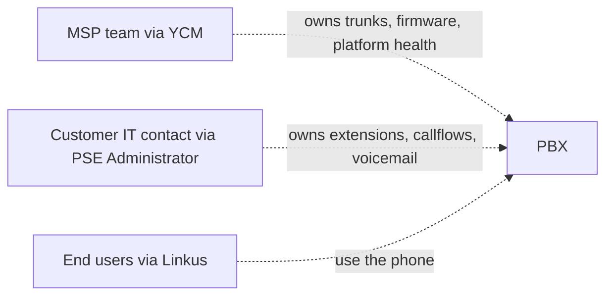

The PBX exists. The trunks are assigned. Now the customer's IT contact has to take ownership of *part* of the surface (their users, their callflow), while the MSP keeps ownership of *another* part (the wrapper, the trunks, the platform-level config). Onboarding is the moment where you draw that line clearly. The lines you draw here are the ones support reads back to you in six months when "who owns this fix?" comes up.

## Decision: who owns the PBX Super Admin login

Every Cloud PBX has a **Super Admin** account on the PSE side. This account is not bound to a user extension; it's the PSE-side root, separate from every extension user account. Who holds the credentials is the cleanest signal of the ownership split.

```mermaid
flowchart TD
    Start[New customer PBX] --> Q1{Does the customer have an in-house IT team?}
    Q1 -- No --> A1[MSP holds the Super Admin]
    Q1 -- Yes --> Q2{Does the IT team want operational ownership of PSE?}
    Q2 -- No, MSP handles all changes --> A1
    Q2 -- Yes, they want self-service --> A2[MSP creates a second admin role on PSE for the customer's IT team]
    A1 --> Note1[Super Admin password lives in MSP's secrets manager.<br/>Customer logs in only via passwordless-login delegation or for their own extension user account.]
    A2 --> Note2[MSP keeps Super Admin in their secrets manager.<br/>Customer's IT team gets the Administrator role (restricted) on PSE.<br/>Day-two changes either party can make; MSP audits both.]
```

The Super Admin is rarely handed wholesale to a customer. Two reasons:

1. The customer's audit trail loses meaning if both the MSP and the customer log in as the same Super Admin account.
2. Some PSE actions (firmware updates, integration changes, deep network settings) can break things in ways the MSP has to recover from; restricting them keeps the support contract honest.

The typical MSP-direct flow is "MSP holds Super Admin, customer's IT contact gets the **Administrator** role with restricted PSE permissions". `yeastar-pse-build` covers the PSE-side roles and what gets restricted.

## Customer record vs PBX vs subscription

Three records the activation email flow touches. Worth nailing the distinction one more time.

| Record | Where it lives | What it carries | What it's for |
|---|---|---|---|
| **Customer record** | Cloud PBX detail → Customer tab | Last/First Name, Company, Email, Mobile, Fax, External ID | Default recipient of activation emails; cross-references to the MSP's PSA |
| **Cloud PBX record** | Cloud PBX list and detail | Name, plan, capacity, region, URL, status, creator, feature flags | The platform-side instance record |
| **YCM user (Hosting User / Colleague)** | Users page | Email, role, permissions, capacity slice (if Hosting User) | Who can log into YCM and what they can do |

The customer is **never a YCM user**. They don't get a YCM login. They get a contact record on the PBX, used by the activation email and by white-labelled communications. They get a *PSE-side* admin or extension user account, which is a different identity entirely.

## Sending the activation email

If you used Initial Configuration on the create form (lesson 2), the PBX boots Activated and the customer's admin credentials are already set; activation email is unnecessary. If you left Initial Config empty, the PBX boots `Unactivated` and needs an activation email to wake it up.

### The send action

```
Cloud PBX list  →  row action menu  →  Send Activation Email
```

<AnnotatedScreenshot
  src="/img/yeastar/send-activation-email-action.png"
  alt="The Cloud PBX row action menu with Resize Capacity, Upgrade Plan, Send Activation Email, Reset Administrator Password, Restore PBX, and Delete visible."
  caption="The Send Activation Email action sits in the same row menu as resize and restore. It only appears when the PBX is in Unactivated state; once activated, the option goes away."
>
  <Hotspot client:load x={50} y={50} tone="primary" label="1" title="Send Activation Email" purpose="Appears only while the PBX is Unactivated.">
    Once the customer admin completes activation (clicks the link, sets a password, signs in), this entry vanishes from the menu. Don't send a fresh one once activation is complete; resend a welcome email through PSE instead.
  </Hotspot>
</AnnotatedScreenshot>

The send pop-up asks which customer record(s) on the PBX should receive the email. By default, the customer record bound at create time is selected. If multiple customer records are attached (a customer with two IT contacts, say), tick each.

The email itself carries:

- The MSP's branding (logo, signature, theme colors; configured via Email Branding, see below)
- The PBX URL (sub-domain.domain you set at create)
- A one-time activation code (8 characters, ASCII)
- A direct activation link (long URL with embedded token)

The customer clicks the link, enters or confirms the activation code if prompted, and walks the Install Wizard. They pick the admin password, timezone, date format, and notification preferences. When they finish, the PBX flips to `Activated`.

### When activation hasn't happened yet

Two failure modes you'll see:

| Symptom | Likely cause | Fix |
|---|---|---|
| Customer says "I never got the email" | Email landed in spam, or wrong recipient email on customer record | Update customer record email, resend |
| Activation link says expired | Default expiry is hours to days; old emails go stale | Resend from the action menu |
| Customer's first login lands on a "PBX not activated" page | They opened the PBX URL directly without clicking the activation link | Send them the activation email, ask them to click that link first |

The activation flow is forgiving in that resends work without breaking anything. The link is single-use though; once the customer activates, a second click on the same link errors.

## Email branding so the welcome email is on-brand

The activation email is the customer's first impression of the PBX. If the MSP is white-labelled, the email *must not* show Yeastar branding. Email branding lives at:

```
System  →  Customization (or Branding, naming varies by release)  →  Appearance for PBX Emails
```

The fields the MSP fills:

- **Email Signature**, up to 500 characters; supports `<br/>`, `<strong/>`, `<b/>`, `<a/>` HTML tags. The MSP's company name, support email, support phone, opening hours.
- **Logo**, the image that appears in the email header.
- **Theme colours**, primary brand colour, success / error / warning colours, used in the welcome and activation emails' buttons and accents.

The full white-label setup (custom domain, login page rebrand, OEM ID switch) is `yeastar-ycm-scale` territory. Email branding is the slice of white-label that affects this lesson: get it right before the first activation email goes out, and the customer sees the MSP's brand everywhere.

<Callout type="info" title="Branding edits apply to newly subscribed PBXes immediately">
The Configuration Effective Time on the branding form has an Update Immediately option. With that on, post-subscription PBXes reboot to apply the new branding when you save. Pre-subscription PBXes (older instances created before the MSP subscribed to the brand kit) need a manual Switch OEM ID action on each row to convert; that's handled in `yeastar-ycm-scale`.
</Callout>

## The Linkus QR pack

Once the customer's PBX is activated and the extensions are built out (PSE-side, in `yeastar-pse-build` lesson 1), users need to install Linkus. Each user gets a QR code that pre-fills their PBX URL, extension number, and registration secret; one scan and Linkus is configured.

The QR generation is PSE-side; what matters at the YCM-stage onboarding is to ensure the customer's IT contact knows it exists, knows where it lives, and knows whether to walk users through the install or hand them a self-service page.

The `yeastar-linkus` Beginner course covers QR scanning and welcome-email flows; refer the customer's IT contact to that as the user-facing reference.

## The handover document

The single most useful artefact at this stage is a short handover document the MSP gives the customer's IT contact. It doesn't have to be long. Six headings cover almost every real onboarding question:

| Heading | Content |
|---|---|
| **PBX URL** | The URL the customer types into Linkus and the admin web UI |
| **Admin credentials** | The Administrator (restricted) role login for the customer's IT contact |
| **Trunk and DID summary** | Which trunk delivers which DIDs; the main number; the failover (if any) |
| **MSP-managed vs customer-managed** | The line: what the MSP owns (trunks, firmware, platform), what the customer owns (extensions, callflows, recording rules, voicemail) |
| **How to escalate** | The MSP's support email, phone, hours; the SLA tier the customer is on |
| **Where to find user help** | The link to the Linkus self-help pages (or the MSP's internal documentation) |

Write it once, template it, fill in the per-customer fields, attach to the onboarding ticket. The MSP techs read this document themselves the next time a question lands; it's not customer-facing only.

## Going forward, the boundary

After handover, three roles share the PBX:



Tickets land based on which surface is broken:

- "We can't make calls" or "the system says we're at capacity": MSP, YCM-side.
- "Our IVR sends after-hours calls to the wrong place": customer IT, PSE-side, or MSP if the customer doesn't have an IT contact.
- "Linkus on my laptop says password incorrect": end-user / customer IT, Linkus QR or extension password.

The Beginner `yeastar-pse-triage` lesson 5 covers the three most common ticket patterns; lessons 3 and 4 of `yeastar-pse-build` cover the build-out side. With ownership clear, the right team picks up the right tickets without thrashing.

Next lesson: day-two YCM moves. Resize, restart, backup-restore, alarm response, and the descent into PSE for the issues that YCM can't fix.
