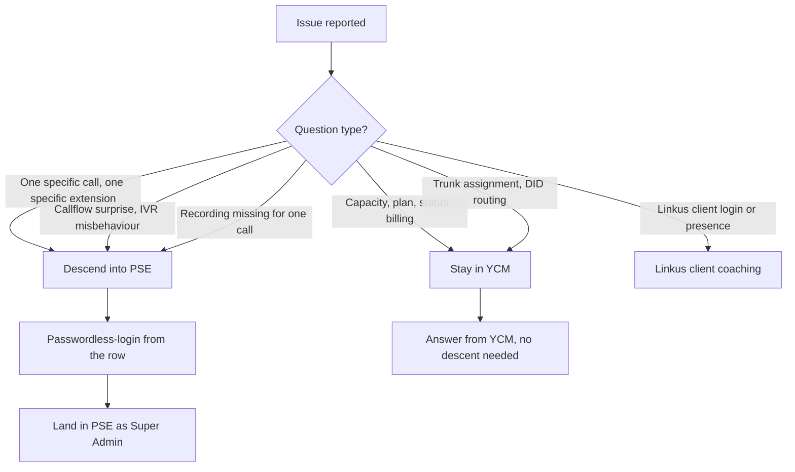

A live customer's PBX needs care it didn't need at create. Capacity needs to grow, recordings fill up, a backup is needed before a risky change, an alarm fires at 03:00 and you need to triage from the YCM dashboard. This lesson walks the four day-two moves YCM owns, the constraint that catches each one, and the rule for when to stop poking at YCM and delegate into PSE instead.

## The four moves YCM owns

```
Cloud PBX  →  row action menu
```

Every day-two action lives on the same per-row action menu you used to create the PBX. The menu changes shape based on the PBX's state and the Colleague's permissions; expect to see some subset of:

| Action | What it does | Constraint |
|---|---|---|
| **Resize Capacity** | Change extension / concurrent call / recording / AI minute caps | Pool must have headroom for the increase; can't reduce recording minutes |
| **Stop / Start** | Pause and resume PBX operation | Stop is destructive to active calls; warn the customer first |
| **Restart** | Restart the PBX without changing config | Active calls drop; usually 30-90 seconds outage |
| **Backup** (87.12.0.71+) | One-shot backup outside the scheduled task | Goes to Repository → Backup Files immediately |
| **Restore PBX** (87.12.0.71+) | Apply a backup file onto the running PBX | PBX must be Running; backup firmware ≤ PBX firmware |
| **Send Activation Email** | Resend if customer never activated | Only visible while Unactivated |
| **Reset Administrator Password** | Reset the PSE-side Super Admin password | Triggers an email to the customer record |
| **Apply Template** | Push a provisioning template onto an existing PBX | Allow Provisioning via Template flag must be on |
| **Delete** | Remove the PBX | Capacity returns to the pool; backup files survive |

<AnnotatedScreenshot
  src="/img/yeastar/cloud-pbx-actions-menu.png"
  alt="The Cloud PBX row action menu showing Resize Capacity, Upgrade Plan, Change PBX Type/Expiration Date, Reset Administrator Password, Restore PBX, and Delete options."
  caption="Every day-two action sits in this dropdown. Items grey or vanish based on the PBX state and the Colleague's permissions; if Resize Capacity isn't there, you don't have the permission, not that the PBX can't be resized."
>
  <Hotspot client:load x={75} y={50} tone="primary" label="1" title="The action menu" purpose="Same row, every day-two move.">
    Resize Capacity, Upgrade Plan, Change PBX Type / Expiration Date, Reset Administrator Password, Restore PBX, Delete: all live behind this single menu. Items grey or vanish based on PBX state and your Colleague permissions; if Resize Capacity isn't there, you don't have the permission, not that the PBX can't be resized.
  </Hotspot>
</AnnotatedScreenshot>

## Resize Capacity, the most common day-two ask

Customer hires fifteen people, the row says 50 / 50, the call from the customer's IT contact lands on the helpdesk. The fix:

```
Cloud PBX list  →  row  →  ... → Resize Capacity
```

The pop-up shows current values (extension capacity, concurrent call capacity, recording minutes, AI transcription, AI receptionist) and a New Value field per row.

The pool check happens at save:

- New extensions or concurrent calls beyond the current allocation are deducted from My Subscription's `extensionCapacity` and `concurrentCallCapacity` available numbers.
- New recording minutes likewise from the recording pool.
- AI minute changes either come from add-on or pack pools.

If the pool doesn't have headroom, save fails with a clear message ("Insufficient extension capacity in subscription"). Two responses:

1. Free pool capacity by deleting an unused PBX or downsizing another customer's allocation.
2. Top up the MSP's subscription with Yeastar (a procurement / finance action; not a YCM-side fix).

<Callout type="warn" title="Recording minutes once issued cannot be reduced">
The Resize pop-up will let you raise recording minutes but not lower them, even if the customer agrees. The minutes are paid-for through the period and the customer has the right to use them. If you allocated 5,000 by mistake when the customer needed 1,000, the difference sits with that PBX until the period rolls over. Read the value twice before saving.
</Callout>

## Restart, when and why

Restart is the YCM-side restart of the PBX. It's not Stop-then-Start; it's a single Restart action that brings the PBX back up in one motion.

When to restart from YCM rather than from inside PSE:

- The customer's IT contact reports PSE is unresponsive or sluggish; their own restart-from-PSE didn't help.
- Firmware behaviour you suspect needs a clean state.
- Post-restore (the PBX restarts itself as part of restore; the YCM action is rare here).

The cost: any active calls drop. Schedule restarts in the customer's quiet window if they're not urgent. The Alarm view fires a "PBX is Restarting" event during the window; suppressed alarms here are normal.

## Backup, the one-shot

The MSP's nightly backup task (set up via Task → Add) covers the routine case. The row action menu's **Backup** button is for one-offs:

- Before a risky configuration change, taken on the customer's say-so.
- Before a firmware upgrade.
- Right after a major callflow build, to capture the working state.

The backup runs immediately. The resulting file lands in Repository → Backup Files, named `PCE-Backup-{firmware}-{ISO timestamp}.bak`. Each backup record carries the source PBX name, source SN, the task ID (for ad-hoc backups, this is "manual"), the file size, and an editable Remark field. Use the remark to capture the *why* ("pre-IVR-rebuild backup" beats "manual backup").

<AnnotatedScreenshot
  src="/img/yeastar/backup-task-list.png"
  alt="The Task list with a row showing object type P-Series CE, task Backup, repeat One-time, with a status icon and execution timestamp."
  caption="Scheduled backups and one-off backups both land in the Task list. The Repeat column is the cleanest way to spot ad-hoc tasks (One-time) from nightlies (Daily / Weekly)."
>
  <Hotspot client:load x={70} y={50} tone="primary" label="1" title="Repeat column" purpose="Scheduled vs one-off at a glance.">
    Repeat = One-time means an ad-hoc backup someone clicked. Daily / Weekly / Monthly means the scheduled task is doing its job. When investigating "did the nightly backup actually run?", filter Task list by Repeat to see the recurring backup task entries clearly.
  </Hotspot>
</AnnotatedScreenshot>

## Restore PBX, the constraints that bite

Restore is the move that recovers from a bad change, a corrupted state, or a platform incident. Two restore paths:

| Path | When |
|---|---|
| **Row action → Restore PBX** | Apply a backup file to the same PBX it came from |
| **Repository → Backup Files → Restore** | Apply a backup file to a *different* PBX (e.g. fresh PBX created to receive a restore) |

Both paths share the same constraints:

1. **The target PBX must be in `Running` status.** Restore on a `Stopped` PBX fails with a clear error. Start the PBX first.
2. **The backup file's firmware must NOT be higher than the target's firmware.** A backup taken on `84.21.x` cannot be restored onto a `84.19.x` PBX. The reverse (older backup, newer PBX) works. Lesson 2's "pick a firmware at or above the backup's" comes home here.
3. **Restore overwrites current config.** Anything done on the PBX since the backup is gone. Tell the customer.
4. **Shared trunks are not in the backup**, so after restore you reassign trunks and DIDs from YCM (lesson 4).

The restore UI shows a progress bar; the PBX moves from `Running` to `Restoring` and back to `Running` over a few minutes. If it gets stuck in `Restoring` for over fifteen minutes, the Alarm view will fire; check there before clicking again.

<Callout type="danger" title="Restoring is destructive and irreversible">
The restore overwrites the live PBX's config wholesale. There is no undo within the restore action. If you restore the wrong backup or onto the wrong PBX, the only recovery is to restore *another* backup, which is itself irreversible. Before clicking Confirm: verify the backup file name, verify the target PBX name, take a fresh one-off backup of the current state if there's any chance you'll need to roll forward.
</Callout>

## Locating a misbehaving PBX from the Alarm view

The Alarm view (covered in `yeastar-ycm-triage` lesson 3) is where you start when "something's wrong with a customer's phones" lands without a specific PBX named. The view's three object scopes (YCM, Cluster, PBX) and the 80% / 90% / 95% event threshold tiers shape what you see:

- **YCM-scoped alarms** (server-side): platform-side issues affecting many PBXes. Don't descend into one PBX; the issue is upstream.
- **Cluster-scoped alarms** (PBXHub / SBC / SBC Proxy): one cluster of PBXes affected. Same advice; descent into individual PBXes is wasted effort until the cluster heals.
- **PBX-scoped alarms** (per-instance): one PBX. This is where you click in.

The 80 / 90 / 95 tiers tell you how close the PBX is to its limit (extensions, concurrent calls, recording minutes, AI minutes). A 95% extension-capacity alarm means the customer is two or three new hires away from a hard ceiling; resize before the support call comes.

## The descent: when to leave YCM for PSE

A senior tech runs this decision quickly:



The descent is via **passwordless-login**, the default delegation flow. From the Cloud PBX list row's action menu, click **Passwordless Login**; the browser opens a new tab logged into PSE as the Super Admin. Foundations covered the audit-trail aspect; the practical bit here is that descent is one click.

`yeastar-pse-triage` covers what to do once you're in PSE. Lesson 5 of that course is the three-pattern triage playbook (no outbound, no audio, callflow wrong); lessons 1-4 cover the navigation. The intermediate course `yeastar-pse-build` covers the configuration moves that come up when triage tells you a config change is needed.

For deep diagnostics that need a packet capture or a SIP-trace read, the future advanced course `voip-deep-diagnostics` covers Wireshark workflows, MOS reading, jitter analysis, and the patterns that escalate to carrier engineering.

## A worked day-two: Able Moose's busy Tuesday

Tuesday morning, three things land in the queue:

| Ticket | Stay in YCM, or descend? |
|---|---|
| "Can't add new starter, system says capacity full" | YCM. Resize the PBX. |
| "Sarah's outbound call to a UK number got 'no matching route'" | Descend. CDR + Outbound Routes in PSE. |
| "Last night's nightly backup didn't run" | YCM. Task list, find the backup task, read the failure reason. Restart the task or escalate to platform. |

The first ticket, two minutes from queue to fixed. The second, descend, 5-15 minutes for the diagnosis. The third, YCM-side, 5-30 minutes depending on the failure. None of them needed deep platform work; the descent decision was clear in each case.

That's the day-two pattern. The bulk of YCM work is fast, low-risk, high-value reads-and-resizes. The cases that need PSE go to PSE cleanly with the trunk and capacity assumptions already validated from YCM.

<Checkpoint slug="yeastar-ycm-provisioning-checkpoint-day-two" client:visible />

That closes the YCM provisioning surface. The advanced YCM course (`yeastar-ycm-scale`, future) picks up the white-label customisation, the YCM REST API, the webhook subscriptions, and the multi-tenant RBAC governance design. The parallel intermediate `yeastar-pse-build` covers everything inside the customer's PBX. Together they're the day-to-day intermediate kit for an MSP technician working a hosted-BYOI Yeastar estate.
