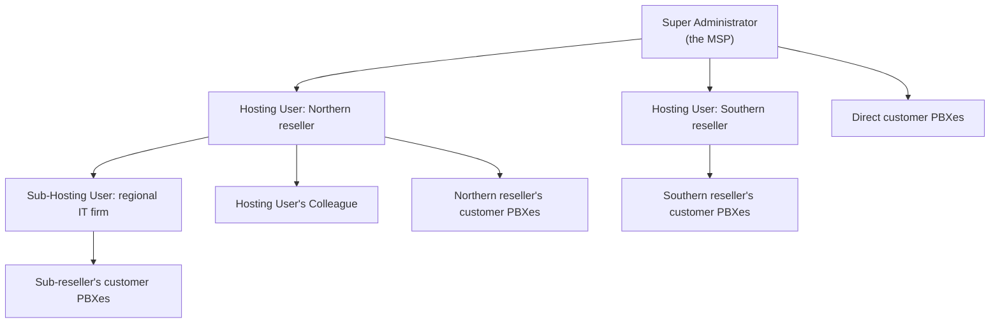

By the time an MSP runs more than a handful of customers through YCM, the question stops being "how do I create a Cloud PBX" and starts being "who in our org is allowed to create one, and what happens when a sub-reseller wants to bring their own customers in." The platform's answer is two distinct actor classes (Hosting Users for sub-resellers, Colleagues for internal staff), per-action permission grants on both, and a small number of feature gates that decide what those actors even see.

This lesson is the design layer. The provisioning course covered the daily mechanics. Here, you design the org chart that lets you scale that work safely.

## Two actor classes, two different governance problems

The provisioning course introduced Hosting Users and Colleagues without saying why an MSP would pick one over the other. The choice carries downstream consequences for capacity, branding, and what your support team can see.

| | **Hosting User** | **My Colleague** |
|---|---|---|
| **Who they are** | A sub-reseller or partner organisation, often an external business | Your internal staff |
| **What they own** | A capacity slice (extensions, calls, recording minutes, AI packs, custom domain quota) carved out of the MSP pool, plus their own Cloud PBXs and their own Colleagues underneath them | Nothing of their own. They act inside your tenancy with the permissions you grant. |
| **`pbxCreationLimit`** | Yes. Caps how many Cloud PBXs they can own in total. | Not applicable. |
| **Custom domain quota** | Per-region quota set on their Hosting Package, lets them brand their own PBX URLs | Not applicable. |
| **Permission tabs at creation** | Start unchecked. You grant only what their tier of the channel needs. | Start unchecked. You grant per internal role. |
| **Reports up to** | You (or your Hosting User chain if they sit inside another reseller) | The Super Administrator |

Hosting Users are the model when your MSP runs a reseller channel: an IT consultancy that sells you to its own customers, an in-country distributor, an affiliate. Their `createdReseller` field on the API response confirms they can themselves create sub-Hosting-Users underneath, which is how the multi-tier hierarchy stacks.

Colleagues are the model for everyone inside your four walls. The MSP's provisioning team, the support team, the on-call engineer, the billing analyst, all get Colleague accounts with carefully different permission sets.

The two roles are not interchangeable. A Hosting User who should not see other resellers' data should never be a Colleague (Colleagues see everything you let them, scoped by feature area, not by tenant). A Colleague that needs their own capacity pool should not be a Hosting User (Colleagues do not have capacity of their own).

## The Hosting User hierarchy

The deeper question for an MSP with a channel is how many tiers of resellers to support.

A Hosting User can themselves create Hosting Users (a sub-reseller channel). Each tier carries its own capacity allocation and its own permission grants. The deeper the chain, the more attention you have to pay to two things:

- **`allowSuperiorPasswordlessLogin`** on each Cloud PBX in the chain. The MSP's ability to passwordless-login down to a customer PBX depends on every link below allowing it. If your tier-two reseller turns this off on their customer's PBX, you cannot delegate in even though you sit at the top.
- **Capacity accounting.** Capacity allocated to a Hosting User is deducted from the MSP pool the moment you save the form. Capacity that Hosting User in turn allocates to their own sub-Hosting-User is deducted from *theirs*, not from yours. The arithmetic stays straight only if each tier respects its own sub-allocations.

Most MSPs stop at one tier of Hosting Users. Two-tier and deeper hierarchies are the exception, reserved for distributor channels with their own resellers underneath. If you cannot draw your channel on a whiteboard in under a minute, the hierarchy is probably more complex than it needs to be.

## Colleague permissions are per-action, designed per role

The provisioning course flagged that Colleague permissions are checkboxes across feature tabs (Cloud PBX, Alarm, Repository, Task, System, and the rest), not coarse role grants. The Advanced practice is to stop checking boxes ad-hoc on each new hire and start designing **named permission profiles** that map to your internal job tiers.

A practical four-profile shape:

| Profile | Cloud PBX | Repository | Alarm | System | Why |
|---|---|---|---|---|---|
| **Triage tech** | Read + passwordless-login | Read | Read | None | Diagnose customer tickets without changing anything |
| **Provisioning team** | Read + Create + Resize + Apply Template + Send Activation Email | Full | Read | None | The build-and-onboard tier |
| **Voice ops engineer** | Full | Full | Full | Email Server, SNMP, Operation Log read | Cluster ops, platform engineering, audit reviewer |
| **MSP admin** | Full | Full | Full | Full (Branding, API, Custom Domains, Email Server, SNMP) | The MSP's voice service owner; usually one or two people total |

Yeastar does not ship these profiles. You design them on your side and stamp them onto each Colleague at account creation. The pattern survives org changes: when someone moves from triage to provisioning, you do not edit fourteen individual checkboxes, you reassign the named profile.

<Callout type="warn" title="The Branding gate is on the System tab, and it is dangerous">
A Colleague with `System` permissions that include **Branding** can change the look and feel of your portal, your email templates, and your Cloud PBX white-label. That affects every Hosting User and every customer downstream. Grant Branding to the MSP-admin tier and nobody else. Same for the API tab, the Custom Domains tab, and the Email Server tab.
</Callout>

<AnnotatedScreenshot
  src="/img/yeastar/colleague-permission-tabs.png"
  alt="YCM Colleague creation form showing the User Permission section with Cloud PBX, Alarm, Repository, Task, System, and more tabs each carrying per-action checkboxes."
  caption="When you create a Colleague, the User Permission section is the entire governance surface for that account. Tabs are feature areas; checkboxes inside each tab are individual actions. Two Colleagues with the same job title can end up with completely different capabilities depending on which boxes are ticked here."
>
  <Hotspot client:load x={20} y={20} tone="primary" label="1" title="Feature tab list" purpose="Each tab is one feature area (Cloud PBX, Trunk, Branding, SNMP, Custom Domain, etc.).">
    Permissions are scoped per feature area. A Colleague who needs to provision PBXs but not change branding gets Cloud PBX tab fully enabled and Branding fully disabled.
  </Hotspot>
  <Hotspot client:load x={70} y={50} tone="warning" label="2" title="Per-action checkboxes" purpose="Design role profiles. Do not click ad-hoc.">
    The temptation is to grant permissions reactively when a colleague asks. The result is permission drift across the team. Design two or three named role profiles ("L1 support", "provisioning team", "platform lead") and apply consistently.
  </Hotspot>
</AnnotatedScreenshot>

## Hosting User permissions, designed from the channel down

The same per-action permission model applies when you create a Hosting User, with one important difference. The Hosting User's permissions are not what *they* can do across your whole tenancy; they are what they (and their Colleagues underneath them) can do **inside their own sub-allocation**. The Branding tab on a Hosting User decides whether *they* can rebrand the portal for *their* customers, not whether they can change yours.

A typical Hosting User permission shape (channel reseller, can self-serve their own customers):

- Cloud PBX, full inside their pool
- Repository, full
- Branding (System tab), granted, so they can apply their own white-label
- Custom Domains (System tab), granted, with `totalCustomDomains` set on their Hosting Package
- API (System tab), granted only if they intend to script their own provisioning
- Operation Log (System tab), granted (read), so they can audit their own staff

A constrained-channel Hosting User (you handle their provisioning, they only consume) gets a much narrower set, often just Cloud PBX read and Repository read so they can see their PBX inventory but not change it.

<Callout type="info" title="Branding cannot be delegated to a Hosting User on YCM itself">
Yeastar's documentation is explicit: branding permission for the *YCM portal itself* can be assigned to a Colleague (for co-management of the MSP brand), but **not** to a Hosting User. Hosting Users brand their own subordinate Cloud PBXs through the PCE White Label flow. They never edit the MSP-level YCM brand.
</Callout>

## A worked design: Able Moose Group's voice MSP

Able Moose Group is a 1,800-person multi-tenant accounting consultancy. They are a customer, not a reseller, but the MSP serving them runs a national channel. Three Hosting User tiers fit the channel without overcomplicating it:

1. **Direct MSP customers.** No Hosting User layer. Able Moose Group is one of these. Cloud PBXs are created directly by Colleagues on the MSP's Super Admin account, against the MSP's pool.
2. **Single-tier resellers.** Small IT consultancies that resell the MSP's voice service. Each is one Hosting User account, with `totalExtensions: 200`, `totalConcurrentCalls: 200`, `totalRecordings: 30000`, `totalCustomDomains: 1`, branding granted, API not granted. Their staff are Colleagues underneath the Hosting User.
3. **Distributor channels.** A handful of geographic distributors who in turn run their own reseller chains. Each is one Hosting User account with `createdReseller > 0` allowed, `pbxCreationLimit: 200`, much larger capacity allocations, and full Branding plus Custom Domains plus API.

Inside the MSP, four Colleague profiles (triage, provisioning, voice ops engineer, MSP admin) cover every internal role. New hires get one of the four. The permission tabs they see when they log in are deterministic from the profile, not from the order in which their lead clicked checkboxes.

The arithmetic check: the sum of all Hosting User allocations plus all direct customer PBX capacity must equal what the MSP's pool shows as used. If they ever diverge, someone created capacity outside the design and it is worth a five-minute audit-log walk to find out who.

## The audit trail under the design

Permission design is only as good as the audit trail behind it. Every action in YCM, who created which Cloud PBX, who applied which provisioning template, who flipped passwordless-login on, who changed which Hosting User's quota, lands in the **Operation Log** with the actor identity, the timestamp, and an old-value / new-value diff for edits.

Three quarterly habits that keep permission design honest:

- **Review Hosting User capacity drift.** Pull the subscription view; for each Hosting User compare `totalExtensions` against the actual `usedExtensions` from their subscription_info endpoint. Hosting Users sitting on 80% headroom for two quarters should give it back so the pool is not starving direct customers.
- **Review Colleague membership.** Anyone who left the company should be gone. Anyone who changed roles should have a different profile. The Users page is the source of truth; cross-check against your HRIS.
- **Spot-check the Operation Log for sensitive actions.** Resize Capacity, Apply Provisioning Template, Branding edits, API enable, Custom Domain add. These are the actions that change the platform's shape. If you see one you did not expect, somebody outside the design did something, and you find out before the next quarter's audit.

The platform gives you the records. The design tells you what "normal" looks like, so the abnormal stands out.

<Checkpoint slug="yeastar-ycm-scale-checkpoint-permissions" client:visible />

Next lesson: branding the YCM portal itself and the customer-facing Cloud PBXs, the custom-domain wiring that makes the brand consistent end-to-end, and the DNS provider integration that keeps certificates renewing on their own.
