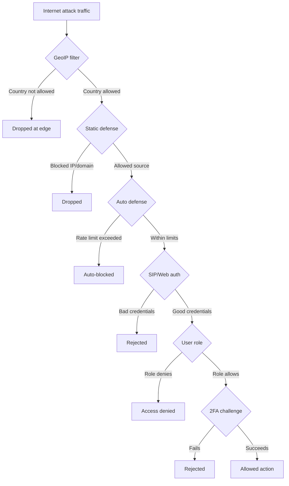

A Yeastar PBX on the public internet is a target. SIP scanners hammer port 5060 hourly looking for weakly-configured registration. Toll fraud schemes try to discover an outbound route they can dial through. Reflexive defence (after the breach) is too late; layered preventive defence is the only model that works. This lesson covers the seven layers PSE makes available, in roughly the order an attack would hit them.

## The seven layers, at a glance



Each layer is independent; an attacker has to bypass all of them to reach a usable surface. Each layer also costs configuration effort, monitoring effort, and (occasionally) legitimate-user friction. The senior tech's job is to pick the right depth per customer.

## Layer 1: Allowed Country IPs (GeoIP)

Yeastar maintains a country/region IP database; you tell PSE which countries are allowed to reach the PBX over the public internet, and the firewall drops everything else.

```
Security -> Security Rules -> Allowed Country IPs
Enable Allowed Country/Region IP Access Protection -> On
```

The default is all-countries-allowed (i.e. the feature is off). Turning it on requires you to first allow your own current country or you'll lock yourself out; PSE shows a warning prompt and asks you to confirm before applying.

For a customer based in one or two countries, this layer kills the majority of bot traffic with no real downside. Able Moose Group operates in Australia and New Zealand; the Allowed Country IPs list is Australia + New Zealand + (because they sometimes need MSP access from overseas) the MSP's own home country.

<AnnotatedScreenshot
  src="/img/yeastar/security-allowed-country-ip.png"
  alt="Allowed Country IPs configuration page with individual countries toggleable"
  caption="Country-by-country allowlist. Toggle Australia on, leave the rest of the world off, and most scanner traffic stops hitting your PBX."
>
  <Hotspot client:load x={20} y={20} tone="primary" label="1" title="Master toggle" purpose="Enable Allowed Country/Region IP Access Protection.">
    Off means all countries reach the PBX. On means only countries you've ticked below can reach it. Flip on as the first move of any hardening pass; the country list is far cheaper to maintain than per-IP blocklists.
  </Hotspot>
  <Hotspot client:load x={75} y={50} tone="primary" label="2" title="Per-country toggles" purpose="Allow or Disallow each country.">
    Tick the country (or countries) the customer's users actually call from. Ignore the rest. Most scanner traffic stops hitting the PBX because the source-IP geolocation falls into a country you haven't allowed.
  </Hotspot>
</AnnotatedScreenshot>

Two related controls live nearby:

- **Allowed Country Codes** (a separate tab): restricts which country prefixes can be DIALLED. This blocks outbound toll-fraud paths to (say) premium-rate satellite numbers. Important for outbound restriction even if your customer's PBX-access country list is permissive.
- **Static Defense allowlist override:** if you turn on Country IPs while your current IP is in a not-yet-allowed country, PSE prompts you to add the specific IP to the Static Defense allowlist as an exception. Use this for the customer's MSP-side remote-management IPs.

## Layer 2: Static Defense

Per-IP-address-or-domain or per-MAC rules for explicit allow / drop / reject decisions. The narrow-aperture firewall that sits inside the country-level coarse-aperture filter.

```
Security -> Security Rules -> Static Defense
```

Each rule has an Action (Accept / Drop / Reject), a source (IP + subnet, domain name, or MAC), and a target (a PBX service like `sip`, `web`, `linkus`, `ssh`, or a port range). The differences between Drop and Reject matter for attack reconnaissance: Drop silently discards the packet (the attacker doesn't know if anyone's home), Reject sends an ICMP / TCP RST back (the attacker confirms the host exists but can't get in). Default to Drop; use Reject only when you specifically want to signal "wrong door".

<AnnotatedScreenshot
  src="/img/yeastar/static-defense-rule-table.png"
  alt="Static Defense rule table listing per-IP firewall rules with action, protocol, service, and port"
  caption="The Static Defense rule table. Each row is one allow-or-block decision; rules are evaluated top-down."
>
  <Hotspot client:load x={60} y={45} tone="primary" label="1" title="The rule list" purpose="Order matters. Rules are evaluated top-down.">
    Allow rules go first (MSP management IPs, named carrier IPs, customer branch-office IPs). Deny rules go last (the broad blanket). A misordered rule list silently denies traffic the allow rules are supposed to permit.
  </Hotspot>
</AnnotatedScreenshot>

The pattern that works: a small allow-list for known-good sources (the MSP's static management IPs, a SIP carrier's signalling IP, a customer's branch-office static IP), followed by a broad deny for everything else. Country IPs handles the bulk of "everyone else"; Static Defense handles named exceptions.

A useful 83.20.0.128 enhancement: when Allowed Country IPs is on and a SIP register-trunk or peer-trunk is configured with a DOMAIN name (rather than an IP), PSE automatically adds the domain to Static Defense as an exception. The integration prevents the country-IP filter from accidentally blocking a legitimate carrier whose own IP resolves to a country you haven't allowed. Worth knowing because it means the carrier configuration doesn't fail on the first day, and it also means the same carrier domain doesn't need a hand-written rule.

## Layer 3: Auto Defense

Rate-limiting. Each Auto Defense rule says "for service X with protocol Y, more than N packets in T seconds from a single source IP -> block that source IP". The standard SIP-scan-killing pattern is on by default:

```
Security -> Security Rules -> Auto Defense
```

The shipped defaults are reasonable. Each rule has:

| Field | Meaning | Typical |
|---|---|---|
| `Service` or `Port Range` | What's being rate-limited | `sip_udp`, `sip_tcp`, `sip_tls`, `https`, `ssh`, `linkus`, etc. |
| `Protocol` | UDP / TCP / BOTH | BOTH for SIP, TCP for web |
| `Number of Packets` | Allowed packet count in the window | 90 for SIP-UDP, lower for less-busy services |
| `Time Interval(s)` | The window in seconds | 60 seconds |

For a customer with a noisy upstream (a SIP carrier that sends frequent keep-alives), the default thresholds may be too tight; tune up if you see legitimate carrier IPs ending up in the Blocked IPs list. For a customer with quiet traffic, tighten the thresholds.

The Blocked IPs page (under Security) lists currently-blocked sources with the rule that blocked them, the timestamp, and a "remove from blocklist" action for false-positives. If a customer's branch-office IP ends up here, the cause is usually an over-aggressive rule combined with normal user behaviour (a Linkus client reconnecting in a loop after a network hiccup). Investigate; don't just unblock.

When an IP gets auto-blocked, the **Auto Defense IP Blocked Out** event fires if you've enabled notifications. The MSP's NOC mailbox should be on that notification list; a sudden cluster of blocks usually indicates a coordinated scan worth knowing about.

## Layer 4: SIP TLS and SRTP

Encryption for SIP signalling (TLS) and RTP media (SRTP). Critical for any deployment where SIP traffic crosses the public internet, which is most MSP-hosted Cloud PBX deployments.

### SIP TLS

```
PBX Settings -> SIP -> TLS
```

The settings split into PBX-as-server and PBX-as-client:

| Setting | Notes |
|---|---|
| `TLS` | Master enable |
| `SIP TLS Port` | Default 5061 |
| `TLS Certificate` (server) | Upload a server cert; required for PBX to accept TLS connections |
| `TLS Verify Client` (server) | Optional; require client certs from registering endpoints (rare) |
| `TLS Connection Method` (client) | TLS v1.0 / v1.2; use v1.2 |
| `TLS Verify Server` (client) | Optional; PBX verifies upstream cert when registering against an ITSP that uses TLS |

The 83.20.0.23 release notes flagged a bug where re-uploaded server certificates failed TLS handshake until deleted and re-uploaded fresh; if you're hitting "TLS verify failed" after a cert rotation, delete and re-add the cert. Same applies to client-side cert rotation against an ITSP.

When TLS is enabled on the PBX, the Transport priority for Linkus clients becomes TLS > TCP > UDP automatically. IP phones use their own configured transport; if your auto-provisioning template doesn't set TLS, the phone falls back to TCP/UDP even though the PBX would accept TLS from it.

### SRTP

Per-extension and per-trunk. Set under the extension's Advanced SIP Settings and the trunk's VoIP settings:

```
Extension -> Advanced -> SIP -> SRTP -> Enable
Trunk -> VoIP -> Enable SRTP
```

SRTP encrypts the RTP payload (the audio). Without SRTP, an attacker on the network path between the endpoint and the PBX could capture the audio in plain G.711. With SRTP, they can't decrypt without the SDP keys.

The deployment pattern that works: SRTP on extensions whose Linkus clients are over public internet (most of them); SRTP on trunks where the carrier supports it (variable; some Australian carriers don't, in which case you can't enable it on the trunk side regardless of the PBX setting).

For Able Moose Group, the deployment is TLS-on-extensions + TLS-on-trunks-where-the-carrier-supports-it, plus SRTP on every extension and every supported trunk. The 14 sub-firms acquired over the last three years are at varying maturity; one sub-firm's old SIP-only branch office is the last legacy carrier, and the migration is on the security roadmap.

## Layer 5: User Roles (granular permissions)

User Roles are the per-user authorisation model. The Super Administrator account has everything; every other admin account is a User Role with explicitly granted permissions.

```
Extension and Trunk -> User Roles
```

The permission matrix is roughly fifteen sections (Extensions, Call Control, Call Features, AI, Messaging, PBX Settings, System, Security, Maintenance, Integration, Hotel Management, Reports and Recordings, Plan, ...). Each section has fine-grained controls. The CDR + Recordings section, for example, separately controls:

- WHICH extensions' CDR / recordings the role can see (All / Same Extension Group / Same Department / Specific Extensions)
- WHAT operations they can perform (Download / Delete / Schedule Download / Play / Pause / Resume)
- WHICH call reports they can access (My / Created by Myself / etc.)

Designing roles for a 1,800-person multi-tenant customer is a significant chunk of senior-tech work. A typical Able Moose Group role catalogue:

| Role | Purpose | Scope |
|---|---|---|
| **Super Administrator** | The MSP's PBX admin account | Everything |
| **Customer-Admin** | Customer-side admin who manages their tenant | All within their sub-firm; nothing across sub-firms |
| **Department-Supervisor** | Manages a department within a sub-firm | CDR / recordings for their department's extensions only |
| **Agent** | Standard user, no admin powers | Self only |
| **Finance-Reporter** | Read-only for call-cost reports | Extension Call Accounting only |
| **Compliance-Reviewer** | Read recordings for compliance | Play / Download recordings, no Delete |

The key design principle: the role grants what's needed, no more. A Department-Supervisor who can view recordings should not have Delete unless deletion is part of their job. A Compliance-Reviewer who can play recordings should not have Schedule-Download unless they need to bulk-export.

## Layer 6: 2FA

Two-factor authentication. Three deployment patterns:

### 2FA for the Super Administrator

Required from day one. Without 2FA on the super admin, a leaked password is a full takeover.

```
Account dropdown (top-right) -> Change Password & Security -> Two-Factor Authentication
```

Two methods: authenticator app (Google Authenticator, Microsoft Authenticator, Authy, etc.) using TOTP (SHA1, 6 digits, 30-second interval) or email (a 6-digit code emailed to the super admin's address, valid for 5 minutes). Authenticator app beats email on speed and on not depending on the email server (which the same PBX may also be managing). Use email only if the customer's authentication policy forbids per-user authenticator apps.

Trusted devices: the user can tick "Trusted Device" at login, which skips the 2FA challenge for that device for 180 days. Remove a trusted device from the Manage Trusted Devices list when the user reports a lost laptop.

### 2FA mandatory for all extension users

```
Security -> Security Settings -> Two-Factor Authentication -> Make Two-Factor Authentication Mandatory for All Extensions
```

(Requires PSE 83.14.0.24+ and Linkus Desktop 1.4.9+.) When enabled, every extension user is required to set up 2FA on next Linkus login. Users who haven't set it up are forced through a setup flow on first login attempt; users who never complete the flow get logged out.

This is a significant user-experience disruption to roll out. Schedule it with the customer's change-management process; announce the change with a deadline; have the IT helpdesk on hand for the first day to handle "I can't get the authenticator app to work" tickets.

### Disabling 2FA for a stuck individual

If an extension user loses access to their authenticator (lost phone, no backup codes, deleted email account):

```
Extension and Trunk -> Extensions -> the extension -> Security -> Login Security -> Two-Factor Authentication -> uncheck
```

This is the "emergency unlock" path. Re-enable 2FA once the user has set up a fresh authenticator. Don't leave it disabled.

## Layer 7: IP-restricted admin login

The super-admin account can additionally be restricted to specific IP addresses. Even with valid credentials and 2FA, login attempts from non-allowed IPs fail.

```
Security -> Security Settings -> IP Restriction
```

Add the MSP's static management IP, the customer's office network range if they have an on-site admin, and (carefully) any home VPN exit IPs needed. Once turned on, you're committed: a configuration change that locks out the MSP's only management IP means a YCM-side passwordless-login workaround or a SSH-console recovery.

## Outbound restrictions

Two adjacent features that limit what can happen on the dial-out side:

### Blocked Numbers

Per-call-direction blocklist:

```
Call Features -> Call Disposition -> Blocked/Allowed Numbers
```

Each rule is a Number (or pattern) and a Type (`inbound` / `outbound` / `both`). Use for known harassment callers (inbound), prevent dialling premium-rate numbers (outbound), or both. CSV-importable for bulk loads.

### Outbound Call Frequency Restriction

Rate-limit dial-out:

```
Call Features -> Call Disposition -> Outbound Call Frequency Restriction
```

Each rule has a Restriction string like `200/10/second&3000/1/minute` (per-second AND per-minute caps, AND-combined). Apply to specific extensions or extension groups. The intended use: detect toll-fraud-via-compromised-extension. If a single extension is suddenly dialling 200 international numbers in 10 seconds, the rate-limit blocks the rest of the dial-out and triggers an event notification. This is a after-the-fact mitigation, not a prevention; pair it with the extension-side security (registration password complexity, IP restriction on Linkus login, 2FA).

## Audit trail: who did what

Two logs to know:

- **Maintenance -> Operation Logs:** PBX-side admin actions. Every config change, every export, every login. Filterable by admin user and date range.
- **Maintenance -> System Logs:** raw PBX system events. Lower-level; useful for "what was the system doing at 03:14 when the customer says the PBX went unresponsive".

The Operation Logs are the audit trail the customer's compliance team will ask for. The System Logs are what you reach for in deep troubleshooting (covered in the next lesson).

The 2FA event log for the super admin login is in the same Operation Logs feed: each 2FA-challenge passed or failed shows up as an event.

<Callout type="info" title="Operation Logs are immutable from the UI">
A super admin can't delete or edit Operation Logs from the web portal. The customer's compliance team can rely on the integrity of the audit trail. (A SSH-console connection with root could theoretically tamper, which is why SSH access is itself logged and gated.)
</Callout>

## A worked hardening pass for a new customer

When Able Moose Group's IT department added their fourteenth sub-firm last quarter, the security baseline was:

<StepThrough client:load>
  <Step title="Country IPs">
    Allowed Country IPs: Australia, New Zealand, plus the MSP's home country for management access. Static Defense exception for the MSP's two management IPs.
  </Step>
  <Step title="Auto Defense">
    Default rules kept. Added a tighter rule for the `https` service (web admin) at 30 packets / 60 seconds; the customer's admin team rarely refreshes the page fast enough to trip it.
  </Step>
  <Step title="TLS + SRTP">
    SIP TLS on, server cert from the MSP's internal CA. SRTP on every extension. Trunks: TLS + SRTP on the two carriers that support it; one legacy carrier still on TCP/SDP-unencrypted, with a migration ticket open.
  </Step>
  <Step title="User Roles">
    Six roles defined (see the role table earlier). Super Admin is the MSP's named account only; the customer's IT manager has Customer-Admin scoped to the parent-firm's department tree.
  </Step>
  <Step title="2FA">
    Super-admin 2FA via authenticator app (mandatory in MSP playbook). Mandatory 2FA for all extension users scheduled three weeks ahead with comms, with helpdesk briefed for the first-Monday-after rollout.
  </Step>
  <Step title="IP restriction">
    Admin login restricted to the two MSP management IPs + the customer's IT manager's office IP. The customer accepts the trade-off that admin tasks from home require VPN.
  </Step>
  <Step title="Outbound restrictions">
    Blocked Numbers list pre-populated with known premium-rate AU prefixes (`+61 19xx`). Outbound Call Frequency Restriction at 60-international-calls-per-hour per extension; suspicious enough to flag, generous enough that legitimate sales staff don't trip it.
  </Step>
</StepThrough>

The baseline isn't bulletproof. It is layered enough that an attacker has to bypass GeoIP, defeat Static Defense, slip under Auto Defense's rate limits, guess a TLS-protected SIP password, defeat 2FA, defeat user-role authorisation, AND come from one of three allowed admin IPs. Each layer alone is breakable; all seven together is impractical for the kind of opportunistic attacker most MSP-hosted PBXs face.

<Checkpoint slug="yeastar-pse-advanced-checkpoint-security" client:visible />

Next lesson: high availability, SD-WAN networking, backup-and-restore, and deep troubleshooting tools.
