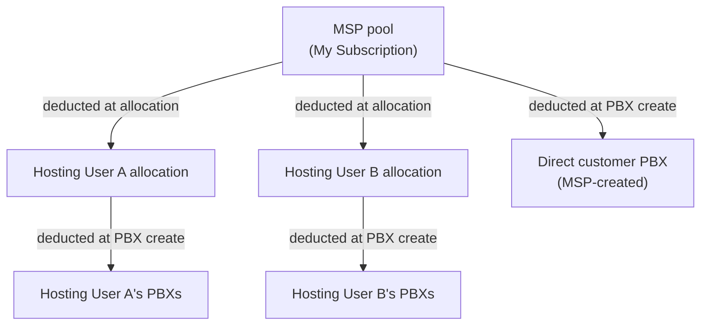

The boundary where YCM stops being a voice platform and starts being a billing question is the My Subscription page. Every minute pack, every extension allocation, every recording hour the MSP holds shows here, with used / available / total. Every Hosting User has their own subset of these counters. The finance team's monthly close depends on this view being honest, and on the MSP's design making it possible to tell which customer consumed what.

This lesson is the discipline that ties the platform to the invoice. None of it changes how YCM works; it changes how confidently you can answer "what did this customer cost us this month" and "are we charging them enough."

## The subscription view

`My Subscription` shows the full P-Series Hosting Package pool: every capacity dimension the MSP holds, with used / available / total. Behind it, the API endpoint `GET /dm/open_api/v1/subscription` returns the same numbers as JSON, which is the pull the finance team's reconciliation script will use.

The capacity dimensions:

| Dimension | What it counts |
|---|---|
| `extensionCapacity` | Extensions across all PBXs the MSP holds |
| `concurrentCallCapacity` | Sum of concurrent-call caps across PBXs |
| `recordingCapacity` | Recording minutes (one-time bucket, not per-month) |
| `ultimatePlanCapacity` | Extensions allowed to be on Ultimate Plan (the higher-tier per-extension licence) |
| `transcriptionCapacity` | AI transcription minutes (one-time bucket) |
| `transcriptionPack` | AI transcription monthly quota packs |
| `receptionistCapacity` | AI receptionist minutes (one-time bucket) |
| `receptionistPack` | AI receptionist monthly quota packs |
| `highAvailability` | Enabled / Disabled flag for the HA service |
| `whiteLabel` | Subscribed flag for the White Label service |

Each capacity dimension is one of two shapes: a **one-time bucket** (the platform draws from it until it runs out and you top up; recording minutes, transcription minutes, receptionist minutes), or a **monthly quota pack** (refills on the first of every month; transcription pack, receptionist pack).

<AnnotatedScreenshot
  src="/img/yeastar/subscription-capacity-dashboard.png"
  alt="YCM My Subscription page showing usage statistics for Extension, Concurrent Calls, Call Recording, Ultimate Plan, AI Transcription, High Availability, and Custom Domain with used / available / total values and progress bars."
  caption="Every capacity row is the same shape: used / available / total. Progress bars give you the at-a-glance read; click into a row for the per-PBX or per-Hosting-User breakdown of who consumed what."
>
  <Hotspot client:load x={20} y={40} tone="primary" label="1" title="Used / available / total" purpose="The three numbers per capacity dimension.">
    Read across each row to see whether the MSP has slack in extension capacity, recording capacity, AI minutes, custom domains, etc. Used + available should equal total; if it doesn't, capacity has been over-allocated to sub-users and the difference is the over-commit.
  </Hotspot>
  <Hotspot client:load x={80} y={20} tone="warning" label="2" title="Subscription flags" purpose="High Availability, White Label, Custom Domain show as on/off badges.">
    These aren't capacity numbers, they're feature gates. If a sub-user asks for HA and the badge here is off, the MSP needs to upgrade the YCM-level subscription before the feature becomes available downstream.
  </Hotspot>
</AnnotatedScreenshot>

## The capacity allocation model

Capacity flows from the MSP pool to either a Hosting User's allocation or directly to a Cloud PBX. The arithmetic is straightforward but easy to lose track of as the org grows.

Three rules to internalise:

1. **Hosting User allocations are reservations.** The moment you save the Create Hosting User form, the capacity leaves the MSP pool, whether or not the Hosting User has created a single PBX yet. The MSP cannot get that capacity back without reducing the Hosting User's allocation (and recording minutes are one-way; once issued, only increases are permitted).
2. **Hosting User PBXs consume from their own allocation.** When a Hosting User creates a PBX, the capacity comes from *their* sub-allocation, not the MSP pool. If their allocation is exhausted, they cannot create more PBXs even if the MSP pool has plenty.
3. **Direct customer PBXs consume from the MSP pool.** The MSP-managed customers (Able Moose Group is one of these) draw from the same pool that funds Hosting User allocations. If you give Hosting Users 80% of the pool, your direct customers fight over the remaining 20%.

The Hosting User subscription endpoint `GET /dm/open_api/v1/users/{userId}/subscription_info` returns each Hosting User's `total*` (allocated) and `used*` (consumed) for every dimension, so a reconciliation script can compute MSP-pool-used = sum of direct-PBX consumption + sum of Hosting-User totals, and confirm that matches what the MSP pool's `used` says.

## The AI minute pack economics

AI Transcription and AI Receptionist are the dimensions that change monthly and need real reconciliation. The plan dimensions:

| Tier | One-time included | Monthly quota pack |
|---|---|---|
| **Enterprise Plan PBX** | 120 transcription mins, 60 receptionist mins | Buyable separately |
| **Ultimate Plan PBX** | 240 transcription mins, 60 receptionist mins | Buyable separately |
| **One-Time Capacity service** | Bulk minutes purchased on Partner Portal, drawn down until exhausted | n/a |
| **Monthly Quota Pack service** | n/a | Refills first of each month, expires unused |

The MSP usually subscribes to both One-Time Capacity (for occasional spikes) and Monthly Quota Pack (for predictable monthly consumption), then allocates portions to specific Cloud PBXs and to Hosting Users. The per-PBX allocation on the Cloud PBX detail decides how much of each pool that customer can consume.

The capacity rollup per Cloud PBX exposes these as separate fields (from the cloud_pbx instances API):

- `transcriptionCapacityPlan`: included in the PBX plan (120 or 240, depending on Enterprise vs Ultimate)
- `transcriptionCapacityAddon`: extra one-time minutes you have assigned beyond the plan
- `usedTranscription`: consumed across both plan and addon
- `transcriptionPack`: monthly pack minutes allocated to this PBX
- `usedTranscriptionPack`: consumed from this month's monthly pack

Same shape for AI Receptionist. When a customer asks "why am I being billed for transcription minutes I did not use?", these fields are the receipt: plan-included, addon, monthly pack, and what was consumed from each.

<Callout type="info" title="Monthly packs do not roll over">
The Monthly Quota Pack model is use-it-or-lose-it. A PBX assigned 60 receptionist minutes per month that uses 20 gets 60 again next month, not 100. If the customer is consistently using less than half the pack, the right move is to drop their monthly pack and rely on plan-included minutes plus the one-time addon for spikes; if they are consistently exceeding the pack, raise the pack rather than chasing overage charges.
</Callout>

## The monthly close

A practical finance reconciliation, run on the first business day of each month:

<StepThrough client:load>
  <Step title="Snapshot the subscription state">
    Hit `GET /dm/open_api/v1/subscription` and `GET /dm/open_api/v2/cloud_pbx/instances` (paginated through all). Save the JSON. This is the source of truth for the month that just ended.
  </Step>
  <Step title="Per-PBX consumption report">
    For each Cloud PBX, extract: plan, extension count, concurrent call cap, used recording minutes, used transcription (plan + addon + pack), used receptionist (plan + addon + pack). This is the per-customer line-item your billing system needs.
  </Step>
  <Step title="Per-Hosting-User rollup">
    Hit `/dm/open_api/v1/users/{userId}/subscription_info` for each Hosting User. Their `total*` is what they were allocated; their `used*` is what their PBXs consumed. Their reseller invoice (from your MSP to them) reconciles against this.
  </Step>
  <Step title="Pool-side check">
    Sum the direct-customer consumption + Hosting User totals; confirm it matches MSP pool `used`. Any drift over a few units is something to investigate before it grows.
  </Step>
  <Step title="Flag exceptions for finance">
    PBXs at >95% extension capacity (upcoming resize), Hosting Users at >95% allocation (upcoming top-up), PBXs that consumed AI minutes outside their plan (potential billing-discrepancy email), PBXs newly created or deleted this month (subscription change events).
  </Step>
  <Step title="Feed into invoicing">
    Whichever billing platform finance runs (NetSuite, Xero, Sage, a homegrown system), feed it the per-PBX line item plus the customer record (which the Cloud PBX customer association gives you).
  </Step>
</StepThrough>

This is a fifty-line Python script for a typical MSP. The work that took a person two days at month-end becomes a scheduled job whose output the finance team reviews.

## Capacity flags that change billing

A few platform-side conditions deserve a finance-side trigger:

- **`allowRunAfterExpirationDate`** on a Cloud PBX. If set to `true`, the PBX keeps running past its subscription expiration. The customer is technically over-consuming; either the contract auto-renews and finance bills them, or they get a grace period documented in the contract.
- **PBX `pbxStatus` changes**. A PBX going to `Stopped` mid-month is potentially "the customer wants to end the contract." A PBX going to `Provisioning` is a new customer this month. The webhook subscription model from the API lesson is the right way to feed these events to the PSA.
- **Hosting User `pbxCreationLimit` hit**. A Hosting User who has filled their cap and wants more PBXs is a contract-expansion opportunity. Make sure your account team sees these, not just your platform team.
- **`whiteLabel` and `highAvailability` flag flips**. These are subscription-grade changes; finance needs to know if HA goes from Enabled to Disabled on a Hosting User mid-contract (refund? contract amendment?).

The platform exposes the state. The discipline is to make the state visible to the people who need it (finance, account managers), not just the voice ops team.

## A worked reconciliation: Able Moose Group's monthly invoice

Sarah at Able Moose Group's MSP runs a Cloud PBX on Ultimate Plan: 200 extensions, 100 concurrent calls, 60,000 recording minutes, 240 transcription plan-included minutes, 60 receptionist plan-included minutes, plus a 500-minute transcription monthly pack and a 200-minute receptionist monthly pack.

End of month, the reconciliation report shows:

- **Used extensions**: 178 (target 80% of 200 = 160; they grew over the month, healthy)
- **Used recording**: 4,200 minutes this month (no addon needed, plan covers it)
- **Used transcription**: 540 minutes (consumed all 240 plan, all 300 of 500 pack)
- **Used receptionist**: 45 minutes (under plan, monthly pack untouched)

Three things the finance team does with this:

1. Standard monthly invoice: Ultimate Plan x 200 extensions, monthly packs as committed.
2. Note that transcription pack consumption is 60%; consider scaling the pack up next quarter if usage continues to climb, or selling them a bigger pack now.
3. Receptionist pack at 0%; suggest dropping it next quarter, saving the customer the line item, or repurposing the budget into a transcription pack increase.

The reconciliation is what turns "we run their voice platform" into "we are a strategic vendor to their business." Without it, the MSP charges what the contract says and never notices the customer is paying for unused capacity (annoying), or vastly outgrowing their commitment (margin risk).

## Closing the loop

Running YCM at this tier is two distinct skill sets working together: platform engineering (clusters healthy, alarms tuned, backups archived, audit log reviewed) and commercial discipline (capacity reconciled, billing tied to consumption, account managers seeing the signals). The MSPs that do both well are the ones that have customers for ten years; the ones that do only one tend to lose customers to MSPs that do both.

Everything in this Advanced course connects: the permission hierarchy decides who can change platform shape, the branding makes it the MSP's platform rather than Yeastar's, the API lets the work scale beyond the headcount, SNMP and archives bring it into your existing infrastructure, the cluster monitoring and audit log keep it operable, and the subscription view ties it back to the business.

You now have the full management surface. The next course on the ladder, if you want to keep going on Yeastar specifically, is whichever vendor or concept track the MSP needs next. For most operations leads, the further work is the customer-side change management: rolling out new features (AI Receptionist for an enterprise customer, M365 SSO for a healthcare customer with strict identity requirements) at scale across the customer estate, which is what the change-management practice on top of this platform looks like.

<Checkpoint slug="yeastar-ycm-scale-checkpoint-billing" client:visible />
